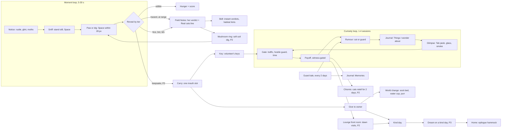

# Ayala — Surprise, Curiosity & Rewards Design

**Project:** Ayala (2D top-down cat adventure game)
**Framework:** Phaser 3 + Vite + TypeScript (strict, `noUncheckedIndexedAccess`)
**Branch:** `sit` @ 1bf7a50
**Context:** This document merges four design proposals (engagement, spirit, MVP, delight), three judges' verdicts, four codebase reports, three research reports and three critic passes into one plan. Read `docs/Ayala_GDD_v0.1.md` and `docs/Ayala_Easter_Eggs.md` first.
**Status:** Design only. Nothing here is implemented.
**Revision 2 (2026-10-10):** objective changed per Manu (§11); weekly rhythm added (§12); return loop added (§4.6).
**Revision 3 (2026-10-10):** Sundays rebuilt on Manu's on-the-ground account: only Paseo de Roxas closes, and it becomes a street market; Ayala Ave and Makati Ave keep their traffic (§12). Q15, Q19, Q22, Q25 decided; Q26 moot.

**Verification markers:**

- **(verified)**: re-read in the repo, or recomputed from `atg.json` with node, while writing this revision.
- **(report)**: taken from the codebase reports and not re-checked.
- **(unverified)**: must be checked before building.

---

## 0. TL;DR

- **The objective is Manu's (revision 2).** Ayala Cats competes with Roblox and Fortnite for Camille's and Kish's free time. If they play for five minutes and drift back to those games, it has failed. So it uses engagement tools on purpose, inside a safe space defined by what it leaves out: nothing for sale, no strangers, no links out of the game and no data collection (§11).
- **Four pillars, one loop.** Foraging (A), treasure and the room (B) and encounters (C) produce finds, keepsakes and stories. Curiosity loops (D) connect them. Each loop runs rumour → glimpse → gate → key earned elsewhere → payoff → next rumour.
- **Uncertainty lives in _what_ she finds, never in _whether she eats_.** Feeding stations stay the reliable source of food. Forage tops up at most about half a day's food (a hard cap of 20 hunger per in-game day, Manu's choice in Q8), and its odds never depend on hunger (a determinism requirement, §5.6).
- **Berries and mushrooms are things she reads, not food.**
  - A sniff verdict stays in her sensory voice. The Journal's Field Note adds a separately styled **"Real cats:"** line with a sourced welfare fact.
  - Berries grow on only one kind of hedge.
  - A mushroom ring marks soft soil.
  - The lamp gecko is something she watches, not something she catches.
  - **No vertebrate is ever caught or hurt.**
- **One new verb, no new button.**
  - Space in empty space is currently a silent greet. It becomes a **sniff**.
  - Space next to a tell becomes a **paw**. On disturbed earth it becomes a 3-press **dig**.
  - Hazard tells are never pawed. She backs away instead.
- **Every find has a home.**
  - Food feeds hunger and score.
  - Knowledge goes into Field Notes.
  - From Phase 2, each keepsake has an **owner**. Giving it back changes the world: Tiger's sock bed, Kuya Jun's water cup, Ginger B's first purr.
  - Gifts raise that cat's trust (+8, once per keepsake) and score +120, through a scripted handler only (§6.3).
- **The user's two examples are the two flagship loops.**
  - **"Stay away from the other side of the road"** pays off with the existing zombies across Makati Ave, now persisted and foreshadowed.
    - She glimpses them in Tab peek from the park's NE corner. No swarm is visible from inside the park today, so this needs a small flagged "dusk lookout" for one zombie (verified).
    - Jayco's key is a _true_ timing tip.
    - D1 is the **only** payoff in the whole design that needs crossing a **live** road. On Sundays only Paseo de Roxas closes, for the street market (§12); Makati Ave and Ayala Ave stay live, so D1 is the same on every day. Blacky says out loud what the game cannot show: cars don't always stop for cats.
  - **"Locked door with a view"** is a real vacant OSM unit on restaurant row.
    - MVP: text-only glimpses. A tabby's box, then kittens, then "Mama and her kittens are safe with us".
    - P2: Rose and Ben (Q4) turn the unit into a borrowed pop-up adoption corner. Mamma Cat earns a key elsewhere and may visit the front room at dawn.
- **The cat adventure room comes in stages so the ending stays intact.**
  - She first sees it through the **window**.
  - She then **visits** the front room briefly at dawn, with the game fully paused.
  - Then she **dreams** of it. The first dream is entered through the McMicking water curtain, a deniable secret portal. Later dreams come on kind days, at most 5 per run.
  - It becomes **home** only after adoption.
  - There is no awake, snatcher-safe hub.
- **Encounters.** Three friendly guards (Kuya Jun, Ate Joy, Manong Ed) tell funny, sad and topical tales, at most one every 2 in-game days. The MVP has 8 tales, 4 of them held back for Chapter 5. Everything is scripted first; AI may later re-voice the spoken lines only.
- **Magic is rare and deniable inside the park, and absurd at the edge.** In-park magic is capped at 3 moments per run: kapre smoke, a white-duwende coin, and the water-curtain portal. The zombies get the dance gag; the crowd gets the Paseo Sunday market, its rotating programmes (yoga, Zumba, a pet-adoption booth, chalk art and a visitor cat) and the Sunday Lights finale.
- **Safe-space engagement (§11).** The game uses the tools Roblox and Fortnite use: variable rewards, rarity tiers with reveal juice, visible collection totals, requests, forgiving streaks, a cliffhanger at the stopping point, weekly real-clock events and score for finds (§11.2). What makes it safe is what it never contains: nothing for sale, no strangers, no links out of the game, no data collection and no push notifications (§11.1). A few rules stay because they keep the fun honest: no fake near-misses, no offline decay, nothing collectable lost for good, and a wind-down line on late school nights (§11.3).
- **Return loop (§4.6).** A treasure in the first five minutes, taught by an on-screen "Space: paw" prompt; a morning gift from its own colony gift table on the first session of each real day; daily favours from named cats, shown on a HUD goal chip; a forgiving weekly streak; collections with visible totals, kept per device; one true cliffhanger at the first shelter rest each night; and score for finds.
- **Weekly rhythm (§12).** Every real Sunday, at any hour, the in-game dawn (06:00–10:00) closes Paseo de Roxas, and it becomes a pedestrian street market: food stalls, music, a busy crowd. Ayala Ave and Makati Ave keep their traffic, as Manu sees them on real Sundays. At 10:00 the market packs up and Paseo reopens to real traffic. Each real Sunday runs one of five rotating programmes (yoga on the lawn, Zumba at the market's end, a pet-adoption booth, chalk art, a Sunday visitor cat). The in-game evening and early night (17:00–23:00) are the Sunday Lights, on Sundays only, all year. From 10 Nov to 15 Jan the lights become the Christmas Festival of Lights, which ships in MVP-B so the playtest can run in season. A "This week" Journal page builds the anticipation.

**Recommended pre-gate build: MVP-A about 17.5 developer days plus MVP-B (Sundays) about 12 days.** No PixelLab art (stalls, barriers and cones are drawn in code). No save-version bump and no `mapRevision` change; a few places are appended through the generator.

1. **Fix the latent bugs that would otherwise corrupt the loops:**
   - "Seen" flags are set before anyone knows the line was actually shown. The real risk is the single-slot HUD narration and edge pulse, where the last call wins. The perceive check itself rarely fails today.
   - The New-Game clear list has drifted from `TRACKED_KEYS`.
   - The existing witness line-of-sight check ignores buildings.
2. **Ship the sniff/paw/dig foraging layer:**
   - 10 seeded tells per in-game day, all resolved at dawn
   - pseudo-random distribution (PRD) with hard caps
   - a partly-buried tell variant
   - Field Notes
3. **Ship curiosity loops built on existing content:**
   - D1, the zombies
   - D2, Simba's rock, seen from the park with no crossing
   - D3, a guaranteed mushroom ring
   - D4-lite, text-only glimpses into the vacant shop
4. **Ship guard tales** at three friendly posts, a **gecko-tick telegraph** before Camille beats 2–4, and the lamp gecko.
5. **Add three Journal pages:** "Things I wonder about", "Field notes" and "Memories".
6. **Ship the return loop (§4.6):**
   - the first-five-minutes script, its "Space: paw" prompt and the first treasure
   - the morning gift, favours, the HUD goal chip and the forgiving weekly streak
   - visible totals kept per device, rarity colour plus glyph, score for finds, and the Golden Fishball
   - the rest-beat cliffhanger, event autosaves and local return diagnostics
7. **Ship the Sundays slice (§12.11):** the Paseo Sunday market with the reopening and five rotating programmes, the Sunday Lights with the Christmas upgrade, the Sunday Book and the "This week" page.

Nothing below the cut line ships until a playtest passes the gate in §15.1.

---

## 1. Why

### 1.1 Where the current loop goes flat

| Symptom                           | Evidence                                                                                                                                                                                                                  | Consequence                                                                                                                                                                                                                                             |
| --------------------------------- | ------------------------------------------------------------------------------------------------------------------------------------------------------------------------------------------------------------------------- | ------------------------------------------------------------------------------------------------------------------------------------------------------------------------------------------------------------------------------------------------------- |
| Needs are solved by about day 2   | Hunger costs about 42 per day. One feeding station gives +40. Open water has no cooldown. Upkeep is about 2–3 minutes of each 14-minute day (report: economy §7).                                                         | After day 2, survival creates no tension. Foraging could only matter for calories if the economy were retuned, and this design does not do that.                                                                                                        |
| Every reward is fixed and visible | Every source is an always-visible emoji with a visible countdown (`FoodSource.ts:214-232`, report).                                                                                                                       | Once a source is found, there is nothing left to discover about it.                                                                                                                                                                                     |
| Almost nothing is left to chance  | The only rolls are crowd morsels (45%, at most 4 a day), snatchers (40% a night), Camille's beats (60% a night) and dumping events.                                                                                       | No outcome is ever _unknown until found_.                                                                                                                                                                                                               |
| Currencies have no sinks          | Global trust saturates. Score buys nothing. Territory has no effect (`checkTerritoryBenefits` is a no-op, report).                                                                                                        | After Chapter 4, progress stops feeling like progress.                                                                                                                                                                                                  |
| Night is a skip                   | Resting at a shelter makes her invisible to snatchers (`SnatcherSystem.ts:158-161`, verified).                                                                                                                            | The tensest part of the day is the easiest to sleep through. **Night stays the natural stopping point; the first shelter rest carries one true reason to come back (§4.6.6), and on real Sundays the lights pull play into the first minute of night.** |
| Ch3 to Ch5 drags                  | The Ch3→Ch4 trust grind, the wait for `dayCount ≥ 5`, then Chapter 5's roughly 6.7 evenings (about 95 real minutes) with no new goal.                                                                                     | This is the stretch most likely to lose Camille.                                                                                                                                                                                                        |
| The best secrets are mute         | The zombies and Simba's rock are never foreshadowed. Their narration fires once per **session** and nothing is persisted (`ZombieSystem.ts:84,187` verified; `ColonyDynamicsSystem.ts` `streetColonyNarrated`, verified). | The best surprises leave no trace and give no reason to tell anyone.                                                                                                                                                                                    |
| The Journal has nothing to find   | It lists cats and score (report).                                                                                                                                                                                         | There is no reason to open it.                                                                                                                                                                                                                          |

### 1.2 Design goal

> **Every session should open on a find within a minute, leave one moment worth retelling, and end with a true reason to come back. Every real week should have a day worth waiting for.**

Success is measured by whether Camille and Kish _choose_ Ayala over their other games:

- distinct days played;
- unprompted sessions a week;
- Sunday attendance;
- sessions under 5 minutes, which are the failure signal;
- the moments they remember.

There is no ceiling on session length; C5 governs late school-night play (§11.3).

This design deliberately leaves alone:

- survival tuning (stations unchanged; forage tops up at most about half a day's food, a hard cap of 20 hunger per in-game day, Manu's choice in Q8);
- chapter gate _thresholds_ (favours and gifts add small amounts of trust);
- traffic, snatchers and frightened newcomers (realism over smoothing), **except** the Sunday-morning closure of Paseo de Roxas for the market and the festival-night snatcher hold, with odds unchanged (§12.5);
- Camille beats 1 and 5 (byte-for-byte);
- the run score, **except** optional bonus lines (§4.6.7);
- night as a skip, **except** the first 40 s of Sunday nights (the lights go off at 23:00).

---

## 2. What the research says

Only sources from the supplied research reports are cited, plus the revision-2 engagement evidence memo.

| #   | Finding                                                                                                                                                                                                                                                                                                                                                                         | Design rule for Ayala                                                                                                                                                                                                                                                                                                                                                                                                          | Source                                                                                                                                                                                                                                                                                                                                                                                                                                                                                                                    |
| --- | ------------------------------------------------------------------------------------------------------------------------------------------------------------------------------------------------------------------------------------------------------------------------------------------------------------------------------------------------------------------------------- | ------------------------------------------------------------------------------------------------------------------------------------------------------------------------------------------------------------------------------------------------------------------------------------------------------------------------------------------------------------------------------------------------------------------------------ | ------------------------------------------------------------------------------------------------------------------------------------------------------------------------------------------------------------------------------------------------------------------------------------------------------------------------------------------------------------------------------------------------------------------------------------------------------------------------------------------------------------------------- |
| 1   | Variable-ratio schedules produce the highest and most extinction-resistant responding. Hopson's article is a how-to guide that recommends them, and avoidance schedules too; its one caution is that sudden reward loss feels unfair and makes players quit.                                                                                                                    | Variable ratio on finds, favours and Sunday finds, inside daily budgets and PRD caps. Never on survival. No offline decay (C3).                                                                                                                                                                                                                                                                                                | [Hopson 2001](https://www.gamedeveloper.com/design/behavioral-game-design), [OpenStax §6.3](https://openstax.org/books/psychology-2e/pages/6-3-operant-conditioning)                                                                                                                                                                                                                                                                                                                                                      |
| 2   | A variable reward attached to deprivation is the withdrawal-driven compulsion loop.                                                                                                                                                                                                                                                                                             | Tell count and odds stay **independent of hunger**, for technical reasons (the PRD is recomputed from day 1 and cannot see past hunger) and C6. A test enforces this. The separate hunger cap is dropped; the tell budget bounds forage.                                                                                                                                                                                       | [Mandryka](https://www.gamedeveloper.com/design/compulsion-loop-is-withdrawal-driven)                                                                                                                                                                                                                                                                                                                                                                                                                                     |
| 3   | The dopamine response moves to the earliest cue that predicts a reward, and a fully predicted reward produces no signal. A separate ramp tracks uncertainty.                                                                                                                                                                                                                    | Put anticipation into learnable cues (rustle, glint, _tik-tik_). Keep the uncertainty in _what_ the find is, so finds never become non-events.                                                                                                                                                                                                                                                                                 | [Schultz 2016](https://pmc.ncbi.nlm.nih.gov/articles/PMC4826767/), [Fiorillo et al. 2003](https://folia.unifr.ch/unifr/documents/300083)                                                                                                                                                                                                                                                                                                                                                                                  |
| 4   | "Wanting" can be separated from "liking". Addiction is wanting that grows without liking.                                                                                                                                                                                                                                                                                       | Spend craft on liking: warmth, cat behaviour, comedy, meaning.                                                                                                                                                                                                                                                                                                                                                                 | [Berridge & Robinson 2016](https://sites.lsa.umich.edu/berridge-lab/wp-content/uploads/sites/743/2019/10/2016-Berridge-Robinson-Liking-wanting-IS-theory-of-addiction-Am-Psychol.pdf)                                                                                                                                                                                                                                                                                                                                     |
| 5   | Curiosity is an inverted U of confidence, peaking at partial knowledge (around 0.5).                                                                                                                                                                                                                                                                                            | Rumours name an **area, not a tile**, and give conflicting partial explanations ("zombies? night shift?").                                                                                                                                                                                                                                                                                                                     | [Kang et al. 2009](https://neuroecon.berkeley.edu/public/papers/Psychol%20Sci%202009%20Kang.pdf)                                                                                                                                                                                                                                                                                                                                                                                                                          |
| 6   | Curiosity is transient and stops when attention moves away.                                                                                                                                                                                                                                                                                                                     | Re-cue an untouched loop after 3 in-game days, from a **second** source.                                                                                                                                                                                                                                                                                                                                                       | [Ady et al. 2022](https://arxiv.org/pdf/2212.00187)                                                                                                                                                                                                                                                                                                                                                                                                                                                                       |
| 7   | The Zeigarnik memory advantage does not replicate. The Ovsiankina urge to _resume_ does (67% against 50% chance).                                                                                                                                                                                                                                                               | Put **one true open loop at the stopping point** (§4.6.6), and surface loops in the Journal so they can be resumed. Never claim open loops improve memory. On late school nights, a wind-down line replaces it (C5).                                                                                                                                                                                                           | [Ghibellini & Meier 2025](https://www.nature.com/articles/s41599-025-05000-w)                                                                                                                                                                                                                                                                                                                                                                                                                                             |
| 8   | In a high-curiosity state, people remember unrelated information shown during the wait.                                                                                                                                                                                                                                                                                         | Put welfare facts (ear tips, no scraps, volunteers, roads) _inside_ anticipation windows and payoffs, not into lectures.                                                                                                                                                                                                                                                                                                       | [Gruber et al. 2014](https://www.sciencedaily.com/releases/2014/10/141002123631.htm)                                                                                                                                                                                                                                                                                                                                                                                                                                      |
| 9   | Expected tangible rewards undermine intrinsic motivation (d = −0.36, and −0.43 for engagement-contingent rewards to children). Unexpected rewards do no harm (d = 0.01). Positive verbal feedback raised free-choice motivation (d = +0.33), but tended to help children less than college students.                                                                            | Favours from named characters for specific things (§4.6.3), with occasional unexpected bonuses; the pool never runs dry. The effect is measured as free-choice play after rewards stop. Ayala's rewards persist through a run but end at the epilogue and grow routine, so the playtest watches for drop-off once favours and finds feel expected. Field Notes are content, not praise; do not count on them to motivate Kish. | [Deci, Koestner & Ryan 2001](https://www.selfdeterminationtheory.org/SDT/documents/2001_DeciKoestnerRyan.pdf)                                                                                                                                                                                                                                                                                                                                                                                                             |
| 10  | Autonomy, competence and relatedness each independently predict enjoyment and future play.                                                                                                                                                                                                                                                                                      | Relatedness is Ayala's strongest lever: keepsakes have owners, and gifts change the world.                                                                                                                                                                                                                                                                                                                                     | [Ryan, Rigby & Przybylski 2006](https://selfdeterminationtheory.org/SDT/documents/2006_RyanRigbyPrzybylski_MandE.pdf)                                                                                                                                                                                                                                                                                                                                                                                                     |
| 11  | Players expect presentation to scale with a reward's value. Pity timers cap droughts at about 2× the mean. Players perceive fair odds as needing a tilt in their favour.                                                                                                                                                                                                        | Reveal juice is proportional to tier, with colour plus glyph (§10.2). PRD has hard caps at 2× the mean. Skill-correct approaches get better odds.                                                                                                                                                                                                                                                                              | [Yin & Xiao 2022](https://www.robertxiao.ca/research/reward-for-luck/), [Hearthstone](https://hearthstone-decks.net/how-do-card-packs-work-in-hearthstone/), [Meier GDC 2010](https://www.adachen.com/gdc10-notes-sid-meier-on-why-everything-you-know-is-wrong/)                                                                                                                                                                                                                                                         |
| 12  | Near-misses raise the urge to play while feeling worse, and recruit win circuitry. Coziness means safety, softness and gifts; obligation and FOMO are anti-cozy. (Streaks moved to row 14.)                                                                                                                                                                                     | Near-misses are honest only (C1); honest proximity cues are fine. "Cozy" is a genre definition from a design workshop, not harm research: keep the "cozy sandwich" (danger _outside_ the refuge), and allow recurring time-limited content (§11.2 row 9).                                                                                                                                                                      | [Clark et al. 2009](https://pmc.ncbi.nlm.nih.gov/articles/PMC2658737/), [Project Horseshoe 2017](https://www.projecthorseshoe.com/reports/ph17/ph17r3.htm)                                                                                                                                                                                                                                                                                                                                                                |
| 13  | Goal gradient: café members bought faster as a free coffee got closer, and effort reset after each reward. Endowed progress: a 10-stamp card with 2 free stamps was redeemed 34% of the time, against 19% for a plain 8-stamp card, for the same 8 purchases.                                                                                                                   | Visible totals (§4.6.5), pre-filled only from things she really did. When a set completes, the Journal highlights the nearest-to-done remaining set, which her own finds have already started.                                                                                                                                                                                                                                 | [Kivetz, Urminsky & Zheng 2006](https://home.uchicago.edu/ourminsky/Goal-Gradient_Illusionary_Goal_Progress.pdf), [Nunes & Drèze 2006](https://en.wikipedia.org/wiki/Goal_pursuit)                                                                                                                                                                                                                                                                                                                                        |
| 14  | Intact streaks raise later engagement. After a break people drop off, more so when they blame themselves and less so when the streak can be repaired. Duolingo's own tests favour leniency (streak freezes, the Weekend Amulet). Adult populations; no child data.                                                                                                              | Forgiving weekly streaks only: a week counts with 2 visit days, an automatic week-freeze every 4 weeks, a counter that never shows 0, milestones on total days, no loss language (C2).                                                                                                                                                                                                                                         | [Silverman & Barasch 2023](https://www.insead.edu/faculty-research/publications/journal-articles/or-track-how-broken-streaks-affect-consumer), [Duolingo](https://blog.duolingo.com/how-streaks-keep-duolingo-learners-committed-to-their-language-goals/)                                                                                                                                                                                                                                                                |
| 15  | Gaming or messaging in the hour before bed meant falling asleep about 30 minutes later; passive screen use had no significant link. AASM recommends 9–12 hours of sleep for ages 6–12. The ICO Children's Code encourages break nudges.                                                                                                                                         | Real-clock events key on the date, not the hour. On late school nights the cliffhanger becomes a wind-down line (C5).                                                                                                                                                                                                                                                                                                          | [Penn State 2023](https://www.psu.edu/news/research/story/interactive-screen-use-reduces-sleep-time-kids-researchers-find), [AASM](https://aasm.org/recharge-with-sleep-pediatric-sleep-recommendations-promoting-optimal-health/), [ICO Standard 13](https://ico.org.uk/for-organisations/uk-gdpr-guidance-and-resources/childrens-information/childrens-code-guidance-and-resources/age-appropriate-design-a-code-of-practice-for-online-services/13-nudge-techniques/)                                                 |
| 16  | Calling a feature "dark" in itself is incoherent. Judge a design by its transparency and by whether players regret it.                                                                                                                                                                                                                                                          | The §11.4 test: regret, anxiety, lost sleep. Odds and rules are written in the Journal (C13).                                                                                                                                                                                                                                                                                                                                  | [Deterding, Stenros & Montola 2020](https://eprints.whiterose.ac.uk/156460/1/DiGRA_2020_paper_189.pdf)                                                                                                                                                                                                                                                                                                                                                                                                                    |
| 17  | The documented harms come from money and strangers. Loot-box spending tracks problem-gambling severity (η² = 0.054, against 0.004 for other purchases). Children call Roblox's paid chance items "child gambling". The FTC's Fortnite case was about default-on chat with strangers and confusing purchase buttons. Mechanics without money are under-studied, not proven safe. | The safe-space definition (§11.1, A1–A4), and a playtest gate that measures regret and late-night play as well as return (§15.1).                                                                                                                                                                                                                                                                                              | [Zendle & Cairns 2018](https://journals.plos.org/plosone/article?id=10.1371%2Fjournal.pone.0206767), [Univ. of Sydney 2025](https://www.sydney.edu.au/news-opinion/news/2025/03/24/literally-just-child-gambling-study-urges-swift-regulation-of-roblox.html), [FTC v. Epic](https://www.ftc.gov/news-events/news/press-releases/2022/12/fortnite-video-game-maker-epic-games-pay-more-half-billion-dollars-over-ftc-allegations), [UOC 2026](https://www.uoc.edu/en/news/2026/video-game-design-spending-youth-research) |
| 18  | Recurring appointments with catch-up paths work: Pokémon GO's monthly Community Day has yearly recaps and "Classic" reruns. Animal Crossing's creator did not want players "punished for not playing". No controlled retention data is published.                                                                                                                               | A weekly Sunday event playable at any hour of a real Sunday; Sunday-only collectables come back every Sunday (§12).                                                                                                                                                                                                                                                                                                            | [Pokémon GO live events](https://en.wikipedia.org/wiki/Pok%C3%A9mon_Go_live_events), [Eguchi interview](https://www.gamedeveloper.com/design/crossing-into-the-mainstream-katsuya-eguchi-on-i-animal-crossing-i-)                                                                                                                                                                                                                                                                                                         |

**Two cautions.**

- Fiorillo's peak at P = 0.5 comes from monkeys and juice. Treat it as a direction, not a constant.
- Endowed progress and the goal gradient ([Madigan](https://www.psychologyofgames.com/2010/11/endowed-progress-effect-and-game-quests/), [Kivetz et al.](https://business.columbia.edu/sites/default/files-efs/pubfiles/1200/goalgradient.pdf)) come from loyalty schemes. This design uses the honest version: visible totals, pre-filled only from things she really did. These are adult populations, so validate in the playtest.

---

## 3. What great games do

| #   | Pattern (game)                                                                                                                                                                                                                                                                                                         | Why it works                                                                                   | Ayala mechanic                                                                                                                                                                                                     |
| --- | ---------------------------------------------------------------------------------------------------------------------------------------------------------------------------------------------------------------------------------------------------------------------------------------------------------------------- | ---------------------------------------------------------------------------------------------- | ------------------------------------------------------------------------------------------------------------------------------------------------------------------------------------------------------------------ |
| 1   | Bounded daily dig budget, catch-up after absence, identification in two beats (Animal Crossing fossils and Blathers, [Nookipedia](https://nookipedia.com/wiki/Fossil))                                                                                                                                                 | Checking in feels complete, never like a treadmill. A second reveal arrives at identification. | 10 tells a day with a backlog of 4. From Phase 2, Blacky names unknown keepsakes.                                                                                                                                  |
| 2   | Each spot's item is fixed for the day, and loot tables vary by region (Stardew artifact spots, [wiki](https://stardewvalleywiki.com/Artifact_Spot))                                                                                                                                                                    | Reloading cannot farm. Knowing _where_ to look is a skill.                                     | All of a day's tells are resolved at dawn from `(RUN_SEED, day, index)`, with tables by habitat and time of day.                                                                                                   |
| 3   | "Suspicious spots" hide creatures, and finishing everything earns a joke (Korok seeds, [Nintendo Everything](http://nintendoeverything.com/zelda-breath-of-the-wilds-korok-seeds-were-originally-stone-objects/), [eggplante](https://www.eggplante.com/2018/01/01/korok-seeds-are-poop-confirmed-by-zelda-director/)) | A living reveal beats a pickup. A joke and a trophy cap completion with delight.               | Reveals are living things: crickets, beetles, the lamp gecko, kittens. Completing Field Notes earns the **Golden Fishball** joke.                                                                                  |
| 4   | Key discovery tools are placed several times over ("five shovels", [A Short Hike](https://en.wikipedia.org/wiki/A_Short_Hike))                                                                                                                                                                                         | Feels found but cannot be missed.                                                              | Sniff and paw are taught three ways: by Jayco Jr, by a first-time narration and by Blacky's line. Those teachers aren't met in minute 1, so a non-modal "Space: paw" prompt covers the first three tells (§4.6.1). |
| 5   | Knowledge is the progression, NPCs tell stories of distant places, and novelty needs familiarity first (Outer Wilds, [Game Developer](https://www.gamedeveloper.com/design/live-die-repeat-how-i-outer-wilds-i-piques-curiosity-in-an-ambivalent-solar-system))                                                        | Questions pull exploration better than objectives do.                                          | A rumour web in the Journal. One starter loop (D3) in Chapter 1; the rest from Chapter 2.                                                                                                                          |
| 6   | Places you can see but not reach, and barter of junk (Little Kitty, Big City, [Game Developer](https://www.gamedeveloper.com/design/how-little-kitty-big-city-was-designed-to-steal-hearts-and-fish))                                                                                                                  | Visible gates pull you forward.                                                                | The vacant shop's glass, a zombie at dusk seen in peek from the park's NE corner, and Simba seen in peek from the park's south apex.                                                                               |
| 7   | Every verb gets a reaction ("the meow button should trigger a reaction", [Stray](https://screenrant.com/swann-martin-raget-interview-stray/))                                                                                                                                                                          | Small rewards arrive constantly.                                                               | The silent free greet becomes a sniff that always answers.                                                                                                                                                         |
| 8   | Humour comes from routines and limited vision, and "no one gets hurt" (Untitled Goose Game, [Game Developer](https://www.gamedeveloper.com/game-platforms/road-to-the-igf-house-house-s-i-untitled-goose-game-i-))                                                                                                     | The player becomes the comedian.                                                               | The delivery rider's parcel, the zombie at the crosswalk, Tiger "not pleased" in his bush.                                                                                                                         |
| 9   | A visitor's arrival foreshadows a night event (Celeste and meteor showers, [Nookipedia](https://nookipedia.com/wiki/Celeste))                                                                                                                                                                                          | The reward signal moves to the cue.                                                            | A gecko ticks three times before Camille (beats 2–4).                                                                                                                                                              |
| 10  | Bait agency without control of the result ([Neko Atsume](https://en.wikipedia.org/wiki/Neko_Atsume))                                                                                                                                                                                                                   | You choose the input, but the outcome stays uncertain.                                         | Gift preferences: Jayco likes shiny things, Fluffy likes soft ones.                                                                                                                                                |
| 11  | Finished sets change the world ([Stardew bundles](https://stardewvalleywiki.com/Bundles)), **without** collect-N grinding                                                                                                                                                                                              | Visible, lasting change.                                                                       | Each returned keepsake causes one persistent world change. There are no bundles.                                                                                                                                   |
| 12  | A rumour made real as a joke ([Cow level](https://en.wikipedia.org/wiki/Cow_level))                                                                                                                                                                                                                                    | A wink rewards belief.                                                                         | Jayco: "There's a cat café." Blacky: "There is no cat café." When the lounge opens, Jayco: "See? CAT CAFÉ."                                                                                                        |

---

## 4. The loop architecture

### 4.1 Moment loop (5–30 s): notice → sniff → paw → reveal → decide

1. **Notice.** As she walks through a habitat, a tell enters her reveal radius (96 px walking, 128 px crouched). It shows as a rustle, a glint or moths. She ear-twitches; **ForageSystem draws the twitch glyph itself**. It never calls `EmoteSystem.show` on her, because that would use up her 3 s emote cooldown and swallow a car-screech alert, a dog alert or Camille's hearts (`EmoteSystem.ts:31,44-46`, verified).
2. **Sniff.** With nothing else to interact with, she stands still and presses Space. Within 1.0 s, tells up to 160 px away are revealed, and ForageSystem draws a scent ripple pointing to the nearest one with strength 1 − d/160. This is honest warmer/colder feedback.
3. **Paw or dig.**
   - **Paw:** Space within 28 px of a _non-hazard_ tell plays the reveal using `startConsuming()` with a 120 ms hop.
   - **Dig:** a partly-buried tell takes 3 Space presses, 400 ms each, with a dust puff on each press.
   - **Hazard tells never get the paw.** These are the lily, the mushroom ring, podocarpus berries, garlic rice and chicken bones. They resolve on the sniff verdict at range. Space within 28 px of one plays a back-away, never `startConsuming()` and never the hop. The animation must not show the very contact the Field Note warns against.
4. **Reveal.** Presentation scales with tier (§10).
5. **Decide.** She eats it (hunger and score) or declines it (a Field Note). In Phase 2 she can also carry it in her mouth.

### 4.2 Day loop: one 14-minute in-game day as an interest curve

| Phase (real s)    | What's new                                                                                                                                                                                                                                                                                                                                                                            | Target moments        |
| ----------------- | ------------------------------------------------------------------------------------------------------------------------------------------------------------------------------------------------------------------------------------------------------------------------------------------------------------------------------------------------------------------------------------- | --------------------- |
| **Dawn** (180)    | 7 fresh tells, plus any backlog. One is the _doorstep tell_ near her. A mushroom ring appears under the giant rain tree by Blacky's steps on the first dawn after D3 is heard, and on 35% of later dawns at a seeded giant. **Dawn chismis:** if a rumour or re-cue is due, one cat wears a `curious` emote. _Phase 2:_ the lounge's front room is open; Lola Pining is on her bench. | 2–3 finds, 0–1 rumour |
| **Day** (180)     | Tells on open lawn (crickets go quiet in the heat; grasshoppers come out). A guard tale, at most once every 2 in-game days.                                                                                                                                                                                                                                                           | 1–2 finds, 0–1 tale   |
| **Evening** (300) | +3 tells at tables, lamps and lawn after the crowd thins. Rumours delivered. The gecko tick on Camille evenings. At dusk, a single zombie stands at the lookout across Makati Ave (flagged, §8.2).                                                                                                                                                                                    | 2–3 finds             |
| **Night** (180)   | Moths at the lamps, and the lamp gecko catching them. Tells near snatcher loops stay exactly as risky as they are. **The first shelter rest of the night carries one true cliffhanger line (§4.6.6); on late school nights it is a wind-down line instead (C5).**                                                                                                                     | 1–2 finds, tension    |

**On a real Sunday (§12):** Dawn is the Paseo Sunday market, ending in the 10:00 reopening of Paseo. Evening and early night (17:00–23:00) are the Sunday Lights.

**Target per in-game day:**

- 8–10 small moments;
- about 1 medium moment every 1–2 days (a tale, a loop step, a gift, a favour);
- an uncommon find about every 5 tells;
- a rare find about every 1.25–1.5 in-game days (about 18–21 real minutes for a skilled player);
- magic: at most 3 deniable moments in the park per _run_.

### 4.3 Meta loop: chapters, run, NG+

| Chapter | New this design adds                                                                                                                                                                                              | Why there                                                                                                                                  |
| ------- | ----------------------------------------------------------------------------------------------------------------------------------------------------------------------------------------------------------------- | ------------------------------------------------------------------------------------------------------------------------------------------ |
| 1       | Sniff, paw and Field Notes; the first-ever paw in a correct habitat is guaranteed to find something. The first treasure, **D3 Pale Things** (the one starter loop), the first favour and the morning gift (§4.6). | Home turf must be familiar before oddities land, but the first session needs a treasure and a reason to come back. D3 is safe and at home. |
| 2       | **D1 The Other Side** (zombies), **D2 Simba's Rock**; guard tales begin.                                                                                                                                          | First open loops beyond home.                                                                                                              |
| 3       | **D4 The Vacant Shop**: the MVP has the tabby, kittens and rescue note. _Phase 2_ adds the keys, the lounge, keepsakes, Pedigree's collar and "no cat café".                                                      | Fills the trust grind.                                                                                                                     |
| 4       | _Phase 2–3:_ lounge dawn visits (it opens around day 7–9), Ate Joy's arc, the kapre rumour.                                                                                                                       | Territory gives a sense of home, and the lounge sharpens the longing.                                                                      |
| 5       | The gecko tells her Camille is coming. Four guard tales are held back for Chapter 5. _Phase 3:_ the curtain portal and dreams, and Blacky's tunnel.                                                               | Fills the flat 95 minutes.                                                                                                                 |
| 6 / NG+ | _Phase 3:_ an unremarked hammock in Camille's apartment in the epilogue. _Phase 4:_ cross-run meta.                                                                                                               | Home.                                                                                                                                      |

### 4.4 Interlock: every _kind_ of reward feeds at least two systems

| Reward                 | Feeds                                                                                                                          | Also feeds                                                                                                                                                                                                                                                              | Never feeds                                     |
| ---------------------- | ------------------------------------------------------------------------------------------------------------------------------ | ----------------------------------------------------------------------------------------------------------------------------------------------------------------------------------------------------------------------------------------------------------------------- | ----------------------------------------------- |
| Edible find            | Hunger (within the tell budget); score (Finds line, §4.6.7)                                                                    | The first of its kind writes a Field Note. The 3rd and 6th finds of that item each add a deeper line to the note ("Moths: thickest at the fountain lamps, late"). _P2:_ carried to a newcomer, it gives comfort +10 within `comfortCeiling`, the game's only real sink. | The seen-eating global trust check              |
| Declined (hazard) find | A Field Note: her verdict plus a "Real cats:" fact                                                                             | After that, a sniff flags the same hazard instantly (skill). Repeats deepen the note. _P2:_ nudge a bone away from a kitten or newcomer for comfort +3 and a kind act. A mushroom ring marks soft soil for a dig.                                                       | Hunger                                          |
| Buried find (MVP)      | Content from the uncommon and rare tables; score (Finds line)                                                                  | Field Note on the first find. _P2:_ story digs (the collar) use the same verb.                                                                                                                                                                                          | —                                               |
| Field Note             | Journal, with totals per set and overall, kept per device (§4.6.5); +25 score for the first of a kind in a run                 | Each note prints a habitat hint, which teaches the skill. A completed set gives a Memory line and +100. Completion earns the Golden Fishball joke.                                                                                                                      | —                                               |
| Keepsake (P2)          | A gift to its owner: a scripted line, a persistent world change, per-cat trust +8, global +1 and score +120, once per keepsake | Identification writes a Field Note. It can be a clue or key for a loop. It counts as a kind day for dreams (P3).                                                                                                                                                        | Any trust from AI output                        |
| Rumour                 | A "?" row in the Journal                                                                                                       | A destination. One `recentEvents` line for the AI's memory.                                                                                                                                                                                                             | Trust                                           |
| Guard tale             | A Memories row in the Journal                                                                                                  | A rumour or a key.                                                                                                                                                                                                                                                      | Trust only (`recordHumanEngagement` is allowed) |
| Loop payoff            | The Journal row turns to "seen"                                                                                                | A scripted follow-up line through CuriositySystem, a chismis wave (P2), and the next rumour or a place unlocked.                                                                                                                                                        | —                                               |
| Lounge visit (P2)      | A fixed energy floor on exit                                                                                                   | Dream content. The adoption message, told inside the world.                                                                                                                                                                                                             | Snatcher safety; passage of time                |
| Dream (P3)             | Guests are cats with trust ≥ 50, so the dream mirrors her friendships                                                          | Foreshadows home (the epilogue hammock).                                                                                                                                                                                                                                | Stats                                           |
| Favour                 | Per-cat trust +3, global +1, score +60                                                                                         | A 25% unannounced bonus tell near the giver, never a hazard; the Favours page and the goal chip (§4.6.3, §4.6.8)                                                                                                                                                        | Survival; anything that expires in real time    |
| Sunday find            | The Sunday Book (§12.6); +200 score the first time in a run, +50 after                                                         | A Memory; "Sundays in the park"                                                                                                                                                                                                                                         | The main PRD; the main Field Notes total        |
| Visit milestone        | A guaranteed-rare morning gift and a named-cat Memory (§4.6.4)                                                                 | The "This week" page                                                                                                                                                                                                                                                    | Score                                           |

**Honest limit:** after the first few days, a repeat common find feeds hunger, a few points of score and, at most, one deeper note line. A comic find feeds only comedy. That is deliberate.



### 4.5 Reward currencies

| Currency          | Earned by                                                                             | Shown or spent where                                                                                       | Explicitly not                                                                         |
| ----------------- | ------------------------------------------------------------------------------------- | ---------------------------------------------------------------------------------------------------------- | -------------------------------------------------------------------------------------- |
| **Functional**    | Edible finds; the lounge exit energy floor; Kuya Jun's water cup (P2, scores nothing) | Stat bars                                                                                                  | Never decides survival. Bounded by the tell budget. Independent of need (determinism). |
| **Informational** | Sniff verdicts, identifications, habitat hints, "Real cats:" facts                    | Journal: Field Notes, Things I wonder about                                                                | Totals shown; denominators count only always-obtainable entries                        |
| **Social**        | Gifts, favours, kind acts, loop payoffs, guard tales                                  | New scripted lines, world changes, chismis lines, Memories; per-cat trust through scripted handlers; score | Never trust from AI output; global trust at most +1 per act                            |
| **Access**        | Keys earned elsewhere (knowledge, a find, a gift, time of day)                        | The lounge door, Blacky's tunnel, the curtain portal                                                       | Never gates the main story                                                             |
| **Emotional**     | Comedy, tenderness, wonder                                                            | Narration, bubbles, vignettes; rarity colour plus glyph (§10.2)                                            | Modal achievement pop-ups                                                              |
| **Habit**         | Real-day visits and Sundays in the park                                               | The "This week" page and milestones (§4.6.4)                                                               | Never lost, never zero, never scored                                                   |

### 4.6 Return loop (sessions and real days)

This section answers Manu's failure condition: a player who tries Ayala for five minutes and drifts back to Roblox. Every piece below is bounded (§11.2) and forgiving (§11.3).

#### 4.6.1 The first five minutes

Timed from the end of the intro on a New Game.

| Time    | Event                                                                                                                                                                                                                                                                                                                                                                                                                      |
| ------- | -------------------------------------------------------------------------------------------------------------------------------------------------------------------------------------------------------------------------------------------------------------------------------------------------------------------------------------------------------------------------------------------------------------------------- |
| ≤ 60 s  | The doorstep tell (existing, §5.6) with first-of-kind juice. It is the first-ever paw, so it is the onboarding beetle (§5.6). **Prompt:** for the first 3 tells ever within `PAW_RANGE_PX`, a non-modal glyph reads "Space: paw" (keyboard), or the touch Act button pulses. After 20 s idle with no tell in range, "Stand still + Space: sniff" shows once. Nothing in the game or HUD teaches Space today (README only). |
| ≤ 150 s | **First treasure placed.** A guaranteed partly-buried tell 200–300 px from her current position, in her facing direction, on a valid H2/H6 cell, with a one-shot scent ripple and rustle.                                                                                                                                                                                                                                  |
| ≤ 240 s | If she is still more than 300 px from it, it is re-placed once, the same way. It holds the silver-vine stick and plays the full rare reveal plus 30 s of zoomies. It comes from a separate onboarding stream that the PRD never counts.                                                                                                                                                                                    |
| ≤ 300 s | The Journal ticker shows "Cats of Ayala 2/12 · Field Notes 2/21" (the beetle and the silver vine). Mamma Cat is pre-filled as entry 1, honestly: _"You. New here."_                                                                                                                                                                                                                                                        |

By the end of in-game day 1 (about 14 minutes):

- **D3 Pale Things** is opened by Blacky in Chapter 1. It pays off at the next dawn.
- **The first favour** is offered on the first return conversation, or as dawn chismis if no return conversation has happened by the next dawn.

**AC:** in a scripted run, all of the above fire by those times. Firing is not finding, so diagnostics also log `firstPawAt` and `firstTreasureFoundAt` to `ayala.diag.v1`. Playtest target: first paw ≤ 90 s and treasure found ≤ 300 s in both players' first sessions.

#### 4.6.2 The morning gift (first session of each real day)

- When `localDateKey(now) ≠ DAILY_SURPRISE.lastDate`, a gift tell spawns 64–96 px from her within 10 s.
- Its content comes from the daily stream `hash(RUN_SEED, dateKey)`, which never touches the main PRD, and from its own table, `DAILY.GIFT_TABLE` (`src/data/forage-items.ts`):
  - 6–8 gift-only, non-food, non-hazard objects drawn as Graphics glyphs. Manu authors them and checks each against C10; they never reuse the P2 keepsakes (bottle cap, feather).
  - A seeded shuffle bag on the daily stream gives no repeats until all have been seen. They fill a "Colony gifts n/8" Journal row (always obtainable, so §4.6.5's denominator rule allows it).
  - After that: 75% uncommon, 25% rare, from non-hazard items only (`treasureValue > 0`: grasshopper, cicada shell, kibble, silver vine, catnip mouse).
  - Gift tells spawn by distance, ignoring habitat and time windows, so the per-item habitat filters that keep hazards in their niches don't apply. **A morning gift is never a hazard.** Without this, about half of all "saved for you" gifts would have been a chicken bone or podocarpus berries.
- Missed days bank, up to `DAILY.MAX_BANKED` = 3. After an absence, banked gifts appear as a small cluster: _"The colony saved these for you."_ Banking is capped, so checking in every few minutes gains nothing.
- If the device clock moves backwards, nothing is given and nothing is lost.
- The nearest met cat greets her. After an absence of 3 or more real days, the greeting is a warm 2-line one and comes with a fresh favour.

#### 4.6.3 Favours (daily cat requests)

- `FAVOUR.MAX_OPEN` 3; `NEW_PER_DAY` 2 (per in-game day). Delivered through CuriositySystem's met-cat modal path, under §7.3 rules (a)–(c).
- The MVP has 16 templates, using MVP verbs only. Templates are parameterised by giver × item or place, and a (template, giver) pair may repeat after a per-giver cooldown of `FAVOUR.REPEAT_COOLDOWN_DAYS` = 3 in-game days, so the pool never runs dry:
  - find a specific item ("a cricket for Jayco Jr");
  - sniff a place (Tiger: "What's that smell by the Tower One steps?");
  - glimpse (Ginger: "Is the big one still on his rock?");
  - keep company (catloaf 8 s within 64 px);
  - sit with the new one: catloaf 8 s within a newcomer's comfort radius while it isn't fleeing; it completes by raising the newcomer's comfort through the existing NewcomerCats comfort path. (Leading a newcomer to water is impossible in the MVP: `goesForWater` excludes newcomers, `ColonyDynamicsSystem.ts:255-259`, and escorting is P4.)
  - check a guard post.
- **Rules:** counts are at most 3; nothing expires in real time; nothing is needed to survive.
- **Reward:** per-cat trust +3, global +1, score +60, and a 25% unannounced bonus tell near the giver.
  - Bonus tells come from their own seeded stream, `mulberry32(hash32(RUN_SEED, day, FAVOUR_STREAM_ID, favourIndex))`, so they never touch the main PRD (which is recomputed from day 1 and can't know which days had favours).
  - They draw only non-hazard treasure items (grasshopper, cicada shell, kibble, silver vine, catnip mouse) and ignore habitat and time windows. **A favour bonus tell is never a hazard.**
- **Blacky's Sunday slot.** Blacky is the Paseo cat: his spawn is 244 px from the Paseo eastbound centreline, and every other named cat is 775 px or more from it (Tiger; verified). His weekly request ("The road by my steps fills with humans on Sunday. Go and smell what they're selling.") has its own slot, `FAVOUR.SUNDAY_SLOT` = 1, outside `MAX_OPEN`, so it never blocks a weekday favour. It is offered on the first Sunday day of each real Sunday once Blacky has been met, at most once per real Sunday; if it is still open, it carries over to the next market (nothing expires). It shows as "Sunday: Blacky wants market news", and completes when she sniffs at any market stall while the market is open (a sniff-a-place favour, §12.3). His thank-you plays on her next greet. It replaces Simba's Sunday slot: Ayala Ave stays live on Sundays, so there is no safe visit to Simba.
- A Journal "Favours" page shows "n open". The HUD goal chip shows the open favour nearest completion (§4.6.8).
- **Pool test:** per chapter, the distinct eligible (template, giver, target) instances, with the cooldown applied, are at least 1.5× the expected draws. Chapter 5 is about 6.7 in-game days × 2 ≈ 13.4 draws, so it needs at least 20 instances. Every template maps to an implemented completion predicate.

#### 4.6.4 Visits and the forgiving weekly streak

Stored per device, in `localStorage['ayala.visits.v1']`, so New Game never wipes it:

```
{ days: string[≤ 60], totalDays: number, weeks: number, bestWeeks: number, lastWeek: string, lastFreezeWeek?: string }
```

- **Crediting.** A visit is credited after 60 s of active play on a local date, and written to the device key immediately, not with the run save.
- **Why weekly.** A daily streak with two freezes a week survives only at 5 or more play days out of 7. The gate's own target is about 3 a week (6 in 14), so the hoped-for player would have seen the streak drop every week, the visible break that Silverman & Barasch link to drop-off.
- **Weekly streak.** A local Mon–Sun week counts if it has at least `VISITS.WEEK_QUALIFY_DAYS` = 2 visit days. One automatic week-freeze every `VISITS.WEEK_FREEZE_EVERY` = 4 weeks fills a missed week. A player on 3 days a week never breaks it.
- **Display.** "Weeks in a row: 3 · Days in the park: 17", with the paw strip (§12.7). It never shows 0 and never uses loss words such as "broken" or "lost". After a longer gap, the count simply restarts at 1.
- **Milestones** key on **total** visit days, which never fall: 3, 7, 14, 30 and 60. On those days the morning gift is a guaranteed rare, plus a named-cat Memory. At 7, Blacky: _"Your spot's warm."_
- **Flourish.** On a Sunday with 3 or more weeks in a row, Jayco Jr counts them aloud: _"Three Sundays in a row!"_ This ties the streak to the Sunday rhythm.
- No score for visits, and no wagers.
- "Sundays in the park" lives in `ayala.sundays.v1` only (§12.6).
- **Check-ins.** In `ayala.diag.v1`, a session under 3 minutes that credited a visit or claimed a gift is tagged `checkIn`. Check-ins are excluded from the gate's under-5-minute metric and reported separately (§15.1), so behaviour the design invites is not read as failure.

#### 4.6.5 Collections with totals

| Page               | Contents                                                                                                                                                                                                                                                                                                                                                                                                                                                                                                                                                                                                                               |
| ------------------ | -------------------------------------------------------------------------------------------------------------------------------------------------------------------------------------------------------------------------------------------------------------------------------------------------------------------------------------------------------------------------------------------------------------------------------------------------------------------------------------------------------------------------------------------------------------------------------------------------------------------------------------- |
| Field Notes        | Five sets of at least 3 MVP entries each, 21 in all: **Bushes & trees** 4 (beetle, hedge berries, mushroom ring, cicada shell), **Lawn** 5 (cricket, grasshopper, grass blade, silver vine, catnip mouse), **Tables** 6 (crust, chicken shred, garlic rice, chicken bone, lily, kibble), **Night lamps** 3 (moth, lamp gecko, the ants comic), **Comic** 3 (leaf, sprinkler, Tiger). A per-set n/N plus a grand total. Completing a set gives a Memory line and +100 score, and the Journal highlights the nearest-to-done remaining set. Catnip-mouse colours are sub-entries on the catnip note ("Catnip mice 1/5"), outside the 21. |
| Cats of Ayala      | n/12: the 8 park personas, Simba, Bantay, Pandan, and Mamma Cat. A street cat counts once it is glimpsed from a park-flood cell in Tab peek with ground LOS (the D2 rule). Ayala Ave never closes, so that is the only way. A greet across the road still learns the name but ticks nothing: **no visible-total tick is earned through a live-road crossing** (C9). If `atgGeography.test` shows the `cat_house` places can't be seen in peek from the park, Bantay and Pandan leave the total and it is n/10.                                                                                                                         |
| Newcomers welcomed | n (no denominator)                                                                                                                                                                                                                                                                                                                                                                                                                                                                                                                                                                                                                     |
| Colony gifts       | n/8 (§4.6.2)                                                                                                                                                                                                                                                                                                                                                                                                                                                                                                                                                                                                                           |
| Treasures (P2)     | n/8, with silhouettes                                                                                                                                                                                                                                                                                                                                                                                                                                                                                                                                                                                                                  |
| Sunday Book        | Its own tallies (§12.6). Never counted in the main totals.                                                                                                                                                                                                                                                                                                                                                                                                                                                                                                                                                                             |
| Odds               | Each page states its odds in plain words (C13)                                                                                                                                                                                                                                                                                                                                                                                                                                                                                                                                                                                         |

Denominators count only what can be got on any future day. First entries are pre-filled only with things she really did.

**Kept per device.** Field Notes, Cats of Ayala, Colony gifts and (P2) Treasures live in `localStorage['ayala.journal.v1']` (§14.6), written immediately on any first-of-kind. Game over calls `SaveSystem.clear()` on the third lost life (`GameScene.ts:1834`, verified), and New Game and NG+ clear every tracked key, so run-scoped totals would reset at the moments players are most likely to quit. Score stays per run: `FIELD_NOTES` stays in the run save only for the +25 first-of-a-kind-this-run bonus. Story state, lives and snatchers are unchanged.

#### 4.6.6 The rest-beat cliffhanger

- It plays on the **first** shelter rest of each in-game night only. Players also rest mid-session for energy, and those rests stay quiet.
- One true line, chosen in this priority:
  1. the Sunday foreshadow (§12.7): Jayco's "tomorrow" line only when the next in-game dawn will fall on a real Sunday; otherwise, once per real Saturday, the real-clock version;
  2. a guaranteed next-dawn event (D3 ring, kitten stage, lounge piece);
  3. a true preview of tomorrow: tells are resolved at dawn from `(RUN_SEED, day, index)` (§5.6), so `resolveDay(seed, day + 1)` already knows which habitat holds the next day's top-tier tell. A cat names the area, never the tile (§2 row 5): Jayco, _"Something smells good by the lamps tomorrow."_ for an uncommon, _"…shiny, under the picnic tables."_ for a rare. It is always true and fresh every night, unlike a stock line heard nightly once the 5 MVP loops close;
  4. a hint toward an open favour;
  5. an unclaimed morning gift ("Something's waiting at dawn").
- It goes through the HUD guard at `payoff` priority, so it never replaces sleep or Camille narration.
- It must pay off on schedule (C7).
- **School nights** (`isSchoolNightLate`, 21:00–05:00 device time, §12.9): _"The colony's asleep. It's a good place to stop. It'll keep till tomorrow."_ No in-game-dawn teaser, because in-game dawn is at most 180 real seconds away and would pull a 12-year-old into 3 more minutes. The next morning gift is keyed to the real date, so the promise is true. No new favour is offered.

Shelter rest is the main routine autosave (`GameScene.ts:1398`, verified); the others are event-driven (chapter, territory, first talks) or the menu's Save button. There is no save-on-exit hook today (no `visibilitychange` or `beforeunload` in `src/`, verified). This design adds event autosaves and a `visibilitychange` save (§14.6), but the first rest stays the natural stopping point and the place for a return hook.

#### 4.6.7 Score for finds

| Item                              | Points |
| --------------------------------- | ------ |
| Common find                       | 10     |
| Uncommon find                     | 40     |
| Rare find                         | 150    |
| Sunday entry, first time in a run | 200    |
| Sunday entry, again               | 50     |
| First of a kind in a run          | +25    |
| Set completed                     | +100   |
| Favour                            | 60     |
| Gift                              | 120    |
| Loop payoff                       | 100    |

- These go in an optional `RunScoreState.bonus?: { finds, notes, sets, favours, gifts, payoffs, sundays }`, sanitised by `sanitizeNonNegativeInt`. "First time" is per run (`SUNDAY_STATE.foundThisRun`, §12.6), so a New Game still scores +200.
- They are **not** in `isValidRunScore`'s required keys (`SaveSystem.ts:100-122`, verified). Adding them there would reject every existing save, and `load()` would return null.
- **Calibration.** Each proximity tick counts as a cat engagement worth 30 points (`scoringWeights.ts:3`, verified), so a day earns about 600. Finds add roughly 270 a day, which is visible.

#### 4.6.8 The goal chip

The mid-term goals (favours, sets, Sunday status) otherwise live only on Journal pages, and the HUD has no goal element today (the chapter hint shows only in the pause menu, `HUDScene.ts:739`). The goal gradient works when the goal is in view while you act; a 12-year-old used to quest trackers won't open a Journal to find out what to do next.

- A compact, non-modal chip under the stat bars, with a settings toggle (on by default).
- One line, chosen in this order: (1) the open favour nearest completion ("Jayco Jr: a cricket 0/1"); (2) otherwise the nearest-to-done Field Notes set ("Night lamps 1/3"); (3) on a real Sunday, the Sunday status ("Paseo market at the park's dawn").
- Tapping it opens the Journal on that page.
- Hidden while `dialogue.isActive`, `cinematicActive` or a Camille beat is playing. On late school nights (C5) it never shows a new favour.

---

## 5. Pillar A: Foraging ("Hunt and Sniff")

### 5.1 The honest reframe

The research rules out most of what the brief imagines eating:

- Cats are obligate carnivores ([Cornell](https://www.vet.cornell.edu/departments-centers-and-institutes/cornell-feline-health-center/health-information/feline-health-topics/feeding-your-cat)).
- ASPCA says pets should eat no wild mushrooms at all ([ASPCA](https://www.aspca.org/news/not-so-magic-mushrooms-tips-keep-your-pets-safe)).
- ATG's podocarpus is toxic to cats ([ASPCA](https://www.aspca.org/pet-care/aspca-poison-control/toxic-and-non-toxic-plants/buddhist-pine)).
- Typical scraps carry onion and garlic, cooked bones and salt ([ASPCA people foods](https://www.aspca.org/pet-care/aspca-poison-control/people-foods-avoid-feeding-your-pets)).
- Real ATG volunteers ask visitors never to feed the cats table scraps ([Over Here Manila](https://www.overheremanila.com/what-to-do-in-ayala-triangle-gardens-after-dark/)).
- The median fishtail palms' berries contain oxalates ([NC State](https://plants.ces.ncsu.edu/plants/caryota-mitis/)). They are left out entirely, because reaching them means crossing traffic.

So the brief's berries and mushrooms stay in the game as **things Mamma Cat reads**. Every reading has two layers:

- **Her verdict**, in her sensory voice, in the floating label and narration. For example: _"Wet earth, and something wrong underneath. No."_
- **The Journal's Field Note**, which adds a separately styled **"Real cats:"** line carrying the sourced fact. No human-concept fact ever appears in the HUD, in floating labels or in her narration.

The rules:

- **Mushrooms** are a sniff-and-decline verdict. Their soil marks a dig spot (Phase 2).
- **Berries** grow only on one kind of hedge (§5.3). From Phase 2, a bulbul visits them. She can watch or stalk it, and it always flies off; nothing is rolled and nothing drops. Real cat predation of threatened birds is a conservation problem ([Lepczyk et al.](https://theconversation.com/beyond-birds-and-mice-free-ranging-cats-eat-a-surprising-number-of-insects-285094)).
- **The lamp gecko is a spectacle, not prey.** Crouched near a wall lamp at night, she watches it snap up a moth: _tik-tik-tik_. There is no pounce and no tail-drop. Lizard hunting carries a liver fluke ([CAPC](https://capcvet.org/guidelines/platynosomum-fastosum/)).
- **No vertebrate is ever caught or injured.**
- **Garlic rice, chicken bones, lily bouquets, salted fish and cockroaches are never eaten and never give hunger.** Salted fish, fishballs and cockroaches do not appear at all.
- **Human food is low-value luck, not a feast.** The plain crust and plain chicken shred are common, low-value finds. The first edible human-food find writes the no-scraps Field Note.

### 5.2 The verb

| Situation (Space pressed)                            | Result                                                                                                                               | Order in the Space chain                                                                                        |
| ---------------------------------------------------- | ------------------------------------------------------------------------------------------------------------------------------------ | --------------------------------------------------------------------------------------------------------------- |
| Food source, water, cat, beat-5 answer, crowd morsel | Unchanged                                                                                                                            | 1–5 (verified: `GameScene.ts:1206-1236` for food and water; `2485-2533` for cat, beat 5, morsel and free greet) |
| A non-hazard tell within 28 px                       | **Paw** (or **dig** for a buried tell), then reveal                                                                                  | 6 (new)                                                                                                         |
| A hazard tell within 28 px                           | Back away; verdict                                                                                                                   | 6 (new)                                                                                                         |
| `window_vacant_unit` within 32 px                    | D4 glass glimpse (MVP, text-only)                                                                                                    | 6b (new)                                                                                                        |
| A human within greet range                           | Existing free greet, meow and `recordHumanEngagement`                                                                                | 7 (unchanged)                                                                                                   |
| Nothing in range                                     | **Sniff** (was a silent greet; branch at `GameScene.ts:2526-2531`, verified). _P2:_ while carrying, this sets the item down instead. | 7b (replaces silent greet)                                                                                      |

Spawn rules keep tells from being shadowed by earlier checks:

- at least 48 px from any FoodSource (the source check reaches 32 px);
- at least 56 px from any water cell. `drinkOpenWater` runs inside `foodSources.tryInteract` before any cat check, with `DRINK_REACH_PX` 22 (`FoodSource.ts:192`, `gameplayConstants.ts:191`, verified). The margin is 22 + 28 + 6.

**An honest limit:** `this.npcs` includes about 24 wandering background cats plus the newcomers and the street colony. A cat that wanders within 50 px takes Space for as long as it stays there. Clearing tells away from spawn points cannot prevent that. Manu's answer (Q11): cats and humans win, so the existing order stands and a nearer cat takes Space.

Touch players get the verb through the existing Act button. There is no new key.

### 5.3 Habitats

All habitats are runtime tile lookups. None needs the map generator.

**Every habitat cell must lie in the park flood.** That is TerritorySystem's exploration set, the same predicate bugs use at `GameScene.ts:2345-2348`. There are 582 open-lawn cells outside it, on medians and city lawns between and across traffic lanes (critic recount). `habitat.test` asserts that no H1–H6 cell lies outside the flood.

| Id  | Habitat                             | Detection                                                                                                                                                                                                                                                                        | Count                                                                                                    |
| --- | ----------------------------------- | -------------------------------------------------------------------------------------------------------------------------------------------------------------------------------------------------------------------------------------------------------------------------------- | -------------------------------------------------------------------------------------------------------- |
| H1  | Shrubs                              | objects index ≥ `plants.firstgid + 128` (= 1193; the `NewcomerCats.cover()` test)                                                                                                                                                                                                | 58 cells from 8 gids: 1193×5, 1224×9, 1237×9, 1267×7, 1270×8, 1271×8, 1282×5, 1285×7 (verified)          |
| H1b | **Berry shrubs** (the "right bush") | `BERRY_SHRUB_GIDS`: 1–2 gids whose art reads as podocarpus, e.g. `[1224]`, test-pinned like `RAIN_TREE_GIDS`                                                                                                                                                                     | e.g. 9 cells. Manu confirms in-game that the stamp looks distinct, or a 1-px berry-dot overlay is added. |
| H2  | Deep shade                          | overhead tree gid with 4 leafy neighbours on open ground                                                                                                                                                                                                                         | hundreds                                                                                                 |
| H3  | Old rain trees                      | **exact lookup:** overhead gid ∈ the 79 s0-stamp canopy gids from `scripts/atg-stamps.json`. The gids are map gids directly: 553 map cells = 7 giants × 79, and no gid is shared with another stamp (verified with node). All 7 canopy centres are in the park flood (verified). | 7 trees                                                                                                  |
| H4  | Table edges                         | **any walkable park cell** within 48 px of a `dining` / `picnic` / `bench` place. All 24 picnic anchors and 32 of the 37 benches stand on lawn (verified).                                                                                                                       | 98 anchors (verified: 37 + 24 + 37)                                                                      |
| H5  | Lamp light                          | within 40 px of a `lamp` place                                                                                                                                                                                                                                                   | 69 lamps (verified)                                                                                      |
| H6  | Open lawn                           | GRASS_LIGHT/MED in the hidden ground layer, with no overhead tile, inside the park flood                                                                                                                                                                                         | about 4,438                                                                                              |

`isUnderCanopy` returns true under roofs as well as trees (`GameScene.ts:2430`, verified). The H2/H3 tests must therefore check the gid range: trees-pale gids are [41, 1065), and ROOF is park-tiles gid 39.

There is **no** "across the road" habitat or tell on a live road. A standing reward for crossing roads would reward the behaviour that kills the most urban cats. The one exception is **H7**, the Sunday tells at the Paseo street market: stall-side drops on the closed Paseo asphalt alongside the market stretch (eastbound segment 4, §12.3), and on the Paseo median lawn along that stretch (98 GRASS_MED cells, 3 with a tree; the whole median is about 190 cells, 9 with a tree; verified). They spawn only while Paseo is closed, count only toward the Sunday Book, and vanish at the reopening (10:00 by default; §12.3, C9). No H7 cell lies on a live road or on the city-side kerb. Territory and the park flood exclude roads (`GameScene.ts:1905-1908`, verified), so H7 needs its own predicate: a road cell of either closed carriageway, or a median cell between the two, whose projection falls on segment 4 (`market_street`); and no H7 cell within 160 px of any live lane (extended and offset the way TrafficSystem builds it). Paseo's apex ends share asphalt with live Ayala and Makati lanes in game (§12.3), so H7 never reaches them.

### 5.4 Item table

"Tier" is what the content roll returns (§5.6). "Time" is the window in which the tell can be seen and pawed. Every tell is resolved at dawn; an item outside its window lies dormant until the window opens. Declined items count as finds and write a Field Note the first time. Quoted text in _italics_ is her verdict; "Real cats:" text appears only in the Journal.

| Item                             | Habitat                                                       | Time                                                                                                                                          | Tier                                                                                                                                                                                                                                           | Effect                                                                                                                                                                                                                                                                                                                                                                                                       | Skill cue the player learns                                                      |
| -------------------------------- | ------------------------------------------------------------- | --------------------------------------------------------------------------------------------------------------------------------------------- | ---------------------------------------------------------------------------------------------------------------------------------------------------------------------------------------------------------------------------------------------- | ------------------------------------------------------------------------------------------------------------------------------------------------------------------------------------------------------------------------------------------------------------------------------------------------------------------------------------------------------------------------------------------------------------ | -------------------------------------------------------------------------------- |
| Beetle                           | H1, H2                                                        | any                                                                                                                                           | common                                                                                                                                                                                                                                         | hunger +3                                                                                                                                                                                                                                                                                                                                                                                                    | Low rustle. Crouching widens the reveal radius.                                  |
| Cricket                          | H6                                                            | dawn, evening, night                                                                                                                          | common                                                                                                                                                                                                                                         | +3                                                                                                                                                                                                                                                                                                                                                                                                           | Chirp. Running within 96 px silences it and removes the tell for 60 s.           |
| Moth                             | H5                                                            | evening, night                                                                                                                                | common                                                                                                                                                                                                                                         | +2                                                                                                                                                                                                                                                                                                                                                                                                           | 2-px dots orbiting the lamp, visible from 160 px.                                |
| Pandesal crust                   | H4                                                            | dawn                                                                                                                                          | common                                                                                                                                                                                                                                         | +3. The first human-food find writes: "Real cats: feeders ask people never to give cats table scraps; most carry onion, garlic, salt or bones. Plain and dropped is luck, not a meal." ([Over Here Manila](https://www.overheremanila.com/what-to-do-in-ayala-triangle-gardens-after-dark/), [ASPCA people foods](https://www.aspca.org/pet-care/aspca-poison-control/people-foods-avoid-feeding-your-pets)) | Under benches at first light.                                                    |
| Plain chicken shred              | H4 near `bench`                                               | day (lunch)                                                                                                                                   | common                                                                                                                                                                                                                                         | +4                                                                                                                                                                                                                                                                                                                                                                                                           | The office lunch slot.                                                           |
| Garlic rice                      | H4                                                            | evening                                                                                                                                       | common (hazard)                                                                                                                                                                                                                                | _"Sharp. Wrong. No."_ Real cats: onion and garlic harm a cat's blood ([ASPCA](https://www.aspca.org/pet-care/aspca-poison-control/people-foods-avoid-feeding-your-pets)).                                                                                                                                                                                                                                    | The verdict becomes instant after the first.                                     |
| Grass blade                      | H6, H2                                                        | any                                                                                                                                           | common (comic)                                                                                                                                                                                                                                 | No hunger. Real cats: many cats chew grass, and vets aren't sure why ([Hart et al.](https://escholarship.org/content/qt8x40j557/qt8x40j557_noSplash_337ca2499b60d30ce2ab5df948863ac8.pdf)).                                                                                                                                                                                                                  | —                                                                                |
| Grasshopper                      | H6                                                            | day                                                                                                                                           | uncommon                                                                                                                                                                                                                                       | +5                                                                                                                                                                                                                                                                                                                                                                                                           | Leaps away if she runs; crouch in.                                               |
| Cicada shell                     | H2, H3                                                        | dawn, day                                                                                                                                     | uncommon                                                                                                                                                                                                                                       | No hunger. A curio, the second non-hazard uncommon: _"Empty. Someone left in a hurry."_                                                                                                                                                                                                                                                                                                                      | On trunks and roots in deep shade.                                               |
| Chicken bone                     | H4                                                            | evening                                                                                                                                       | uncommon (hazard)                                                                                                                                                                                                                              | _"Splinters. No."_ Real cats: cooked bones splinter ([ASPCA](https://www.aspca.org/pet-care/aspca-poison-control/people-foods-avoid-feeding-your-pets)). _P2:_ nudge it away from a kitten for comfort +3.                                                                                                                                                                                                   | —                                                                                |
| Hedge berries (podocarpus)       | H1b berry shrubs only                                         | day                                                                                                                                           | uncommon (hazard)                                                                                                                                                                                                                              | _"Bitter. Not for us."_ Real cats: this hedge is toxic to cats ([ASPCA](https://www.aspca.org/pet-care/aspca-poison-control/toxic-and-non-toxic-plants/buddhist-pine)). _P2:_ a bulbul visits; she may watch or stalk; it always flies; nothing is rolled.                                                                                                                                                   | Birdsong; berries only on the narrow-leaved hedge (the note's hint).             |
| Mushroom ring                    | H3                                                            | dawn through day. Guaranteed on the first dawn after D3 is heard, at the giant by Blacky's steps; after that, 35% of dawns at a seeded giant. | event (hazard)                                                                                                                                                                                                                                 | _"Wet earth, and something wrong underneath. No."_ Real cats: no wild mushroom is safe for a cat ([ASPCA](https://www.aspca.org/news/not-so-magic-mushrooms-tips-keep-your-pets-safe)). Blacky's payoff line. _P2:_ the soft soil becomes a dig spot.                                                                                                                                                        | The oldest trees, first light.                                                   |
| Kibble spilled from Rose's scoop | H4/H6 within 96 px of a feeding station (and ≥ 48 px from it) | evening, from day 3 (Rose's first round)                                                                                                      | rare                                                                                                                                                                                                                                           | +10, purr                                                                                                                                                                                                                                                                                                                                                                                                    | After the feeders' round.                                                        |
| Silver-vine stick                | H6 near jogger/dog-walker route ends                          | dawn                                                                                                                                          | rare                                                                                                                                                                                                                                           | 30 s zoomies: running costs no energy. Real cats: about 8 in 10 cats react to silver vine ([Bol et al. 2017](https://scholars.uthscsa.edu/en/publications/responsiveness-of-cats-felidae-to-silver-vine-actinidia-polygama-/)).                                                                                                                                                                              | Dog-walk mornings. A human dropped it; silver vine is not native.                |
| Catnip mouse                     | H6 near `picnic`                                              | dawn                                                                                                                                          | rare                                                                                                                                                                                                                                           | She rolls on it but never eats it. 20 s of zoomies. Real cats: eaten catnip can upset a cat's stomach ([ASPCA](https://www.aspca.org/pet-care/aspca-poison-control/toxic-and-non-toxic-plants/catnip)).                                                                                                                                                                                                      | —                                                                                |
| Lily bouquet                     | H4 near `selfie` places                                       | any                                                                                                                                           | **event hazard**: its own slot, `FORAGE.LILY_DAY_P` 0.15 at selfie places, guaranteed by the 7th eligible day while its note is unwritten (`LILY_PITY_DAYS` 7; without it about 10% of players would wait over 14 days); never in the rare bag | Verdict at range: _"Sweet, and wrong. Back away."_ Real cats: lilies can kill a cat, even a little pollen ([ASPCA experts](https://www.aspca.org/news/do-you-know-which-flowers-and-plants-are-toxic-pets-our-experts-explain)).                                                                                                                                                                             | Event leftovers.                                                                 |
| Comic                            | any                                                           | any                                                                                                                                           | common, ≤ 20% of commons                                                                                                                                                                                                                       | "A leaf. It was a leaf." / "Ants. Many ants." (at lamp posts only; filed under Night lamps) / sprinkler (+5 thirst, very wet) / "Tiger was in that bush. He is not pleased." (only if Tiger is within 200 px)                                                                                                                                                                                                | It is still an outcome.                                                          |
| **Lamp gecko** (_butiki_)        | H5 lamps within 64 px of a building wall                      | night                                                                                                                                         | spectacle (not a roll)                                                                                                                                                                                                                         | Crouched within 40 px, she watches it snap up a moth. No pounce, no tail. The first time writes: Real cats: hunting lizards can give a cat a liver fluke, a kind of worm ([CAPC](https://capcvet.org/guidelines/platynosomum-fastosum/)).                                                                                                                                                                    | _Tik-tik-tik_ ([house gecko](https://en.wikipedia.org/wiki/Common_house_gecko)). |

### 5.5 The skill layer: a skilled player finds about twice as much

| Lever    | Novice                                                       | Skilled                                                                 |
| -------- | ------------------------------------------------------------ | ----------------------------------------------------------------------- |
| Reveal   | Walks past tells it never sees (96 px)                       | Crouches (128 px) and sniffs while still (160 px plus ripple)           |
| Timing   | Plays whatever phase it is                                   | Lamps at night, tables after the crowd, rain trees at dawn              |
| Approach | Runs, so crickets fall silent and grasshoppers leap          | Crouches in: +10 percentage points of edible share among commons        |
| Reading  | Sniffs garlic rice every time; looks for berries on any bush | Every Field Note makes later verdicts instant and prints a habitat hint |

**Expected yield per in-game day:** a skilled player finds about 8–9 of the 10 tells (about 6 useful); a casual walker finds 3–4. Both get at least one moment per session, thanks to the doorstep tell.

### 5.6 The variable schedule

| Rule                    | Value                                                                                                                                                                                                                                                                                                                                                                                                                                                                                                                                                                                                                                                                                                                                                                                                                                                                                                                                              | Why                                                                                                                                                                                                                                      |
| ----------------------- | -------------------------------------------------------------------------------------------------------------------------------------------------------------------------------------------------------------------------------------------------------------------------------------------------------------------------------------------------------------------------------------------------------------------------------------------------------------------------------------------------------------------------------------------------------------------------------------------------------------------------------------------------------------------------------------------------------------------------------------------------------------------------------------------------------------------------------------------------------------------------------------------------------------------------------------------------- | ---------------------------------------------------------------------------------------------------------------------------------------------------------------------------------------------------------------------------------------- |
| Daily tells             | 7 at dawn (2 H1, 1 H2, 2 H4, 1 H5, 1 H6), plus 3 in the evening (H4 after the crowd thins, H5 and H6). One dawn slot on H2 or H6 may be a **partly-buried** variant (a disturbed-earth glyph; dig 3×; content from the uncommon/rare table).                                                                                                                                                                                                                                                                                                                                                                                                                                                                                                                                                                                                                                                                                                       | Matches the research ladder of texture every 1–2 real minutes while moving.                                                                                                                                                              |
| In-park only            | Every main-stream tell is in the park flood, so only in-park tells exist to count toward Field Notes completion. Sunday tells (H7, §12.3) sit on the closed Paseo, count only toward the Sunday Book, and vanish at the reopening.                                                                                                                                                                                                                                                                                                                                                                                                                                                                                                                                                                                                                                                                                                                 | No find pays for a live-road crossing.                                                                                                                                                                                                   |
| Carry-over              | Unfound tells roll forward, at most **+4** (live cap 14). When trimming, drop commons first, then the oldest uncommon. **A rare is never dropped**; the backlog can exceed 4 only by unfound rares. Nothing decays.                                                                                                                                                                                                                                                                                                                                                                                                                                                                                                                                                                                                                                                                                                                                | Animal Crossing's catch-up model. Absence never costs anything, and a pity-guaranteed rare is never thrown away.                                                                                                                         |
| Doorstep tell           | Index 0 of the day's dawn batch, always common. It is placed **64–96 px** from Mamma Cat (inside the walking reveal radius and on screen) the first time that in-game day becomes active in a session. If no valid cell lies in that ring, it goes on the nearest valid cell within 160 px, with a one-shot scent ripple and a rustle.                                                                                                                                                                                                                                                                                                                                                                                                                                                                                                                                                                                                             | Short iPad sessions open on a find within seconds. It is one of the budgeted tells, so it is **not** a login reward and reloading cannot farm it. Only its position can move, and only if the game is reloaded before the next autosave. |
| Determinism             | **Every tell's position, tier and item is resolved at dawn, in index order (0–6 dawn, 7–9 evening),** from `mulberry32(hash(RUN_SEED, dayCount, index))` and a PRD that advances only at spawn. The PRD state is therefore a pure function of `RUN_SEED` and the day; it is recomputed from day 1 on load (about 10 rolls per day) and cannot drift. Phase-bound items lie dormant until their window.                                                                                                                                                                                                                                                                                                                                                                                                                                                                                                                                             | Neither paw order, phase nor reload can change any outcome (Stardew). There is no seeded RNG in `src/` today (report).                                                                                                                   |
| Rare tier               | **The PRD decides _when_:** nominal 8%, C = 0.00955, mean ≈ 12.5 tells (verified by calculation), so about every 1.25 in-game days. **Hard cap 25** (2× mean). At most **2 rares per in-game day**, counted at spawn. **A seeded shuffle bag of the 3 rares decides _which_:** no repeats until all 3 are drawn; kibble enters the bag from day 3. The lily is not in the bag: it is a hazard with its own event slot (§5.4), so every rare draw is a treasure. The drawn rare takes over that day's next slot whose window matches it, and is placed in its niche. **The bag starts with the onboarding silver vine already marked drawn**, so the first PRD rares are catnip, then kibble (from day 3), never a repeat of the first treasure. **Catnip mice come in 5 seeded tints** (one Graphics tint each), drawn from their own seeded bag and recorded as sub-entries on the catnip note, so a rare reveal stays new until that set closes. | Eligibility never blocks a rare, and rare variety doesn't collapse to one item. Pure PRD would only guarantee a rare by tell 105, so the hard cap matters.                                                                               |
| Uncommon tier           | PRD nominal 20%: C = 0.0557. Mean ≈ 5.0 (verified by calculation). **Hard cap 10.** **Which uncommon:** a seeded shuffle bag of the 4 uncommons (grasshopper, cicada shell, chicken bone, hedge berries) picks the item first; it is then placed in its niche (berries only on `BERRY_SHRUB_GIDS` cells), so a niche item can't wait weeks for a random cell.                                                                                                                                                                                                                                                                                                                                                                                                                                                                                                                                                                                      | —                                                                                                                                                                                                                                        |
| Common                  | The remaining 72%, weighted by the habitat × phase table. Comic ≤ 20%.                                                                                                                                                                                                                                                                                                                                                                                                                                                                                                                                                                                                                                                                                                                                                                                                                                                                             | —                                                                                                                                                                                                                                        |
| Onboarding              | The first-ever paw in a correct habitat is always a beetle: _"Crunchy. The bushes are full of food, if you're patient."_ On a New Game the doorstep tell is that first paw, so the doorstep and the beetle are one note.                                                                                                                                                                                                                                                                                                                                                                                                                                                                                                                                                                                                                                                                                                                           | Early competence.                                                                                                                                                                                                                        |
| Forage hunger           | **Hard cap: `FORAGE.HUNGER_DAILY_CAP` = 20 per in-game day** (about half the ≈ 42 daily cost; Manu's choice, Q8: "snacks top up a little"). Expected uncapped yield is about 20–28 a day and about 40 on a full-backlog day, so the cap bites on good days and backlog days. Past the cap every find still reveals, files its Field Note, counts toward collections and scores its Finds points, with _"Not hungry. Still curious."_ The mercy tell (Q8b) counts toward the cap. Stations (+40) are unchanged and stay the backbone.                                                                                                                                                                                                                                                                                                                                                                                                               | Forage is a top-up, never a replacement for the stations. A catch-up day after an absence still pays out in finds, collections and score, just not in extra hunger.                                                                      |
| Need-independence       | Tell count, placement and odds **never** depend on hunger. A unit test enforces this. **Mercy option (Q8b):** one extra seeded common tell at dawn when hunger is low, seeded by `(RUN_SEED, day, 'mercy')`, with the flag stored in `FORAGE_STATE` so a reload can't re-roll it.                                                                                                                                                                                                                                                                                                                                                                                                                                                                                                                                                                                                                                                                  | Technical: the PRD is recomputed from day 1 on load and cannot see past hunger, so hunger-dependent odds would make reloads diverge. Also C6: survival never depends on a roll.                                                          |
| No pity rule beyond PRD | The MVP proposal's "guaranteed gain after 2 misses" is **dropped**. The morning gift, favour-bonus, onboarding and Sunday streams are separate seeded streams; none advances the main PRD.                                                                                                                                                                                                                                                                                                                                                                                                                                                                                                                                                                                                                                                                                                                                                         | It drained the uncertainty that carries the reward.                                                                                                                                                                                      |

### 5.7 What forage is not

- **It is not a `FoodSource`.** Tells never enter `sourceStates` or `VALID_SOURCE_TYPES`, because an unknown type wipes saves (verified, `SaveSystem.ts:48-55`). The kibble tell is a forage tell, not Rose's station.
- **It scores through the bonus Finds line** (§4.6.7), not through the seen-eating trust check (`GameScene.ts:1227-1232`, verified), which feeds global trust.
- **It does not replace the 60 existing `bugs` markers.** They stay untouched in the MVP, as the rule "don't break the playable game" requires; see §16.

---

## 6. Pillar B: Treasure, secrets and the Cat Adventure Room

### 6.1 Uncovering

| Tell                                            | Verb  | Input                                                  | Phase |
| ----------------------------------------------- | ----- | ------------------------------------------------------ | ----- |
| Rustle or moths                                 | Paw   | 1 Space                                                | MVP   |
| Disturbed earth (a partly-buried tell on H2/H6) | Dig   | 3 Space presses, 400 ms each, with a dust puff on each | MVP   |
| Glint: metal only, low sun (dawn and evening)   | Reach | Crouch, then 1 Space                                   | P2    |
| Mushroom-ring soil patch                        | Dig   | As above                                               | P2    |

**Drawing rules:**

- Tells draw at depth 11, above the depth-10 canopy, and only within the reveal radius, so the whole-map peek cannot spoil them.
- The placeholder animation is `startConsuming()` plus particles. Hazards never use it.
- Do **not** reuse `Black-Pounce.png` or `Black-Attack.png`. They are solid-black side-view strips, not Mamma Cat's style (judge verification).

### 6.2 Carry (Phase 2)

- One mouth slot, held in the `CARRYING` registry key and drawn as a 12 px icon at a mouth offset. No new animation is needed.
- She sets it down automatically to eat or drink, and picks it back up afterwards.
- **To set it down:** press Space when nothing else is in range. While carrying, this replaces the sniff, because a cat can't sniff with a mouthful. She also sets it down when she lies down to sleep, and picks it up on waking.
- **To pick it up:** press Space over it.
- **Z is unchanged.** Holding it for 1,000 ms is still rest (`REST_HOLD_MS`, verified).
- If she collapses or is snatched, the item drops and its tell reappears at the next dawn. **A keepsake is never lost.**
- An item set down on the claimed pyramid steps is **kept**, and appears on a small den shelf. This is the territory's first real benefit.

### 6.3 Keepsakes: each one has an owner (Phase 2)

| Keepsake                      | Where it turns up                                                                                                                                                   | Clue (an area, never a tile)                                                 | Owner    | What giving it does (persistent)                                                                                                                                                                                                                                                                                                                                                                                              |
| ----------------------------- | ------------------------------------------------------------------------------------------------------------------------------------------------------------------- | ---------------------------------------------------------------------------- | -------- | ----------------------------------------------------------------------------------------------------------------------------------------------------------------------------------------------------------------------------------------------------------------------------------------------------------------------------------------------------------------------------------------------------------------------------- |
| Bottle cap                    | Picnic lawn                                                                                                                                                         | Jayco Jr: "Shiny things live in the grass!"                                  | Jayco Jr | Teaches the give verb. Zoomies and `meow_kitten.wav` (on disk but unused).                                                                                                                                                                                                                                                                                                                                                    |
| Pedigree's collar             | A disturbed-earth tell on lawn or shade within 200 px of `spawn_pedigree`. There are no shrubs within 450 px of it, or within 200 px of `poi_blackbird` (verified). | Pedigree (trust ≥ 50): "Something that jingled. I buried it when they left." | Pedigree | The tag is faded and there is no name (Q1): _"The name on the tag is faded. But someone called her this, once."_ Pedigree's changed lines are about her friend, an old, sick cat she never left. **Her friend's fate stays unknown** (§16).                                                                                                                                                                                   |
| Gym sock                      | Tower One steps                                                                                                                                                     | Tiger: "Something stinky by the tall glass."                                 | Tiger    | A sock prop where Tiger sleeps: "Don't tell anyone."                                                                                                                                                                                                                                                                                                                                                                          |
| Fountain coin                 | PSE fountain rim                                                                                                                                                    | Ginger: "Humans throw shiny into our water. Why?"                            | Ginger B | **His first purr.**                                                                                                                                                                                                                                                                                                                                                                                                           |
| Moulted bulbul feather        | An H1 tell under a berry shrub, independent of any stalk                                                                                                            | —                                                                            | Fluffy   | Fluffy plays for the first time: "I… forgot cats do this."                                                                                                                                                                                                                                                                                                                                                                    |
| Kuya Jun's ID lanyard         | Shrubs or lawn edge within 250 px of `guard_playground` (one shrub 32 px from the post, verified)                                                                   | Jun grumbling in a bubble: "Lost my ID again. That's a memo, ming."          | Kuya Jun | **A permanent water cup** at his post. It is added with `ensureSource('water_bowl', post)`, called in `create` whenever the gift flag is set, next to the colony bowls (`GameScene.ts:683-686`, verified), because `sourceStates` are dropped on a `mapRevision` change. Its key goes into a `noScore` set in GameScene, so it skips `discoverFoodSource` (+40) and the seen-eating check. `VALID_SOURCE_TYPES` is unchanged. |
| Volunteer's keys (red string) | 48–120 px from feeding station 1                                                                                                                                    | §8, D4                                                                       | Rose     | Opens the lounge's front room.                                                                                                                                                                                                                                                                                                                                                                                                |

**Gifting rules:**

- **A gift raises its owner's trust.** `TrustSystem.gift(cat, GIFT.CAT_TRUST)` emits a new `cat:gift` event, and `ScoringSystem.recordTrustEvent` gets a matching case. It is called only from the scripted KeepsakeSystem handler, once per keepsake, never from AI output or cat-dialogue event suffixes: per-cat +8, global +1, score +120. Then `syncTrustDisposition(cat)` runs.
- **Cascade check.** Chapters gate on global trust (25/50/80/90) plus `CH1_RESTED`, day and flag gates (`ChapterSystem.ts:46-95`, verified), so a gift cannot skip a chapter. +8 per cat is about 4 proximity ticks (`TrustSystem.ts:67-74`, verified). Per-cat trust is not side-effect free: crossing 50 flips the cat friendly, adds a close friend worth +150 (`GameScene.ts:776-781`, verified), and meets Jayco's territory gate (`GameScene.ts:1668`, verified). That is intended: to give is to receive.
- A gift pays off in a scripted line, the world change, trust, score and the kind-act flag.
- Giving an item to the wrong cat gets an _identification_ instead ("A collar. Someone loved a cat once."). That is the second reveal beat.

**Treasures n/8, with silhouettes.** An unfound keepsake appears as a silhouette; its clue ("Someone lost something that jingles") shows once heard.

### 6.4 Clue chains

1. **Two-beat identification.** A find starts as _"Something hard and shiny, half-buried."_ It gets its name when a cat or human reacts. This is Blacky as Blathers ([Nookipedia](https://nookipedia.com/wiki/Fossil)).
2. **Declined into treasure.** Sniffing and declining a mushroom ring writes a Field Note, and the soft soil becomes a dig spot the next dawn. The welfare "no" points to treasure.
3. **Story digs are never rolled.** A rumour or a tale reveals each one, and only a sniff finds it: Pedigree's collar, the volunteer's keys.

### 6.5 The hidden cave: Sedeño tunnel mouth (Phase 3)

The tunnel mouth is already painted dark and is Blacky's post (report).

- Before Chapter 5, Blacky says: _"Nothing for you down there yet."_
- In Chapter 5, during the last 60 s of night, Blacky's Midnight Story (an existing 💭 egg) plays. He then leads her a few steps in, to a framed vignette of painted fish on the tunnel wall. The mural is **fictional**: the real marine mural is in a different underpass. _"The painted fish don't move. You check anyway. Twice."_
- It plays once, gives no reward, and adds a Places row to Memories.

### 6.6 The secret portal: the McMicking water curtain (Phase 3)

The generator literally calls this tile `mcmickingPortal` (`generate-map.mjs:170`, verified). It is the **secret portal to the room**, entered only as a dream.

- **Once per run, at dusk, after the vacant shop's window has been seen**, Ginger B leaves the fountain and sits facing the curtain. This uses the existing `NPCCat.followRoute` (verified, `NPCCat.ts:161`).
- If Mamma Cat joins him and catloafs for 5 s, the water shimmers and fades into her **first dream** (§6.7, Stage 3): the room, softer and warmer. For 2 s there is a person's silhouette in it, a **wordless foreshadowing of Camille**.
- She wakes on the fountain lawn. The moment stays deniable: _"Light on water does strange things."_
- Ginger B says nothing, because Ginger B knows.
- It does not start while a timed window is live (§6.7).

### 6.7 The Cat Adventure Room: Window → Visit → Dream → Home

The GDD says she is _"never truly 'content' or 'cozy' until she finds her human"_ (`GDD:22`, verified). A plush room she could reach mid-game would spend the ending early. So the brief's hammocks, swings, scratching poles and warm beds arrive in four stages, each a different kind of reward:

| Stage                                   | What                                                                                                                                                                                                                                                                                                                                   | When                                                                                         | Rules                                                                                                                        |
| --------------------------------------- | -------------------------------------------------------------------------------------------------------------------------------------------------------------------------------------------------------------------------------------------------------------------------------------------------------------------------------------- | -------------------------------------------------------------------------------------------- | ---------------------------------------------------------------------------------------------------------------------------- |
| **1. Window** (seen, unreachable)       | A real OSM `shop=vacant` unit on restaurant row (m[266,−37], px ≈ 4896,3792). **MVP:** text glimpses at the glass (D4-lite). **P2:** inset art, and the view changes by time of day (§8.4).                                                                                                                                            | Ch3+                                                                                         | An inset, because the map shows roofs from above and a "view through" has to be framed.                                      |
| **2. Visit** (borrowed)                 | Rose and Ben's (Q4) **pop-up adoption corner**, "Pusa Corner: Adopt, don't shop", in a shop the mall has lent them ([Threads](https://www.threads.com/@makeitmakati/post/DVQClZAkd5M/your-next-best-friend-might-be-one-of-the-friendly-cats-roaming-freely-at-ayala)). **Front room only**; the foster cats are behind a closed door. | Dawn only, once per in-game day, after D4's keys are returned                                | Full GameScene pause (below). Rewards are fixed and granted on exit. At most 90 s.                                           |
| **3. Dream** (rare, earned by kindness) | The same room, remembered: softer, warmer, with friends asleep in it.                                                                                                                                                                                                                                                                  | P3. The first dream comes through the curtain portal (§6.6). Later dreams come on kind days. | PRD at nominal 50% (C ≈ 0.302, guaranteed by the 4th eligible sleep). At most 1 per day and 5 per run. Full pause. No stats. |
| **4. Home** (real)                      | An unremarked hammock in a corner of Camille's apartment in the epilogue.                                                                                                                                                                                                                                                              | Ch6                                                                                          | One prop. No text change. Approved by Manu (Q2).                                                                             |

**Why a full scene pause, not the Journal pattern.** The Journal sets `isPaused` and calls `physics.pause()` (`GameScene.ts:1536-1541`, verified). That stops `update()` and with it day/night and stats (`:1281`, verified), but the Phaser clock and tweens keep running. During a 90 s visit, scene timers would keep firing: the snatcher first-sighting delay and witness check (`SnatcherSystem.ts:210,221`), the beat-5 decision timer (`CamilleEncounterSystem.ts:916`) and dumping sequences (`ColonyDynamicsSystem.ts:409-434`) (critic citations). So:

- **On open,** `LoungeScene`, `DreamScene` and `VignetteScene` call `this.scene.pause('GameScene')`, which pauses the clock, tweens and update. On exit they call `this.scene.resume('GameScene')`. The overlay owns its own exit input.
- **On resume,** GameScene drains `Phaser.Input.Keyboard.JustDown(this.spaceKey)` and `restKey`, and clears the touch interact queue. GameScene reads `JustDown(spaceKey)` only after its `isPaused` return (`:1281` before `:1337`, verified), so a latched press would otherwise fire on the first resumed frame and eat, talk or paw at the door. The existing precedent is the stale-flag drain at `:1381`.
- **Belt and braces:** an overlay never opens while a timed window is live. That covers the snatcher witness window, the beat-5 decision, a dumping sequence and a pending Camille encounter.
- **In play:** visits and dreams are frozen moments with **fixed rewards on exit**. They use no time-based effects, never touch the snatcher shelter check (`isResting && isNearShelter`), and never make nights skippable beyond the existing shelter rest.
- **Test:** no GameScene timer advances during a visit or dream.

The engagement proposal's awake "Night Room" contradicted itself on exactly this point, so it is cut.

**Lounge contents.** The front room opens with the heated bed and the sisal pole already in place. Rose and Ben add one more piece per in-game day. Pieces arrive by in-game day and stay, so nothing can be missed.

| Order | Piece          | Interaction (inside LoungeScene's own input) | Reward                                                      |
| ----- | -------------- | -------------------------------------------- | ----------------------------------------------------------- |
| 1     | Heated bed     | Hold Z to curl up                            | Ends the visit with energy set to max(current, 70).         |
| 2     | Sisal pole     | Hold Space for 1.2 s to scratch              | `meow_loud_happy.wav`. Scratch marks persist across visits. |
| 3     | Wall shelves   | Space ×3 to climb                            | The perch looks out at the park. A Memory.                  |
| 4     | Window hammock | Tap Z to catloaf                             | A gentle sway. A Memory the first time.                     |
| 5     | Feather swing  | Space on the beat, 3 times in a row          | A tiny skill toy. A Field Note on first success.            |

**First visit.** Rose: _"Front room lang, ha. You haven't seen the vet yet."_
Narration (tone guard): _"Warm. But it smells of other cats' sleep, through the door. Not mine."_

**Leaving.** Ben appears at the door: _"Sige na, pusa. Out you go. Someone's coming to meet the cats later."_

**Dreams (P3).**

- **Kind day:** she gave a gift, nudged a bone away from a kitten, or helped a newcomer reach a comfort milestone.
- The first dream comes through the curtain (§6.6). After that, on a kind day, her first shelter sleep may become a dream.
- Dream guests are up to 2 named cats with trust ≥ 50, seeded. Jayco Jr is always on the swing if he qualifies.
- Each dream lights one more corner of the room.
- It ends: _"Warm. … You wake on cold concrete."_ Normal sleep then continues.
- Dreams may carry up to 5 short fragments of her pet life, written by Manu (Q3).

---

## 7. Pillar C: Encounters

### 7.1 Scheduling and rarity

| Rule                             | Value                                                                                                                                                                                                                                                                                                                                                                                                                                                                                                                                                                                                                                                                                          |
| -------------------------------- | ---------------------------------------------------------------------------------------------------------------------------------------------------------------------------------------------------------------------------------------------------------------------------------------------------------------------------------------------------------------------------------------------------------------------------------------------------------------------------------------------------------------------------------------------------------------------------------------------------------------------------------------------------------------------------------------------- |
| Guard tales (MVP)                | At most 1 every 2 in-game days across all guards. **Trigger:** a friendly guard on duty (`crowd.guardsOnDuty`, which carries post names) whose `isNoticing` is true (stopped and facing her within 64 px; `GuardNPC.ts:166-172`, report). **Delivery:** GuardTaleSystem calls `GuardNPC.holdNotice(ms)` so the guard stays stopped and facing her for line 1, the window and line 2 (about 10 s). The hold releases when line 2 ends or she moves beyond `NOTICE_REARM_RANGE` (112 px). Line 1 plays as a bubble. **If she catloafs within 64 px within 5 s**, line 2 plays, because sitting with someone is a cat's way of listening. Tales are keyed by post name (`guard_playground` etc.). |
| Authored vignettes (P2 director) | Seeded at `newDay`. From Chapter 2, P(armed) = 0.5 on days with an eligible vignette, guaranteed after 2 dry eligible days. At most 1 per day. **Never** on an evening a Camille beat has rolled. **Exception:** E6 is deterministic (§8.2, D4).                                                                                                                                                                                                                                                                                                                                                                                                                                               |
| Pool sizing                      | Each chapter's authored pool must hold at least 1.5× the expected draws. Chapter length is estimated from the median run (Ch2 about days 1–3, Ch3 about 3–4.5, Ch4 about 4.5–6, Ch5 about 6–12.7). `tests/data/guardTales.test.ts` checks this. When a pool runs out, guards fall back to a repeatable heart emote and a generic bubble with **no story**. There is no "at least one per session" forcing rule.                                                                                                                                                                                                                                                                                |
| Witness gating                   | A once-per-save vignette is consumed only when `narrateIfWitnessed` returns true. That needs distance, a **ground-aware** line of sight (`hasLineOfSightTiles` over ground and objects, like `ZombieSystem.notices`, `:254`, verified) **and** the HUD accepting the line. Today's `hasLineOfSight` reads only the objects layer, where the only colliders are 3 monuments (`GameScene.ts:2396-2404`, verified), so buildings would not block it. An early dismiss skips `onComplete` and re-arms via `onHide` / `onDismiss`. Nothing expires unseen.                                                                                                                                          |
| Friendly roster pinned           | `planGuards` makes every third calm guard friendly by roster order, so adding a `guard_post` would reshuffle everyone. **Never add a guard post.** Extend the existing `tests/utils/crowdSchedule.test.ts` (verified present; it already imports `atg.json`). First extract the keep-out construction in `AmbientCrowdSystem.createGuards` (player spawn, restaurant guard, `RESOURCE_POI`) into a pure `buildGuardKeepouts(spawns, tuning)` in `src/utils/crowdSchedule.ts`. Then pin dispositions and `nightShift` as computed from `atg.json`: friendly = pse_plaza, playground, gabriela; night = tower_one, pse_plaza, shops, playground (critic recomputation, matches the report).      |

### 7.2 Encounter table

| #   | Who / where                                                              | Trigger                                                                                                                                                                                                           | Tone           | What is said or happens                                                                                                                                                                                                                                                                                                                   | Payoff                                                                                                     | Phase |
| --- | ------------------------------------------------------------------------ | ----------------------------------------------------------------------------------------------------------------------------------------------------------------------------------------------------------------- | -------------- | ----------------------------------------------------------------------------------------------------------------------------------------------------------------------------------------------------------------------------------------------------------------------------------------------------------------------------------------- | ---------------------------------------------------------------------------------------------------------- | ----- |
| E1  | **Kuya Jun**, `guard_playground` (friendly, day and night)               | Ch2+                                                                                                                                                                                                              | funny          | "One Christmas the mall dressed us as toy soldiers. Then the police fined each of us ten thousand. 'Improper uniform.' The kids loved it, though." ([Gulf News](https://gulfnews.com/world/asia/philippines/mall-guards-penalised-for-wearing-drummer-boy-outfits-in-philippines-1.60294633))                                             | Memory row, heart emote                                                                                    | MVP   |
| E2  | Kuya Jun                                                                 | night, Ch2+                                                                                                                                                                                                       | funny + rumour | "The night-shift people across Makati Ave walk like zombies. Ha. Don't go over there, pusa."                                                                                                                                                                                                                                              | Re-cues D1 with an ambiguous second explanation                                                            | MVP   |
| E3  | Kuya Jun                                                                 | night, **Ch5+**                                                                                                                                                                                                   | sad            | "Twelve hours today. My daughter learned to ride her bike in Iloilo. I watched on my phone." ([GMA](https://www.gmanetwork.com/news/money/economy/613410/militant-labor-group-abolish-contractualization-of-security-guards/story/))                                                                                                      | If she catloafs beside him: _"…Salamat, ma'am."_ Memory. No trust.                                         | MVP   |
| E4  | **Manong Ed**, `guard_gabriela` (friendly, day)                          | Ch2+                                                                                                                                                                                                              | kind           | "Across Ayala, the building guards feed three. The big one sits on a rock like he owns the bank. You can see his rock from the south tip, if you look hard."                                                                                                                                                                              | Opens D2 and gives its key                                                                                 | MVP   |
| E5  | **Ate Joy**, `guard_pse_plaza` (friendly, day and night)                 | night, Ch3+                                                                                                                                                                                                       | wry            | Points at a colony cat: "See the clipped ear? _Kapon na_. Means someone cared enough." Neutering facts from [PAWS](https://paws.org.ph/stray-feeding/). The line stays ear-neutral; which ear is clipped doesn't matter (Q14).                                                                                                            | A trap-neuter-return fact delivered while curiosity is high                                                | MVP   |
| E17 | Manong Ed                                                                | day, **Ch5+**                                                                                                                                                                                                     | wistful        | "Thirty years on this post. Three mayors, two big floods." / (catloaf) "And a hundred cats. You're the first one who sits with me."                                                                                                                                                                                                       | Memory                                                                                                     | MVP   |
| E18 | Ate Joy                                                                  | night, **Ch5+**                                                                                                                                                                                                   | tender         | "My bunso asked if the cats here have names." / (catloaf) "I said yes. I didn't know any. …What's yours, ha?"                                                                                                                                                                                                                             | Memory                                                                                                     | MVP   |
| E19 | Kuya Jun                                                                 | day, **Ch5+**                                                                                                                                                                                                     | funny          | "A lady asked if the cats here have a manager." / (catloaf) "I said yes, ma'am, the black one by the stairs. She went to complain to him."                                                                                                                                                                                                | Memory                                                                                                     | MVP   |
| E6  | Kuya Jun                                                                 | **Deterministic:** the first friendly-guard notice after the rescue note has been seen                                                                                                                            | worried        | "One of the volunteers lost her keys in the gardens. Red string. She cried, pusa." / (catloaf) "Someone said by the big trees, near the bowls."                                                                                                                                                                                           | Opens the key half of D4; line 2 carries the clue                                                          | P2    |
| E7  | Ate Joy                                                                  | 2–4 days after E5                                                                                                                                                                                                 | joy            | Her eldest passed the board exam. She does a tiny dance. "My lola said the big acacias have a kapre…"                                                                                                                                                                                                                                     | Memory. Seeds D6 (kapre).                                                                                  | P2    |
| E8  | Ben (feeder)                                                             | dawn circuit, Ch3+, once                                                                                                                                                                                          | sad            | "The volunteers used to come more often. The money ran out a while back. Now it's mostly us." ([GMA on CARA](https://www.gmanetwork.com/news/lifestyle/content/931246/cara-welfare-ph-to-stop-cat-welfare-programs-in-5-makati-areas/story/), unnamed in game). Once the lounge has opened, he adds: "The mall lent them the empty shop." | The welfare message as subtext (`GDD:657`)                                                                 | P2    |
| E9  | **Lola Pining**, a dawn bench                                            | Ch3+, 20% per dawn, 3 visits per save                                                                                                                                                                             | bittersweet    | "My Kikay slept in my slippers. Fourteen years. You have her eyebrows. Cats don't have eyebrows. Hush."                                                                                                                                                                                                                                   | On the 3rd visit: a knitted ribbon (kept at the den; the hammock in her dreams)                            | P2    |
| E10 | Two officemates on a lunch bench (mixed gender if the crowd looks allow) | day; she catloafs within 56 px for 4 s                                                                                                                                                                            | funny          | "_Mare_, the cat-feeder lady lost her keys by the big trees." / "_Kapre daw_ sa malaking acacia."                                                                                                                                                                                                                                         | One rumour per sitting. The existing 45% morsel roll still applies.                                        | P2    |
| E11 | Delivery rider                                                           | day; she catloafs on his parcel within 24 px                                                                                                                                                                      | slapstick      | "Ma'am, that is for a client." … "Okay. Five minutes." He takes a photo and waits.                                                                                                                                                                                                                                                        | Chismis: "You sat on a human's box?"                                                                       | P2    |
| E12 | **Gecko tick**                                                           | Evening, only when Camille's roll proceeds to beats 2–4                                                                                                                                                           | folk, honest   | Three ticks nearby. _"Someone is coming."_ (the belief that a gecko's ticking means a visitor)                                                                                                                                                                                                                                            | An honest telegraph on an existing 60% roll                                                                | MVP   |
| E13 | Zombie at the crosswalk                                                  | Dusk, after `ZOMBIES_SEEN`, on the east kerb of the Makati crossing; witnessed from the park side (peek allowed, ground-aware LOS; a geometry test pins it)                                                       | absurd         | _"Uuurgh… (waiting)."_ A car passes and he flinches politely.                                                                                                                                                                                                                                                                             | Comedy. Feeds the officemates' line "my officemate saw a guy at the Makati crossing just… waiting. Green." | P3    |
| E14 | **Zombie shuffle** (the "flash mob")                                     | Night, **at least 2 in-game days after** `ZOMBIES_SEEN`. Performed at the `zombie_lookout` spot, so it can be witnessed in peek from the park's NE corner. Once per save, when witnessed. **No crossing needed.** | absurd         | Zombie*1's swarm steps in place in sync for 20 s (walk frames, facing flips on the beat, a y-bob). If one notices her, all freeze and turn: *"…Uuurgh?"\_ Then the normal chase.                                                                                                                                                          | Journal: "They dance?". Jayco: "I told you. Chismis is never wrong."                                       | P3    |
| E15 | Sunday dawn Zumba at the market's east end (§12.3, §12.6)                | Zumba Sundays (one programme in five), while Paseo is closed                                                                                                                                                      | funny          | An instructor and about 8 dancers on the closed asphalt at `market_zumba`: "Five minutes, guys!" ([Make It Makati](https://makeitmakati.com/visit-ayala-triangle-gardens/)). Facing flips on the beat plus a y-bob, no new frames. Built first here in MVP-B (in B10's 1.5 d); the P3 zombie shuffle reuses it.                           | 2 Sunday Book entries                                                                                      | MVP-B |
| E16 | Lost: Bubbles                                                            | Ch3+, once per run                                                                                                                                                                                                | warm           | "LOST" posters. A frightened house cat in a shrub, found by sniff and led back to the owner.                                                                                                                                                                                                                                              | A hopeful contrast between lost and dumped pets                                                            | P4    |

Authored pet names are tested so they never collide with `COLONY_CAT_NAMES` or `STREET_COLONY`; "Mochi" and "Bituin" are colony names (`colonySpawn.ts:69-74`, verified).

**MVP tale pool:** 8 tales (E1–E5, E17–E19), about 16 lines. E1, E2 and E4 are Ch2+; E5 is Ch3+; E3, E17, E18 and E19 are Ch5-only.

- At 1 tale every 2 days, the median run draws about 2.25 tales in Ch2–4, from a pool of 4, and about 3.4 in Ch5, from 4 Ch5-only tales plus leftovers.
- Both stay at or above 1.5× headroom.

**On the flash mob.** The brief asks for one. Revision 2 changes the costing:

- The Sunday Lights (§12) need crowd staging and a third AudioSystem music state anyway, so those costs are no longer the flash mob's alone.
- The **zombie shuffle** still ships in P3, at the edge where the absurd already lives.
- The crowd "flash mob" becomes the Sunday Lights finale sway plus Sunday-dawn Zumba at the market (E15, MVP-B). Q5 is resolved.

### 7.3 AI versus scripted

| Content                                                      | Source                                                                                                                                                                                                                                                                                                                                                                                                                                                                                                                                                                                                       | Why                                                                                                                                                                                                  |
| ------------------------------------------------------------ | ------------------------------------------------------------------------------------------------------------------------------------------------------------------------------------------------------------------------------------------------------------------------------------------------------------------------------------------------------------------------------------------------------------------------------------------------------------------------------------------------------------------------------------------------------------------------------------------------------------ | ---------------------------------------------------------------------------------------------------------------------------------------------------------------------------------------------------- |
| Every tale, rumour, joke, folklore line, Lola, gecko, payoff | **Scripted and authored**                                                                                                                                                                                                                                                                                                                                                                                                                                                                                                                                                                                    | LLM comedy is unreliable, and rumours must never lie.                                                                                                                                                |
| Who, when and where; every flag, item and Journal row        | **Deterministic, in `onComplete` / system handlers**                                                                                                                                                                                                                                                                                                                                                                                                                                                                                                                                                         | The existing invariant: the AI never controls state.                                                                                                                                                 |
| Rumour delivery to the player                                | Scripted modal lines via `CuriositySystem.rumourFor(cat)`, at the start of `CatDialogueController.show(cat)` (verified at `:228`). The branch must: **(a)** require the cat to be already met (`*_TALKS > 0` / `MET_*`), so it never pre-empts `*_first`; **(b)** call `cat.engageDialogue()` before showing and `disengageDialogue()` in both `onComplete` and `onHide`; **(c)** set `lastDialoguePartner` / `lastDialoguePartnerAt` in both callbacks, because the same Space press that closes the line would otherwise re-enter `tryInteract` next frame (`CatDialogueController.ts:243-256`, verified). | Avoids `matchScriptedResponse` re-firing events, avoids the trust-suffix trap, and plays verbatim in scripted-only mode.                                                                             |
| Payoff follow-ups ("You WENT?")                              | The **same CuriositySystem path**: a scripted modal at the start of `show(cat)`, gated on registry state, marked delivered by `RUMOURS[id].s` 3 → 4 ("followed-up"). `cat-dialogue.ts` is not used for them: script conditions see only the `DialogueRequest`, matching ignores played status, and "unplayed" scans only the last 10 conversations (`DialogueService.ts:110-126`, `CatDialogueController.ts:299-300`, verified).                                                                                                                                                                             | Plays exactly once, gated on real state.                                                                                                                                                             |
| The cat's memory of having said it                           | One short `recentEvents` line through `buildRecentDialogueEvents` (report, `:567`)                                                                                                                                                                                                                                                                                                                                                                                                                                                                                                                           | Keeps the AI consistent without bloating prompts toward the proxy's 12k-character cap.                                                                                                               |
| Guard spoken lines                                           | P3 option: re-voiced by tier-2 personas (`guard_jun`, `guard_joy`, `guard_ed`), with the authored line as fallback                                                                                                                                                                                                                                                                                                                                                                                                                                                                                           | Needs `encounterBeat.kind` widened (`DialogueService.ts:54-58`, report), a branch in `buildSystemPrompt`, its own single-flight guard and `AbortController`, and persistence of rendered lines only. |
| The MVP                                                      | **100% scripted, zero new network calls**                                                                                                                                                                                                                                                                                                                                                                                                                                                                                                                                                                    | Works with `VITE_AI_PROXY_URL` unset.                                                                                                                                                                |

---

## 8. Pillar D: Curiosity loops on existing gameplay

### 8.1 Template and rules

**The loop:** Rumour (partial, about 50% confidence) → Glimpse (visible but out of reach) → Gate (real friction, unchanged) → Key earned elsewhere (knowledge, a find, a gift, time of day) → Payoff (witness-gated, two beats) → seed the next rumour.

**What counts as a glimpse:** `advance(id, 'glimpsed')` fires when all three hold:

- Tab peek is active;
- the target lies inside `cameras.main.worldView` (camera clamping at the map edges is respected);
- a ground-aware LOS check passes.

At `DEFAULT_ZOOM` 2.5 on the 816×624 canvas she sees only about 326×250 world px. Peek (0.5) shows 1,632×1,248, with half-extents of 816×624 (`GameScene.ts:85-86`, `GameConfig.ts:13-14`, verified).

**Rules:**

- **At most 3 open loops at once.** At most 1 new rumour per in-game day. Favours are separate (at most 3 open, plus Blacky's Sunday slot, §4.6.3).
- **One starter loop (D3) in Chapter 1; the others from Chapter 2.** Novelty needs a familiar home first (Outer Wilds); D3 is at home, safe, and pays off at the next dawn.
- **Re-cue** an untouched loop after 3 in-game days, once, from a _second_ source: a guard tale or a dawn-chismis cat.
- **Every loop pays off and none expires.** An unpaid gap breaks trust, so no tease ships without its payoff in the same release.
- **One true line at the stopping point.** The first shelter rest of each in-game night carries one true cliffhanger (§4.6.6), through the HUD guard at `payoff` priority. On late school nights it becomes a wind-down line (C5). Anything else due shows as the dawn-chismis `curious` emote after she wakes, and as the Journal "?" row.
- **Journal, "Things I wonder about":** each open loop is one "?" row in the teller's paraphrase. It becomes a past-tense "seen" row when resolved. With no open loops, the page shows the most recent payoff line. Favours have their own Journal page with counts (§4.6.3).

### 8.2 The loops

| Loop                                    | Tease                                                                                                                                                                                                | Gap                                                                 | Glimpse                                                                                                                                                                                                                                                                                                                                                                                                                                                                                                                                                                                                                                              | Key, and where it is earned                                                                                                                                                                                                                                                                                                                                                                                                                                                                                                                                                                           | Payoff                                                                                                                                                                                                                                                                                                                                                                                                                                                        | Open for                                                                                                              | Phase        |
| --------------------------------------- | ---------------------------------------------------------------------------------------------------------------------------------------------------------------------------------------------------- | ------------------------------------------------------------------- | ---------------------------------------------------------------------------------------------------------------------------------------------------------------------------------------------------------------------------------------------------------------------------------------------------------------------------------------------------------------------------------------------------------------------------------------------------------------------------------------------------------------------------------------------------------------------------------------------------------------------------------------------------- | ----------------------------------------------------------------------------------------------------------------------------------------------------------------------------------------------------------------------------------------------------------------------------------------------------------------------------------------------------------------------------------------------------------------------------------------------------------------------------------------------------------------------------------------------------------------------------------------------------- | ------------------------------------------------------------------------------------------------------------------------------------------------------------------------------------------------------------------------------------------------------------------------------------------------------------------------------------------------------------------------------------------------------------------------------------------------------------- | --------------------------------------------------------------------------------------------------------------------- | ------------ |
| **D1 The Other Side** (user example 1)  | Blacky, Ch2+: _"The big road east. Makati. Don't cross it. Cats who go over come back jumpy. They say the humans there walk wrong."_                                                                 | Walk wrong how? Jayco says zombies; Kuya Jun says night shift (E2). | **In Tab peek, from the park's NE corner,** of the **dusk lookout zombie** (MVP, behind flag `ZOMBIE_DUSK_LOOKOUT`). In the last 40% of evening, one zombie from zombie_1's swarm walks to `zombie_lookout`, a clear city cell about 160 px east of the NB centreline, ≈ px (8784,1456), about 400 px from its home, and sways there until night. About 136 park-flood cells see it in peek with ground LOS, the nearest at about 490 px. `ZOMBIE_WEST_LIMIT_PX` is unchanged. (All verified.) **Without the flag,** no swarm is visible from the park: only the Makati Ave median's NE stretch or the NE traffic island sees zombie_1 (590–840 px). | **Knowledge, and true.** Jayco: _"If you're stupid enough to go, go when the big road sleeps. Deep night, hardly a car. But that's when the dark-clothes humans walk."_ `trafficDensity` is ≤ 0.12 from 23:00 to 05:00 (the night phase runs 21:00–06:00), against 1.0 at the rush hours (`trafficLanes.ts`, `DayNightCycle.ts:14-19`, verified). Crossing location changes nothing: crossings are paint only, and drivers brake for her anywhere (`TrafficSystem.ts:171-173,262`, verified). Makati Ave never closes on Sundays (only Paseo does, §12.3), so the gate and the payoff hold every day. | The existing scare, now **persisted** and narrated once per save. Jayco: _"You WENT? …Did they groan? They groan."_ Blacky: _"You went. Of course you did. …They stopped for you. They don't always stop for us."_ First-time Field Note: "Real cats: in real cities, cars kill many street cats. Feeders put bowls away from roads." Seeds D2.                                                                                                               | 1–3 sessions                                                                                                          | MVP          |
| **D2 Simba's Rock**                     | Manong Ed (E4); Tiger: _"Across the south road there's a cat who sits on a rock like he owns the city. Guards feed him. Lucky."_                                                                     | Who is he? Who feeds them?                                          | **In Tab peek from the park's south apex,** by the S-apex underpass steps (82 park-flood cells, px ≈ 5040–5490, 6100–6380, at 703–1,005 px), or from the Ayala Ave median (435–800 px). The Legazpi steps are 896 px away and out of view even in peek (verified).                                                                                                                                                                                                                                                                                                                                                                                   | **Knowledge:** where to look from (Manong Ed's "from the south tip"). The underpass steps are a landmark, not a route; the generator drops the tunnels.                                                                                                                                                                                                                                                                                                                                                                                                                                               | **The sighting itself is the payoff. No crossing is needed.** Perceiving Simba on `cat_rock` that way writes `STREET_COLONY_SEEN` and plays the existing line. Follow-ups from Tiger and Ed come through CuriositySystem. If she does walk over, a Simba-only branch in the colony path of `show` (gated on the flag) says: _"You crossed THAT for me? Go home, park cat."_ Ayala Ave keeps its traffic on Sundays, so there is no safe Sunday visit (§12.3). | 1–2 sessions                                                                                                          | MVP          |
| **D3 Pale Things**                      | Blacky, **Ch1** (the starter loop): _"Pale things grow under the oldest trees after the night. There's one by my steps. Don't eat them."_                                                            | When? What are they?                                                | —                                                                                                                                                                                                                                                                                                                                                                                                                                                                                                                                                                                                                                                    | Dawn at the s0 giant by Blacky's steps, px (3696,2560), about 180 px from his spawn (verified). **A ring is guaranteed there on the first dawn after the rumour, and lasts through the day phase.**                                                                                                                                                                                                                                                                                                                                                                                                   | Field Note plus Blacky: _"You didn't eat it? Good."_ After that, rings appear on 35% of dawns at a seeded giant. _P2:_ the soil becomes a dig spot.                                                                                                                                                                                                                                                                                                           | 1 dawn                                                                                                                | MVP          |
| **D4 The Vacant Shop** (user example 2) | Ch3+, night: _"A heavy-bellied tabby squeezes through the vent of the empty shop."_ This uses witness-gated narration via `narrateIfWitnessed`, re-armed every night from Ch3 until it is witnessed. | What is in there?                                                   | **MVP, text-only:** Space at the glass shows that day's stage, at days [0, 1, 2, 3] after the tabby was witnessed: _"A box. The box is breathing."_ → kittens with eyes shut and tiny mews (`meow_kitten.wav`) → kittens tumbling → an empty box and a note: _"Mama and her kittens are safe with us. Thank you! – ATG cat volunteers."_ **P2:** inset art, then the volunteers fit out _Pusa Corner_ and the lit window changes by time of day (§8.4).                                                                                                                                                                                              | **P2:** (1) Kuya Jun's E6, fired deterministically on the first friendly-guard notice after the note is seen; its line 2 carries the clue. (2) A deterministic glint tell 48–120 px from feeding station 1 the next dawn, found only by sniff. (3) Carry the keys to Rose on her dawn circuit (she lingers 45 s at station 1, report).                                                                                                                                                                                                                                                                | **MVP:** the note, a Memories row and a "seen" row. **P2:** Rose: _"Ay! My keys!… You found them? Come, I'll show you."_ She props the door with a brick and the front room opens that same dawn (§6.7). Jayco: _"See? CAT CAFÉ."_                                                                                                                                                                                                                            | 4 days (MVP). About 4–6 in-game days to the lounge (P2): from day 3, the lounge opens around day 7–8 in a median run. | MVP-lite, P2 |
| **D5 Something That Jingled**           | Pedigree's second talk at trust ≥ 50                                                                                                                                                                 | What did she bury?                                                  | A disturbed-earth tell within 200 px of her spawn the next dawn                                                                                                                                                                                                                                                                                                                                                                                                                                                                                                                                                                                      | The dig verb                                                                                                                                                                                                                                                                                                                                                                                                                                                                                                                                                                                          | A faded tag with no name; Pedigree speaks of the old, sick friend she never left (Q1). **Her friend's fate stays unknown.**                                                                                                                                                                                                                                                                                                                                   | 1 session                                                                                                             | P2           |
| **D6 The Smoking Tree**                 | Ate Joy (E7) and the officemates: _"Kapre daw…"_                                                                                                                                                     | Is it real?                                                         | Night smoke above the oldest rain-tree canopy, visible in peek                                                                                                                                                                                                                                                                                                                                                                                                                                                                                                                                                                                       | Patience: catloaf 8 s beneath it at night                                                                                                                                                                                                                                                                                                                                                                                                                                                                                                                                                             | The §9 kapre moment. The Journal never confirms it: _"It could have been a smoker on a balcony. You will never be sure."_                                                                                                                                                                                                                                                                                                                                     | 1–3 days                                                                                                              | P3           |
| **D7 The Hum**                          | Jayco: _"The water wall at McMicking hums at night."_ Ate Joy: _"Maintenance says it's the pump. Maintenance also says the elevator is fine."_                                                       | What hums?                                                          | Ginger B sitting at the curtain                                                                                                                                                                                                                                                                                                                                                                                                                                                                                                                                                                                                                      | Catloaf beside Ginger B for 5 s at dusk, after the vacant shop's window has been seen                                                                                                                                                                                                                                                                                                                                                                                                                                                                                                                 | The curtain portal into her first dream (§6.6). Before it pays off, Blacky: _"There is no room behind the water. Go to sleep."_                                                                                                                                                                                                                                                                                                                               | 1–3 days                                                                                                              | P3           |
| **D8 Tik-tik**                          | Jayco, Ch5: _"Three ticks means someone's coming."_                                                                                                                                                  | Will she come tonight?                                              | The tick at dusk (E12)                                                                                                                                                                                                                                                                                                                                                                                                                                                                                                                                                                                                                               | —                                                                                                                                                                                                                                                                                                                                                                                                                                                                                                                                                                                                     | Camille arrives                                                                                                                                                                                                                                                                                                                                                                                                                                               | per evening                                                                                                           | MVP          |
| **D9 The Tunnel**                       | Blacky: _"Nothing for you down there yet."_                                                                                                                                                          | What's in the dark?                                                 | The painted tunnel mouth                                                                                                                                                                                                                                                                                                                                                                                                                                                                                                                                                                                                                             | Chapter 5 plus a visit in the last minute of night                                                                                                                                                                                                                                                                                                                                                                                                                                                                                                                                                    | The painted fish (§6.5, fictional)                                                                                                                                                                                                                                                                                                                                                                                                                            | most of the game                                                                                                      | P3           |

### 8.3 Visible but unreachable, nearly for free

| Glimpse                       | Where from (verified geometry)                                                                         | Gate                                                                                                           |
| ----------------------------- | ------------------------------------------------------------------------------------------------------ | -------------------------------------------------------------------------------------------------------------- |
| Dusk lookout zombie (flag on) | The park's NE corner, Tab peek (about 136 park cells; nearest about 490 px)                            | Traffic                                                                                                        |
| Zombie_1's swarm (flag off)   | Makati Ave median NE stretch or NE island, Tab peek (590–840 px). She must step onto the road to look. | Traffic                                                                                                        |
| Simba on his rock             | The park's south apex by the S-apex underpass steps, Tab peek (703–1,005 px); Ayala Ave median         | Traffic, every day. Seeing is the payoff.                                                                      |
| Lit lounge window (P2)        | Restaurant row at night; the glow shows in peek                                                        | Hostile `guard_restaurant_row_w` patrols about 450 px away by day and goes home at night (report); locked door |
| Smoke above the giant canopy  | Anywhere with a view of the crown                                                                      | Night, patience                                                                                                |
| Ginger B at the curtain       | Fountain lawn                                                                                          | The vacant shop's window must have been seen                                                                   |

Peek mode (`PEEK_ZOOM = 0.5`) already works as a scouting tool, and buildings and canopy are natural occluders (the BotW triangle rule, [Game Developer](https://www.gamedeveloper.com/design/enjoy-a-bit-of-fresh-insight-into-how-nintendo-built-i-breath-of-the-wild-i-)). D2 also teaches the Look verb.

### 8.4 Walk-through: the lounge window by time of day (Phase 2)

| Phase   | View through the glass                                                     | Why come back                           |
| ------- | -------------------------------------------------------------------------- | --------------------------------------- |
| Dawn    | Rose sets out bowls with a coffee in her other hand                        | The volunteer has a face                |
| Day     | Sunlight. The newest furniture piece, still wrapped in plastic             | Something changed                       |
| Evening | A volunteer photographs an adoptable cat "for the post"                    | The adoption message, without a lecture |
| Night   | A nightlight. Through the inner door's glass, foster cats asleep in a heap | Longing, and the reason the key matters |

Each visit is a variable reward with no appointment and no loss for absence.

### 8.5 Walk-through: "a cat telling Mamma Cat to stay away from the other side of the road" (MVP)

1. **Ch2, Blacky return talk.** Blacky has already been met. The rumour plays as the first modal lines of `show(cat)`, with the anti-chain guard armed. The Journal gains "? Blacky says the humans across Makati Ave walk wrong." There is no trust change. The next press gives Blacky's normal conversation.
2. **Second voice.** Jayco gossips "zombies"; Kuya Jun jokes "night shift". The two sources disagree, which keeps her near 50% confidence.
3. **Glimpse.** At dusk, from the park's NE corner, in Tab peek: one figure sways beyond the traffic at the lookout. _"Stiff. They don't go to work, they just… stand."_ (Without the flag, only from the median's NE stretch.)
4. **Gate.** Makati Ave traffic, unchanged. Cars brake, honk and crawl around her as they do today.
5. **Key.** Jayco's tip is true. Deep night has the fewest cars (density ≤ 0.12), and it is also when snatchers walk. Crossing location changes nothing in traffic, and the design does **not** add yield-at-crossing behaviour.
6. **Payoff.**
   - On a zombie wake she perceives (`ZombieSystem.ts:184`, already ground-aware LOS), and only while `ZOMBIES_SEEN` is unset, the existing line is offered through `narrateIfWitnessed`.
   - `ZOMBIES_SEEN = dayCount` is written **only if it returns true**. If a higher-priority line holds the HUD, the next wake retries.
   - The narration therefore plays once per save.
   - Jayco and Blacky follow up through CuriositySystem, the Field Note is written, and the row turns "seen". This seeds D2.
   - _P2:_ chismis for 2 days. _P3:_ the crosswalk zombie and the shuffle, both witnessed from the park side.
7. **Honesty check.**
   - In-game, cars never hit her (`TrafficSystem.ts:173`), so the game does not show the danger. The loop therefore states the real-world truth itself, inside the payoff: Blacky's _"They don't always stop for us"_, and the Field Note. Makati Ave never closes, so the line is true on Sundays too.
   - D1 is the single payoff in the whole design that needs a crossing (§11 C9; on a **live** road). Every glimpse, follow-up and later D1 wonder is reachable from inside the park.

---

## 9. Easter eggs and magic

### 9.1 Principles

- **The absurd lives at the edge.** The zombies across Makati Ave are the precedent: they never harm her, are hemmed in by `ZOMBIE_WEST_LIMIT_PX`, and resting de-escalates them.
- **Magic inside the park is deniable and capped at 3 moments per run.** It is never farmable and never repeats on demand.
- **Folklore rules** ([Kapre](https://en.wikipedia.org/wiki/Kapre), [Nuno sa punso](https://en.wikipedia.org/wiki/Nuno_sa_punso), [Aswang Project](https://www.aswangproject.com/creatures-mythical-beings-philippine-folklore-mythology/), [Casibual 2022](https://journal.usep.edu.ph/index.php/Southeastern_Philippines_Journal/article/download/143/69/1144)):
  - the kapre is never drawn;
  - only the _white_, harmless duwende appears;
  - the White Lady, aswang and cat-form creatures are excluded;
  - there is no santelmo and no "black butterfly after a snatch", because both make the death of snatched cats overt, against `GDD:657`;
  - there are no "My Way" karaoke jokes near guard characters;
  - no gendered gossip stereotypes: no "Marites" character type;
  - **Kishdale reviews every Filipino line before ship (Q6),** with spot checks from guards and park visitors. Manu accepts that Kish sees spoilers. This is release-blocking (§15.1). The kapre and duwende lines below are flagged for that review.
- **No modal achievement pop-ups** (`Ayala_Easter_Eggs.md` principle 1). A 1.8 s corner Journal ticker ("Field Notes 9/21 ★") is a counter, not a banner (Q21, resolved by the egg doc's principle 1 edit). **Never gate the main story** (principle 6).

### 9.2 Egg table

| Egg                                  | Where                                                                      | Rarity                                                                                                                                                 | How it is found                                                                                                                                                                                                                                                                                                                                                        | How it spreads                                                                         |
| ------------------------------------ | -------------------------------------------------------------------------- | ------------------------------------------------------------------------------------------------------------------------------------------------------ | ---------------------------------------------------------------------------------------------------------------------------------------------------------------------------------------------------------------------------------------------------------------------------------------------------------------------------------------------------------------------- | -------------------------------------------------------------------------------------- |
| Zombies, persisted (existing ✅)     | East of Makati Ave                                                         | Always there; narrated once per save                                                                                                                   | D1                                                                                                                                                                                                                                                                                                                                                                     | Jayco and Blacky follow-ups; chismis                                                   |
| Zombie at the crosswalk              | East kerb of the Makati crossing, witnessed from the park side             | First time when witnessed, then 1 in 6 dusks                                                                                                           | Pure surprise                                                                                                                                                                                                                                                                                                                                                          | The officemates' line                                                                  |
| Zombie shuffle                       | At the `zombie_lookout`, seen in peek from the park's NE corner            | Once per save, when witnessed                                                                                                                          | Night, ≥ 2 in-game days after `ZOMBIES_SEEN`                                                                                                                                                                                                                                                                                                                           | Jayco: "Chismis is never wrong."                                                       |
| **Kapre** (magic 1/3)                | The s0 giant at px (4880, 2880), in the park flood (verified)              | Once per run: from day 6 after D6, 25% per eligible night, guaranteed on the 3rd                                                                       | A curl of cigar smoke at the crown, a single firefly (realistically rare in the business district, [ScienceDaily](https://www.sciencedaily.com/releases/2020/02/200204094744.htm)), a deep _"Hm."_ A rain-tree pod drops at her paws. The firefly leads her once round the trunk to an unfound keepsake (the pity timer, made part of the story). _(Filipino review.)_ | Field Note left ambiguous                                                              |
| **White duwende coin** (magic 2/3)   | Her sleep spot                                                             | Once, the dawn after her 5th kind act                                                                                                                  | A ₱1 coin, no sprite: _"Someone left this. Nobody saw who."_                                                                                                                                                                                                                                                                                                           | Blacky shrugs: _"Someone noticed you being kind. Don't ask who."_ _(Filipino review.)_ |
| **Water-curtain portal** (magic 3/3) | `mcmickingPortal`                                                          | Once per run, at dusk, after the vacant shop's window has been seen                                                                                    | Ginger B's vigil, into her first dream (§6.6)                                                                                                                                                                                                                                                                                                                          | Nothing is said. It stays private.                                                     |
| "There is no cat café"               | Jayco and Blacky                                                           | Ch3                                                                                                                                                    | Dialogue                                                                                                                                                                                                                                                                                                                                                               | Pays off when the lounge opens                                                         |
| **Golden Fishball**                  | PSE fountain at dawn                                                       | When Field Notes reach N/N (visible; MVP-A). Every entry that ships in the current phase is in-park and always obtainable; no Sunday-only item counts. | A fishball-shaped keychain. Blacky: _"All that sniffing. For a keychain."_                                                                                                                                                                                                                                                                                             | A joke caps completion                                                                 |
| Painted fish                         | Sedeño tunnel (fictional mural)                                            | Once                                                                                                                                                   | D9                                                                                                                                                                                                                                                                                                                                                                     | —                                                                                      |
| **The Sunday market**                | Paseo de Roxas, both carriageways, beside the park's NW edge               | Every real Sunday, in-game dawn (§12.3)                                                                                                                | Play on a real Sunday: barriers at 06:00, stalls, vendors, a busker and a crowd, that week's programme, the pack-up and reopening at 10:00                                                                                                                                                                                                                             | The Sunday Book; Blacky's Sunday favour; the "This week" page                          |
| **The Sunday Lights**                | Exchange Plaza canopy, Tower One arch, wrapped giant rain trees            | Every real Sunday, in-game evening and early night, 17:00–23:00 (§12.4)                                                                                | Shows at 18:00 and 19:00, the finale at 20:00; light butterflies she can never catch                                                                                                                                                                                                                                                                                   | The Sunday Book; Ate Joy's festival tales (with guard tales)                           |
| Christmas lights                     | Parol stars over Ayala Ave, elves at the canopy                            | Real Sundays from 10 Nov to 15 Jan                                                                                                                     | The Sunday Lights, upgraded (§12.4)                                                                                                                                                                                                                                                                                                                                    | Christmas Book entries                                                                 |
| Middle of Paseo de Roxas             | The aisle between the stall rows: a closed road tile ≥ 48 px from any kerb | Sunday market mornings                                                                                                                                 | Catloaf for 5 s                                                                                                                                                                                                                                                                                                                                                        | Memory: _"Nobody honked."_                                                             |

### 9.3 The chismis wave (P2)

When a wonder is witnessed, `WONDERS_SEEN[id] = day`. For the next **2 in-game days**:

- 1 or 2 named cats get a one-line `recentEvents` token (precedent: `MANU_VISITED_FLUFFY_DAY`), for example Tiger: _"Heard you sat on a human's box. Undignified."_;
- background colony pools gain one line about the wonder.

The world retells what she did, which gives Camille and Kish something to tell each other.

### 9.4 Building on `docs/Ayala_Easter_Eggs.md` without duplicating it

| Egg-doc entry                                                   | What this design does                                                                                                                                   |
| --------------------------------------------------------------- | ------------------------------------------------------------------------------------------------------------------------------------------------------- |
| Pedigree's Collar                                               | Built on the dig verb (D5)                                                                                                                              |
| Blacky's Midnight Story                                         | Built as D9                                                                                                                                             |
| Hidden Kittens                                                  | Becomes the vacant-shop kittens (D4, MVP-lite). Sniff-only kittens in shrubs are P4, with "Kittens n/5".                                                |
| Hidden Letter, Stuffed Cat, Balloon                             | Become buildable once carry exists (P2–3). **The Letter reads "To my Corazon / You are the only one for me / With all my love / your nom noms" (Q10).** |
| The Sunday Lights (formerly the parked Festival of Lights idea) | Ships as §12, every real Sunday, with a 10 Nov–15 Jan upgrade. Simbang Gabi is not in the egg doc; it is Q20.                                           |
| The Sunday Market on Paseo (was Car-Free Sunday)                | Ships as §12, as the Paseo Sunday market (Manu's account replaced the Ayala Ave closure; §12.1)                                                         |
| Title Screen Accumulation, Extended Credits                     | Now consistent with visible totals (§4.6.5). Extended Credits' "all named cats" means the park cats, so 100% never needs a live-road crossing.          |

---

## 10. Anticipation and reveal craft

### 10.1 Telegraphs (honest state only)

| Cue                       | Meaning                                    | Range                        | Render                                                                                                                                                                           |
| ------------------------- | ------------------------------------------ | ---------------------------- | -------------------------------------------------------------------------------------------------------------------------------------------------------------------------------- |
| Ear twitch                | A tell entered her reveal radius           | 96 / 128 px                  | **ForageSystem's own Graphics/Text glyph**, never `EmoteSystem.show(player)`. A test checks that a tell entering the radius does not suppress a following alert or heart on her. |
| Scent ripple / `~ ~~ ~~~` | Direction and distance to the nearest tell | 160 / 96 / 48 px, sniff only | ForageSystem Graphics. No new `EmoteType`.                                                                                                                                       |
| Rustle                    | Tell in a shrub or on lawn                 | 64–128 px                    | 3-frame leaf flick at depth 11, jitter every 1.2–2.4 s, rustle SFX                                                                                                               |
| Disturbed earth           | A partly-buried tell                       | Reveal radius                | Static glyph, dust on each dig press                                                                                                                                             |
| Moth dots                 | Lamp tell                                  | 160 px                       | 2-px orbit, evening and night                                                                                                                                                    |
| Glint (P2)                | Metal keepsake                             | Reveal radius, low sun only  | 1-frame twinkle every 3 s                                                                                                                                                        |
| Cricket chirp             | Prey on lawn                               | Audio                        | Stops if she runs within 96 px: skill feedback, not a fake near-miss                                                                                                             |
| _Tik-tik-tik_             | The lamp gecko, or Camille coming          | Audio                        | Synthesised                                                                                                                                                                      |
| Dawn chismis              | A cat has news                             | In view                      | `curious` emote on that cat                                                                                                                                                      |
| Enforcer's whistle        | Paseo reopens soon                         | Audio                        | 09:30 on market mornings; stalls start packing up and browsers drift to the park-side pavement (§12.3)                                                                           |
| Bulb-string test flicker  | The Sunday Lights tonight                  | In view                      | 17:00 on real Sundays (§12.4)                                                                                                                                                    |
| Stacked barriers (P2)     | The Sunday market tomorrow                 | In view                      | At the Paseo kerb on an in-game evening whose next dawn falls on a real Sunday (§12.7)                                                                                           |

### 10.2 Reveal tiers (juice scales with value)

| Tier                      | Colour and glyph | Sound                                | Visual                                                                                                                                      | Camera                                                                                                                    | Text channel                                                         |
| ------------------------- | ---------------- | ------------------------------------ | ------------------------------------------------------------------------------------------------------------------------------------------- | ------------------------------------------------------------------------------------------------------------------------- | -------------------------------------------------------------------- |
| Common                    | cream ●          | Soft "thup"                          | 120 ms hop, 1 dust puff (never on hazards)                                                                                                  | none                                                                                                                      | Floating 10-px label above her, in her voice ("Crunchy.")            |
| Uncommon or first-of-kind | green ◆          | Purr                                 | + 400 ms hold, a ForageSystem-drawn glyph                                                                                                   | none                                                                                                                      | Floating label + Journal "noted" tick (reuses the save-notice style) |
| Rare                      | gold ★           | 3-note rising purr-chime             | A 700 ms hidden-shimmer anticipation, then the reveal. `pulseEdge(0x2a2410, 0.15, 600, 'find')`, skipped if a higher-priority pulse is live | 1.00 → 1.04 micro-zoom over 600 ms. **No `time.timeScale` hitstop**, because physics and tweens use separate time scales. | Floating label + the corner Journal ticker                           |
| Sunday                    | violet ✦         | The festival chime                   | As rare                                                                                                                                     | As rare                                                                                                                   | Floating label + ticker; Sunday Book tick                            |
| Hazard                    | orange-red ⚠     | None                                 | A back-away; no hop, never gold                                                                                                             | none                                                                                                                      | Floating label (her verdict)                                         |
| Loop payoff               | —                | `meow_loud_happy.wav` (unused today) | Edge pulse at "payoff" priority                                                                                                             | none                                                                                                                      | HUD at "payoff" priority, only if `!dialogue.isActive`               |
| Magic                     | —                | Music ducks to 50% for 3 s           | Event-specific                                                                                                                              | none                                                                                                                      | Narration only, never UI                                             |

All colour keys on a `treasureValue` field, not the PRD draw tier, so a hazard can never get loot presentation. Every colour is paired with a glyph.

**Priority guard (MVP prerequisite).**

- `HUDScene.showNarration` is a single slot where the last call wins (`:824-841`, verified). `pulseEdge` is single-slot too: every call kills the previous pulse and its fade timer (`:783-800`, verified). That includes Camille's 0x332200, the snatcher's and the dumping pulse.
- Add a priority to both: story > danger > payoff > event > find. A lower-priority call never replaces a higher one still on screen. `showNarration(line, priority)` **returns boolean**: false when a higher-priority line is held.
- Routine finds **never** use the HUD narration slot; they use the floating label. A beetle can never wipe out a Camille line or a Camille pulse.

**No manufactured near-misses** (C1, [Clark et al.](https://pmc.ncbi.nlm.nih.gov/articles/PMC2658737/)). **No modal achievement pop-ups.** Colour is always paired with a glyph.

### 10.3 Audio

Add to `scripts/generate-sfx.mjs`, which is deterministic synthesis (verified that the file exists):

- rustle, thup, sniff, _tik-tik_, cricket chirp, purr, dig scuff.

Wire up the unused `meow_kitten.wav` (kittens, Jayco Jr) and `meow_loud_happy.wav` (payoffs; P2 accepted gifts).

A `festival` music state is needed for §12 (P2), using a royalty-free track whose licence allows a free web game (Q22). New SFX: whistle, barrier clatter, the market busker loop, crowd "ooh", show chime, rare arpeggio.

### 10.4 Reduced motion (`MOTION_REDUCED`)

| Normal                                       | Reduced                                        |
| -------------------------------------------- | ---------------------------------------------- |
| Hop, zoom, shake, particles                  | None. 200 ms alpha fade                        |
| Rustle jitter, glint twinkle                 | Static glyph with slow alpha pulse; static dot |
| Ripple                                       | Static arrow glyph                             |
| Edge pulse                                   | 300 ms fade at half intensity                  |
| Zombie shuffle bob, lookout sway, swing sway | Facing flips at 1 Hz; 3-frame steps            |
| Festival chase lights, lasers                | Static lights with a slow fade; no lasers      |
| Light butterflies                            | Slow drift                                     |
| Rare hidden shimmer (700 ms)                 | 200 ms fade                                    |

Every cue keeps an audio or text equivalent.

---

## 11. Safe-space engagement charter

**Objective (Manu's, settled).** Ayala Cats competes with Roblox and Fortnite for Camille's and Kish's free time. It fails if they play for five minutes and drift back to those games. So it uses the tools those games use to create adventure, anticipation, curiosity and the occasional hit of dopamine:

- variable rewards;
- rarity, with reveals that get bigger as the find gets rarer;
- visible collections;
- requests;
- streaks;
- cliffhangers;
- weekly real-clock events;
- score.

What makes Ayala a safe space is not that it avoids these tools. It is what the game never contains.

**Why this is the right baseline.** The documented harms in this space come from money, strangers and lost sleep, not from the mechanics themselves:

- Loot-box spending tracks problem-gambling severity (η² = 0.054) far more than other paid purchases do (0.004) ([Zendle & Cairns 2018](https://journals.plos.org/plosone/article?id=10.1371%2Fjournal.pone.0206767)).
- Children on Roblox call paid chance items "child gambling" ([Univ. of Sydney 2025](https://www.sydney.edu.au/news-opinion/news/2025/03/24/literally-just-child-gambling-study-urges-swift-regulation-of-roblox.html)).
- The FTC's Fortnite case was about default-on chat that matched children with strangers, and about confusing purchase buttons ([FTC v. Epic](https://www.ftc.gov/news-events/news/press-releases/2022/12/fortnite-video-game-maker-epic-games-pay-more-half-billion-dollars-over-ftc-allegations)).
- Interactive play in the hour before bed delays sleep ([Penn State 2023](https://www.psu.edu/news/research/story/interactive-screen-use-reduces-sleep-time-kids-researchers-find)).

Calling a mechanic "dark" because a slot machine also uses it is not a useful test. The useful test is whether it causes regret, anxiety or lost sleep ([Deterding, Stenros & Montola 2020](https://eprints.whiterose.ac.uk/156460/1/DiGRA_2020_paper_189.pdf)). Mechanics without money attached are under-studied, not proven safe ([UOC 2026](https://www.uoc.edu/en/news/2026/video-game-design-spending-youth-research)). That is why the playtest gate (§15.1) measures regret and late-night play as well as return.

### 11.1 What the game never contains (the safe space)

- **A1. Nothing for sale.** No store, real-money currency, ads, sponsorship, paid unlocks or "support us" prompts. No in-game currency that could later be sold.
- **A2. No strangers.** No accounts, chat, DMs, friend requests, public leaderboards, or content from anyone outside the family.
- **A3. No way off the platform.** No outbound links, QR codes, share buttons, or prompts to visit other apps or sites. Real-world sources live in the docs, not in the game's UI.
- **A4. No data collection.** No analytics, telemetry, fingerprinting or identifiers.
  - The only network traffic is the optional AI dialogue proxy, and it carries game-generated text only.
  - The game has no free-text input, and must never gain one that reaches the proxy.
  - Scripted-only mode makes zero network calls.
  - Playtest diagnostics stay in the device's localStorage, where they can be read and deleted.
- **A5. No push notifications.** There is also a technical reason: there is no PWA, service worker or subscription store, and push would mean server-side state about a child's device. Anticipation is built inside the game instead (§12.7).
- **A6. No harmful content.** See C10.

### 11.2 What we use, and how

| #   | Mechanic                      | In Ayala                                                                                                              | Implementation rule                                                                                                                                                                                                                                                 | Reason                                                                                                                                                                                                                                                                                                                                                                                             |
| --- | ----------------------------- | --------------------------------------------------------------------------------------------------------------------- | ------------------------------------------------------------------------------------------------------------------------------------------------------------------------------------------------------------------------------------------------------------------- | -------------------------------------------------------------------------------------------------------------------------------------------------------------------------------------------------------------------------------------------------------------------------------------------------------------------------------------------------------------------------------------------------- |
| 1   | Variable rewards              | Forage tells, the morning gift, Sunday finds, favour bonuses                                                          | Seeded PRD with hard caps at 2× the mean. Odds are written in the Journal. Odds never depend on live stats.                                                                                                                                                         | Players read pure randomness as unfair. Determinism (§5.6) blocks reload-farming, and it only works if odds are a function of seed and day.                                                                                                                                                                                                                                                        |
| 2   | Rarity tiers and reveal juice | Common, uncommon, rare, Sunday. Colour plus glyph. Sound, motion and camera scale with tier (§10.2).                  | Presentation keys on a treasure-value field, not the draw tier. Hazards get a danger look, never loot styling. Every colour is paired with a glyph. `MOTION_REDUCED` is honoured.                                                                                   | Players expect presentation to scale with value ([Yin & Xiao 2022](https://www.robertxiao.ca/research/reward-for-luck/)).                                                                                                                                                                                                                                                                          |
| 3   | Visible collections           | Field Notes n/21 in sets, Cats of Ayala n/12, Colony gifts n/8, Treasures n/8 (P2), the Sunday Book (its own tallies) | Denominators count only what can be got on any future day. Sunday-only items have their own book. First entries are pre-filled only with things she really did. When a set completes, the nearest-to-done remaining set is highlighted. Totals are kept per device. | Effort rises as the goal gets close, and pre-filled cards are finished faster ([Kivetz et al. 2006](https://home.uchicago.edu/ourminsky/Goal-Gradient_Illusionary_Goal_Progress.pdf); Nunes & Drèze 2006). A total that can never close is a point where players quit.                                                                                                                             |
| 4   | Requests                      | Daily favours from named cats (§4.6.3)                                                                                | A named cat asks for a specific thing or place; counts are at most 3; nothing expires in real time; nothing is needed to survive; the pool holds at least 1.5× the expected draws.                                                                                  | Relatedness and competence predict future play ([Ryan, Rigby & Przybylski 2006](https://selfdeterminationtheory.org/SDT/documents/2006_RyanRigbyPrzybylski_MandE.pdf)).                                                                                                                                                                                                                            |
| 5   | Streaks                       | A weekly visit streak and "Sundays in the park"                                                                       | A week counts with 2 visit days; one automatic week-freeze every 4 weeks. The counter never shows 0. Milestones key on total visit days, which never fall. No wagers.                                                                                               | Intact streaks raise engagement; broken ones cause drop-off, and less so when the streak can be repaired ([Silverman & Barasch 2023](https://www.insead.edu/faculty-research/publications/journal-articles/or-track-how-broken-streaks-affect-consumer)). [Duolingo's own tests](https://blog.duolingo.com/how-streaks-keep-duolingo-learners-committed-to-their-language-goals/) favour leniency. |
| 6   | Cliffhangers                  | One true foreshadow at the first shelter rest of each in-game night                                                   | It must pay off on schedule. On late school nights it is replaced by a wind-down line (C5).                                                                                                                                                                         | People tend to go back to unfinished tasks ([Ghibellini & Meier 2025](https://www.nature.com/articles/s41599-025-05000-w)).                                                                                                                                                                                                                                                                        |
| 7   | Real-clock weekly events      | The Paseo Sunday market and the Sunday Lights (§12)                                                                   | Keyed to the real date and played in in-game phases, so any hour of Sunday works. Recurs every week, with a rotating programme. Sunday-only collectables come back every Sunday, or within one programme cycle.                                                     | Recurring appointments with ways to catch up ([Pokémon GO Community Day](https://en.wikipedia.org/wiki/Pok%C3%A9mon_Go_live_events) and its "Classic" reruns), and absence that isn't punished ([Eguchi on Animal Crossing](https://www.gamedeveloper.com/design/crossing-into-the-mainstream-katsuya-eguchi-on-i-animal-crossing-i-)).                                                            |
| 8   | Score for finds               | New Finds, Notes, Sets, Favours, Gifts, Payoffs and Sundays lines in the run score                                    | An optional save field, never a required key in `isValidRunScore`.                                                                                                                                                                                                  | Score is always on the HUD (`HUDScene.ts:285`, verified). Leaving the core verb out of it disconnects the most visible feedback.                                                                                                                                                                                                                                                                   |
| 9   | Time-limited but recurring    | Dawn and dusk windows, Sundays, the Nov–Jan season                                                                    | Anything collectable in one window comes back in a later window.                                                                                                                                                                                                    | Losing a reward for good after a deadline is what drives stress and burnout in battle passes ([Fredriksson Friman & Zätterlund, battle-pass thesis](https://www.diva-portal.org/smash/get/diva2:1776593/FULLTEXT01.pdf)).                                                                                                                                                                          |
| 10  | Gifts raise trust             | Returning a keepsake raises its owner's trust (P2)                                                                    | Per-cat trust +8, once per keepsake; global +1; scripted handler only.                                                                                                                                                                                              | Chapters gate on global trust plus day and flag gates (`ChapterSystem.ts:46-95`, verified), so a gift cannot skip a chapter (§6.3).                                                                                                                                                                                                                                                                |
| 11  | Welcome back                  | Up to 3 banked morning gifts, a warm greeting and a fresh favour after an absence                                     | No decay. Banking is capped, so checking in every few minutes gains nothing.                                                                                                                                                                                        | Absence is forgiven. Short restock timers are the screen-time multiplier to avoid.                                                                                                                                                                                                                                                                                                                 |
| 12  | Missable spectacles           | Recurring, low-odds ambient moments (crosswalk zombie, the lamp gecko, light butterflies)                             | Only spectacles that recur. Never a story loop, a counted item or a Camille beat.                                                                                                                                                                                   | "Did you see it?" is what Cam and Kish will tell each other.                                                                                                                                                                                                                                                                                                                                       |

### 11.3 Guardrails that stay (implementation rules)

- **C1. Honest near-misses only.**
  - Show real misses: the grasshopper that leapt because she ran, the cricket that went quiet, the light butterfly that can't be caught.
  - Never show an outcome as "almost" when it wasn't.
  - _Reason:_ tells work because cues predict outcomes ([Schultz 2016](https://pmc.ncbi.nlm.nih.gov/articles/PMC4826767/)); fake near-misses teach players to ignore cues. Outcomes are resolved at dawn, so a fake would also contradict stored state.
- **C2. Streaks forgive.**
  - The rules are in 11.2 row 5.
  - Never use loss language such as "broken" or "lost".
  - After a gap, a cat greets her and offers a fresh favour.
  - _Reason:_ reminding people of a failure doesn't work; offering a new goal does (Barasch).
- **C3. No permanent loss for absence.**
  - Nothing decays offline: not hunger, thirst, energy, trust or score.
  - _Reason:_ offline decay applied on load drives stats to 0, and `CollapseSystem` then costs a life at the moment the player returns. Wall-clock decay can also be gamed by changing the device date.
- **C4. Nothing collectable is gone for good.** Once-ever moments fire at the first opportunity, whenever that is. Your first Sunday market is whichever Sunday you first play.
- **C5. Bedtime-friendly timing.**
  - Real-clock events key on the date, not the hour, so a Sunday-afternoon session gets both the market morning and the lights.
  - On school nights, from 21:00 Sunday–Thursday until 05:00 the next morning (device time; `isSchoolNightLate`, §12.9), the rest-beat cliffhanger becomes a wind-down line that promises only the real tomorrow, and no new favour is offered. After midnight is the worst case for sleep, so it is covered.
  - _Reason:_ interactive play in the hour before bed delays sleep by about 30 minutes ([Penn State 2023](https://www.psu.edu/news/research/story/interactive-screen-use-reduces-sleep-time-kids-researchers-find)). [AASM](https://aasm.org/recharge-with-sleep-pediatric-sleep-recommendations-promoting-optimal-health/) recommends 9–12 hours of sleep for ages 6–12. The [ICO Children's Code, Standard 13](https://ico.org.uk/for-organisations/uk-gdpr-guidance-and-resources/childrens-information/childrens-code-guidance-and-resources/age-appropriate-design-a-code-of-practice-for-online-services/13-nudge-techniques/) endorses break nudges.
- **C6. Survival never depends on a roll.** Feeding stations stay the reliable food source. Forage odds are independent of hunger, which is also a technical requirement (§5.6).
- **C7. Every tease pays off, and rumours never lie.**
  - _Reason:_ an unpaid tease teaches players to ignore the next one ([Kang et al. 2009](https://neuroecon.berkeley.edu/public/papers/Psychol%20Sci%202009%20Kang.pdf)).
- **C8. The AI never controls state.** New trust, score, items and flags come only from scripted system handlers. They never come from LLM output, or from cat-dialogue event suffixes.
- **C9. Roads.**
  - On a live road, D1 remains the only payoff that needs a crossing, and it tells the real-world truth in its own payoff. No visible-total tick is earned through a live-road crossing (§4.6.5).
  - On Paseo de Roxas while it is closed for the Sunday market, being on the road is safe on the market stretch, and may be rewarded there. In game, Paseo's two apex ends still carry live Ayala and Makati lanes (§12.3). Rewards sit only on closed road cells and the median between them alongside the market stretch (segment 4), never on the city-side kerb, so nothing pays for crossing to the city. Ayala Ave and Makati Ave never close.
  - All road rewards end at the reopening (10:00 by default, Q16), which plays with that hour's weekday density (≈ 0.87 at 10:00).
- **C10. Welfare and respect.**
  - She never eats garlic, bones, salted fish, mushrooms, lilies or catnip, and never paws a hazard.
  - No vertebrate is caught or hurt. No table scraps are celebrated.
  - The cats are never the joke. Snatched-cat death is never made overt. No stereotypes as punchlines.
  - CARA is named only in the epilogue.
- **C11. Social stays in the family.** Cross-player features are offline codes or screenshots shared through the family's own channels (Phase 4). No backend, accounts or public surfaces.
- **C12. Realism over smoothing.**
  - Traffic, hostile guards, snatchers and frightened newcomers keep their friction.
  - Sunday changes follow Manu's account of the real Sunday (Paseo de Roxas only, closed for the market 06:00–10:00 by default, §12.3) and end at the reopening (10:00 by default, Q16), with that hour's weekday density (≈ 0.87 at 10:00, just after the morning rush). The market keeps its own friction: busy feet, dogs, vendors who shoo her.
  - Festival nights don't change snatcher odds.
- **C13. Transparency.**
  - Odds, streak rules and the Sunday schedule are written in plain words in the Journal.
  - _Reason:_ transparency is what separates a fair design from a manipulative one (Deterding et al. 2020).
- **C14. The HUD priority guard lands first.** No new juice, teaser or event line ships until a lower-priority line can never replace a story or danger line (§14.1).

### 11.4 The test for any new mechanic

1. Does it sell anything, expose a player to strangers, link out of the game, or collect data? If so, cut it.
2. Could it cause regret, anxiety or lost sleep for a 12-year-old? If so, reshape it with C1–C5 before it ships.
3. Does it make Ayala more fun to come back to? If so, ship it and measure it against the gate in §15.1.

### 11.5 We will

- Put welfare facts inside anticipation windows and payoffs, as clearly marked "Real cats:" lines, never in her inner voice.
- Have Kishdale review every Filipino line (Q6), with spot checks from guards and visitors.
- Keep personal content (the Letter to Corazon; the dream fragments) Manu's to write.
- Offer a natural stopping point every in-game night. Shelter rest already autosaves (`GameScene.ts:1398`, verified). That stopping point also carries one true reason to come back.

### 11.6 How rewards keep their value

- daily tell budgets, PRD hard caps at 2× the mean, and at most 2 rares per in-game day;
- at most 3 in-park magic moments per run;
- collections that close, with a joke and a trophy: the Golden Fishball, and the Extended Credits at 100%;
- at most 3 open loops and 3 open favours (plus Blacky's Sunday slot), each paying off.

**Measured by return.** Success means Camille and Kish choose Ayala without being prompted. It is measured by:

- distinct days played;
- unprompted sessions a week;
- Sunday attendance;
- few sessions under 5 minutes;
- "Which moments do you remember?"

Session length has no ceiling. The only time-based limit is C5.

---

## 12. The weekly rhythm: the Paseo Sunday market and the Sunday Lights

**Implementation update — 11 October 2026 (Manu's revised ATG-001 requirements):** The market now runs from in-game Dawn through Evening, **06:00–21:00**, from Day 2. Guards begin at 03:00, let the last cars drain, place barriers from 04:00, and vendors progressively set up from 04:30 to Dawn. Traffic clearance takes priority if a car is still held up. Pack-up starts at 20:30; people and finds leave at 21:00, guards remove barriers, and Paseo reopens at 21:30. Market finds, browsers, greetings and visiting cats last all day; the Sunday Lights keep their 17:00–23:00 window. This replaces this proposal's older Dawn-only market, 09:30 whistle and 10:00 reopening references. The built behavior is documented in README and tested in `tests/systems/SundaySystem.test.ts`.

Manu's request (revision 2): Car-Free Sunday in the morning, and the Festival of Lights every real-world Sunday night. Revision 3 follows his answers to the open questions: on a real Sunday only Paseo de Roxas closes, and it becomes a street market. This section is that design. Together with the morning gift and visits (§4.6), it is the only part of the game that reads the real calendar.

### 12.1 What it is, and how honest it is

- **The Paseo Sunday market is Manu's account, and the game follows it.**
  - Manu, from the ground (Q15): _"Any time on a real Sunday but the only road closure is Paseo de Roxas. There is a street market and the road on that side of ATG becomes a pedestrian market with food stalls and music and excitement."_
  - Both Paseo carriageways close. Ayala Ave and Makati Ave keep their normal traffic.
  - Paseo runs along the park's whole NW and N side: the eastbound line is the park's ring edge itself (`generate-map.mjs:127,133-137`, verified). So the market sits right against the park.
  - What the stalls sell, where the market starts and ends, and its hours are not yet established (Q16, §14.10). The game draws generic food, fruit, plant and craft stalls (unverified).
- **The web sources describe something else.**
  - Sources from 2023 on describe Car-Free Sunday on **Ayala Ave**: every Sunday, 06:00–10:00, since 10 Sept 2023, run by Ayala Land, MaCEA and the City of Makati ([GMA](https://www.gmanetwork.com/news/topstories/metro/881679/ayala-avenue-in-makati-now-car-free-on-sunday-mornings/story/), [Wikipedia](https://en.wikipedia.org/wiki/Car-free_days_in_the_Philippines)), with an "ATG Fitness Loop" around the Triangle. A third-anniversary run was listed for 6 Sept 2026 ([Race Roster](https://raceroster.com/events/2026/140530/car-free-sundays-at-ayala-ave-turns-3)).
  - Manu's on-the-ground account (Oct 2026) is a Paseo de Roxas street market with Ayala Ave open. This doc does not know why the two differ (unverified). Manu is the ground-truth source, so the game follows him.
  - GDD §5.3 (`Ayala_GDD_v0.1.md:308`), its research note (`:595`) and open question 14 (`:661`) still describe a car-free closure of all three roads (verified). They are stale and need the same correction.
- **The Festival of Lights is real but seasonal.**
  - It runs nightly from mid-November to mid-January, with shows between 18:00 and 22:00 ([Wikipedia](https://en.wikipedia.org/wiki/Ayala_Triangle_Gardens)).
  - The visuals verified across years are:
    - projection on Tower One and the Exchange Plaza canopy;
    - LED floors;
    - hanging lights, lasers and fog;
    - floor-projected butterflies that children chase (2023, [Window Seat](https://www.windowseat.ph/festival-of-lights-ayala-triangle-gardens-2023/));
    - "Wish Upon a Light" at a fountain (2023);
    - Kapampangan-parol lights on Ayala Ave trees (2024, [Art+](https://artplus.ph/features/a-radiant-holiday-experience-at-makati));
    - sarimanok, anahaw and sampaguita motifs (2025, [Philstar](https://www.philstar.com/lifestyle/arts-and-culture/2025/11/14/2487262/ayala-scales-back-reimagines-traditional-makati-christmas-lights)).
- **The weekly Sunday version is Manu's invention.** In-game it is called **"the Sunday Lights"**, so the game doesn't claim the real festival is weekly. On Sundays in season (10 Nov–15 Jan) it is upgraded to the **Christmas Festival of Lights**. Manu chose "Sundays only, all year" (Q19), so there are no weeknight lights, even in season.

### 12.2 When it happens

- **Evaluation.**
  - `isLocalSunday(now())` is checked against the device's local date:
    1. once, by `SundayEvents.init()`, called at the end of `GameScene.create()` after every system and the `newDay` listener exist. (The `restore` at `GameScene.ts:578` sits inside `if (save)`, so New Game and NG+ never reach it, and it runs before the crowd and zombies are built at `:661-670`.)
    2. on every `newDay`, which SundayEvents subscribes to itself (`scene.dayNight.on('newDay', …)`), skipping while `scene.cinematicActive`.
  - There is no intro hook: the intro plays only on a fresh day 1 (`shouldPlayCinematic` requires a New Game, `GameScene.ts:717`), and `SUNDAY.MIN_DAY` = 2.
  - The result is locked for that in-game day. A reload honours the lock only if both the real local date and `dayCount` match. A Sunday save loaded on Monday is therefore not a Sunday.
  - There is **no Sunday mode on in-game day 1** (`SUNDAY.MIN_DAY = 2`). The player must learn that roads are dangerous before a closure makes one safe, and the tutorial stays readable.
  - Any hour of a real Sunday counts (Q15, decided). There is no strict real-hours mode.
- **Every in-game day of a real Sunday is a Sunday day.** One real hour is about 4.3 in-game days, so that is about 4 market mornings and 4 light shows per hour of play.
  - The Sunday Book guarantee is once per real Sunday (§12.6).
  - "Only the first in-game day each real Sunday" stays an option behind `SUNDAY.MAX_DAYS_PER_REAL_SUNDAY` (Q17).

How the real hours map onto the in-game clock. `DAY_NIGHT_PHASES` (`DayNightCycle.ts:15-18`, verified) gives 45 / 25.7 / 75 / 20 real seconds per in-game hour for dawn / day / evening / night:

| Beat                                                                                     | In-game hour          | Real seconds   |
| ---------------------------------------------------------------------------------------- | --------------------- | -------------- |
| Paseo closes, barriers appear, stalls open (stalls in view wait for the last car, §12.3) | 06:00 (dawn start)    | 0 s of dawn    |
| Yoga on the lawn, or Zumba at the market's east end (programme Sundays)                  | 06:30–08:30           | 22–112 s       |
| Enforcer's whistle; stalls pack up, browsers drift to the park-side pavement             | 09:30                 | 157 s          |
| **Reopening.** Barriers lifted; Paseo traffic returns at `trafficDensity(10)` ≈ 0.87     | 10:00 (day start)     | 180 s          |
| Bulb strings near the stage light up, crowd gathers, test flicker                        | 17:00 (evening start) | 0 s of evening |
| Lights on, show 1 (30 s)                                                                 | 18:00                 | 75 s           |
| Show 2 (30 s)                                                                            | 19:00                 | 150 s          |
| Finale (45 s)                                                                            | 20:00                 | 225–270 s      |
| Crowd thins                                                                              | 21:00–22:00           | night 0–20 s   |
| Snatcher spawn check held until                                                          | 22:00                 | night 20 s     |
| Lights off, row by row                                                                   | 23:00                 | night 40 s     |

The market window is **180 real seconds** by default. Whether that matches the real market's hours is Q16; `SUNDAY.REOPEN_HOUR` follows the answer. The Sunday Lights are lit for about 265 s. (`trafficDensity(10)` ≈ 0.87 is interpolated from `DENSITY_BY_HOUR`, `trafficLanes.ts:275-278`, verified.)

### 12.3 Sunday market morning on Paseo

**The world.**

- **Closure.**
  - `SUNDAY.CLOSED_LANES` lists lane place names (`atg.json` has six: `traffic_ayala_westbound` / `_eastbound`, `traffic_makati_southbound` / `_northbound`, `traffic_paseo_eastbound` / `_westbound`; verified).
  - The default is Manu's closure: both Paseo carriageways, `traffic_paseo_eastbound` (park side) and `traffic_paseo_westbound` (city side). Ayala Ave and Makati Ave keep their traffic. Zombies read only `traffic_makati_northbound` (`ZombieSystem.ts:89`, verified), so their car fright and knockdowns work as on any day.
  - The two Paseo carriageways hold about 40% of the car cap (lane shares 0.198 and 0.199, `TrafficSystem.ts:240`; verified). With the other lanes keeping their share, the map has about 19 fewer cars at 06:00 (density 0.35) and up to about 55 fewer at 08:00 (cap 140, `GameScene.ts:448`). Whether diverted traffic should make Ayala and Makati busier has no source (unverified). The default does not renormalise, the same rule as Sunday afternoons (§12.5).
- **Draining the cars.**
  - On closure, each closed lane gets `closed = true`, so its target is 0 on every frame (§12.9).
  - Off-camera cars on a closed lane are recycled every frame, not just once. Each Paseo lane is about 9,840 px long once `extendToBounds` runs it up to 2400 px past the map edges (`trafficLanes.ts:59-81`), so at about 175 px/s a car would need about 56 s to drain on its own (verified).
  - Visible cars drive out, which takes 15 s or less.
  - At 06:00 density is only 0.35, so few cars are on the road.
  - `PaseoMarket` opens a stall in view only once no car of a closed lane is within the camera view. Stalls off-camera open at once; visible ones fade in after the last car has gone. A car stopped for Mamma Cat stays put while she does (`stepLane` brakes for her, `TrafficSystem.ts`, verified), and at depth 4 it would draw over fresh stalls and vendors.
- **Barriers and cones.** `RoadClosureProps` places them on both Paseo carriageways, bracketing the closed market stretch, at points where no live lane (extended and offset the way TrafficSystem builds it) comes within 80 px. The apex ends of Paseo (x < about 700 and x > about 8,600) share asphalt with live Ayala and Makati lanes in game, because `TrafficSystem` carries every lane straight on off-map (`TrafficSystem.ts:221-229`, `trafficLanes.ts:59-81`; verified: a live lane comes within 40 px of a Paseo lane at eastbound x ≈ 5–608 and 8,669–9,235, and westbound x ≈ 1–374 and 8,807–9,275). So no barrier goes there; cars would drive through it. They are **drawn in code** (chunked Graphics, like `RoadMarkings`), not atlas frames: `tests/data/vehicles.test.ts:49-56` fails on any vehicles-atlas frame that isn't a traffic or story car (verified). If code-drawn props read poorly, a separate props generator with its own atlas, or a `src/data/props.ts` registry added to that test's `used` set, comes later. Never hand-edit the vehicles atlas.
- **The first market Mamma Cat witnesses** narrates: _"No engines on the road by Blacky's steps. Just feet, smoke and someone singing."_
- **The pack-up and reopening.**
  - At 09:30 by default (`REOPEN_HOUR` − `WHISTLE_LEAD_H`), an enforcer's whistle. Vendors pack up: the awnings fold (their Graphics shrink and fade by the reopening). `PaseoMarket.clear()` recycles every off-camera market figure at once; visible browsers drift to the park-side pavement (never the city side; westbound ones cross the closed median to it) and are recycled once off-camera. Without this they would hold the lanes closed into the in-game afternoon.
  - At 10:00 the last stalls are gone, the barriers go, and traffic trickles back onto Paseo from off-map at near-rush density (≈ 0.87 at 10:00 per `DENSITY_BY_HOUR`).
  - At 10:15 (`REOPEN_HOUR` + `REOPEN_GRACE_H` 0.25) any market figure still on a closed lane is force-recycled with a 300 ms fade, so `laneEmpty` can never hold a lane past 10:15.
  - If she is on the road, the existing brake, honk and crawl behaviour applies, with no special protection.
  - The first reopening she witnesses narrates: _"The road is a road again."_ and adds a Memory.

**The market.** The places come from the map generator (§14.7); every number below is from `atg.json` (verified) unless marked.

- **Where.** Eastbound segment 4 of Paseo, (3466,2246) to (6264,1357): 183 m, straight, with a continuous grass median. By its west end, `exit_sedeno_underpass`, the escalator and Blacky's steps (`spawn_blacky`) lie 195–244 px from the eastbound centreline; by its middle, the playground (`poi_playground`) lies 415 px from it, and Kuya Jun's `guard_playground` 519 px. No overhead tile sits on any eastbound Paseo road cell, so the stalls are fully visible. Tree canopy overhangs about 15 westbound road cells, at x ≈ 3,184–3,216 (just west of the market) and x ≈ 3,888–3,920 (inside it), so chalk art and pausing browsers never use a westbound cell with an overhead tile (verified). The market stretch is at least 1,859 px from every live lane. No `dining` place lies within 480 px of Paseo, and Starbucks / `zone_shops` is more than 1,200 px away.
- **Stalls.** Two rows on the eastbound (park-side) carriageway, on the lane 0 and lane 2 offsets (±52.8 px from the `market_street` centreline). A stall is 3 × 2 m (48 × 32 px at 16 px/m), drawn in code as two chunked Graphics: the table and its shadow at depth 2.4, like the picnic blankets (`AmbientCrowdSystem.ts:171,183,297`), and the awning at depth 3.99, above people and below cars, at alpha about 0.85, so a cat under the booth table reads as under it. Road markings sit at depth 1, the crowd at 2.5–3.98 around Mamma Cat at 3 (`AmbientCrowdSystem.ts:165-168`, `MammaCat.ts:217`), cars at 4 (verified). `SUNDAY.MARKET.STALLS_PER_ROW` sets the count (32 a row, about 5 m apart, so the street reads as packed), and the pure `stallSlots()` helper places them centred on segment 4, with at least `END_CLEAR_PX` (200 px, about 12 m) clear at each end for the busker (west) and Zumba (east) (§12.9). 32 stalls at an 80 px pitch span about 2,530 of segment 4's 2,936 px, leaving about 204 px at each end. The view at zoom 2.5 is about 326 × 250 world px (816 × 624 canvas, `GameConfig.ts:13-14`, `GameScene.ts:85`; verified), so about 4 stalls per row, and their vendors, are on screen at once. Stall kinds: grill, fish, kakanin, fruit, vegetables, plants, crafts (unverified mix).
- **The aisle.** Lane 1, between the rows, is where shoppers walk, and it is "the middle of Paseo". The kerb is about 79 px from the centreline, so "≥ 48 px from any kerb" means within about 31 px of it. Segment 4 has about 500 eastbound road cells; 179 lie within 31 px of the centreline, which is the aisle (verified).
- **The westbound carriageway** has no stalls. It is the walking street: strollers, families, dog walkers and, on chalk Sundays, the chalk art. Both carriageways are closed, so the median between them is reachable without touching a live lane. North of it is city pavement, outside the park flood; no reward sits there (C9).
- **The music spot.** `market_music`, in the clear west end of segment 4 by the Sedeño underpass: a busker with a guitar, or a 2–3 piece band from existing looks. MVP-B plays a short generated loop (`generate-sfx.mjs`), positional: its volume comes from `earVolume(x, y)` with `SFX_EAR_RANGE_PX` 700 (`GameScene.ts:1891-1895`, `gameplayConstants.ts:188`). It plays through `AudioSystem`, which owns every sound in the game today (no `sound.play` or `sound.add` outside `AudioSystem.ts`, verified), so mute and `stop()` cover it (§12.9). It is guarded by `cache.audio.exists` the way `AudioSystem.playTrafficSfx` is (`AudioSystem.ts:178-184`). P2 can play the royalty-free track there instead (Q22). Positional music is a new pattern: today the only music is two global looping tracks (`AudioSystem.ts:9-18`).

**Who appears.**

| Where                                      | Who                                                                                                                                                                                                                                                  | How                                                                                                                                                                                                                                                                                                                                                                                                                                                                                                                                                                                                                                                |
| ------------------------------------------ | ---------------------------------------------------------------------------------------------------------------------------------------------------------------------------------------------------------------------------------------------------- | -------------------------------------------------------------------------------------------------------------------------------------------------------------------------------------------------------------------------------------------------------------------------------------------------------------------------------------------------------------------------------------------------------------------------------------------------------------------------------------------------------------------------------------------------------------------------------------------------------------------------------------------------- |
| Stalls                                     | One vendor per stall in view (existing looks such as lola, dad, youngPro, officeWoman and barongMan, with the `food` prop; there is no vendor look)                                                                                                  | New `PaseoMarket`. Vendors stand behind the table facing the aisle. They are spawned only for stalls within the camera view plus a margin, from the market's own small pool.                                                                                                                                                                                                                                                                                                                                                                                                                                                                       |
| The aisle and the westbound walking street | Browsers: families, teens, lolas, students, tourists (existing looks)                                                                                                                                                                                | `PaseoMarket`. Out-and-back walkers along lane offsets of the closed carriageways, pausing at stall fronts; they enter and leave off-camera, and only on closed lanes, except the pack-up walk to the park-side pavement. Browsers, dogs and programme figures move only within `market_street`'s extent plus a margin, and fade in and out at its ends, never along the whole closed lane (its apex ends carry live lanes). No nav grid: the human A\* grid blocks roads plus a 1-tile clearance (`GameScene.ts:1859-1862,1912-1933`, verified). Keyed by lane place name: `traffic_paseo_eastbound` 10 (the aisle), `traffic_paseo_westbound` 6. |
| Westbound walking street                   | 2 market dog walkers, dogs on leads: two of SmallDog / BrownDog / WhiteDog (`BootScene.ts:88`), never Ella, who is friendly by design and already walks `route_dogwalker_1` from Sedeño at dawn (`HumanPresenceSystem.ts:218-219,234-236`, verified) | `PaseoMarket`. The existing `route_dogwalker_1`, which starts by Sedeño at (3536,2512) (`HumanPresenceSystem.ts:204-213`, verified), runs as on any day.                                                                                                                                                                                                                                                                                                                                                                                                                                                                                           |
| Music spot                                 | A busker, or a 2–3 piece band                                                                                                                                                                                                                        | `PaseoMarket`, at `market_music`                                                                                                                                                                                                                                                                                                                                                                                                                                                                                                                                                                                                                   |
| Park                                       | Twice the joggers; strollers ×1.5 with family looks; office workers ×0; smokers ×0 (the office towers are empty)                                                                                                                                     | A Sunday multiplier in `AmbientCrowdSystem`. The existing `jogger_male` route already loops the Paseo park-side pavement (`HumanPresenceSystem.ts:191-200`, verified).                                                                                                                                                                                                                                                                                                                                                                                                                                                                             |
| Lawn                                       | On yoga Sundays (§12.6 programmes): a yoga block of 8 seated (groundSit) figures, 06:30–08:30                                                                                                                                                        | A `yoga` AnchorType fed by a `yoga_block` place that the map generator appends (§14.7). AmbientCrowdSystem builds anchors only from map places, once, in its constructor (`AmbientCrowdSystem.ts:267-291`, verified), so a runtime cluster would never spawn. A new `yoga_student` role (anchor `yoga`, pose groundSit, population 0 in every slot) fills it, switched on only by SundayEvents through `setEventModifier`'s `roleAdd` (§12.9): crowd targets are base population × scale (`crowdSchedule.ts:32-40`, verified), so no multiplier can lift a role from 0, and a role with a dawn population would appear every weekday dawn.         |
| Market's east end                          | On Zumba Sundays (E15, Manu's Q5): an instructor plus about 8 dancers, 06:30–08:30                                                                                                                                                                   | `PaseoMarket`, at `market_zumba`, in the clear east end of segment 4. Facing flips on the beat plus a y-bob, no new frames. Built first here in MVP-B (in B10's 1.5 d); the P3 zombie shuffle reuses it (`ZombieSystem` has no beat or bob code today, verified).                                                                                                                                                                                                                                                                                                                                                                                  |
| Street colony                              | Simba, Bantay, Pandan                                                                                                                                                                                                                                | Unchanged. Ayala Ave keeps its traffic, so there is no Sunday visit.                                                                                                                                                                                                                                                                                                                                                                                                                                                                                                                                                                               |

- The crowd never stands on asphalt today: its walkway graph drops every edge onto road tiles, and cars brake only for Mamma Cat, never for people (report). That is why market figures on the asphalt are a separate system that only uses a road once it is closed, and the road must be empty of people before it reopens.
- What the real stalls sell, and where the real market starts and ends, are unverified. Keep the stall kinds generic.

**Friction.** Realism over smoothing: the market is crowded, and she is a frightened house cat in it. Don't sanitise any of this.

- **Busy feet.** Browsers don't path around her. They step round her at the last moment, and a pass within 20 px startles her (alert emote). Now and then one stops: _"Ay, pusa!"_ (Filipino review).
- **Dogs.** A dog on a lead within 96 px lunges to the end of its lead and barks (a text bubble), at most once per 8 s, and she flinches (alert emote). The dogs never get loose. This reuses `DogNPC`'s bark and lunge, with its `BARK_RANGE` 96 and `BARK_COOLDOWN_MS` 8000 (`src/sprites/DogNPC.ts:9-10,91`, verified); they move to `gameplayConstants.ts` only if they need tuning. Widen its `owner: HumanNPC` to `{ x: number; y: number; visible: boolean }` (it reads only those, `:31-32,63,80-81`) so a PaseoMarket walker can hold the lead.
- **The vendor who shoos her.** If she lingers within `SHOO_PX` (40 px) of a food stall's front for 2 s, the vendor flaps a cloth at her (facing flips, no new frames) with a bubble: _"Shoo! Shoo! Not for you!"_ The vendor then stays wary for `SHOO_COOLDOWN_MS`. Nothing hurts her, and that stall never feeds her. There is no shoo mechanic in `src` today; the bubbles use `HumanPresenceSystem.renderHumanBubble`, widened to `{x, y}` as §14.5 already plans.
- **Kids who want to pet her.** A child browser may break off toward her, one at a time, within `KID_PET_PX` (48 px). If she holds a catloaf, the child pets her: a heart emote, with no trust or score. If she moves, the child follows a few steps, on closed-lane cells only, until a parent calls: _"Anak, careful!"_ (Filipino review). The first time is a once-per-save Memory: _"A small hand. Gentle, mostly."_
  - There is no child crowd look today: every look is an adult or a teen (`ambient-roles.ts:22-39`, verified). MVP-B uses a `student` or `teen` browser scaled to `SUNDAY.MARKET.KID_SCALE` (0.8) in code (readability unverified), and the parent line becomes generic. A PixelLab child crowd sheet (same account and style, packed by `scripts/build-crowd-sheets.py`, plus a `PIXEL_CROWD` entry) is a P2 art ask (§14.8). Never reuse Kish's sprites: anonymous kids would read as Kish.
- **No food from the crowd on the road in MVP-B.** Crowd morsels are refused while she is on a road (`AmbientCrowdSystem.ts:595-599`, verified). P2: PaseoMarket vendors and shoppers may toss a morsel on closed Paseo cells. They draw on the crowd's daily budget through a new `crowd.tryConsumeTreat()`, which shares `treatsToday` / `treatsPerDay` 4 and `treatHunger` 8 (`ambient-roles.ts:348-353`). AmbientCrowdSystem's on-road refusal is unchanged: it runs only for its own `TREAT_ROLES` (picnicker, lunch_eater, diner; `ambient-roles.ts:385`, verified), never for market figures (§12.11).

**What Mamma Cat can do.**

1. **Sit in the middle of Paseo de Roxas.** Catloaf for 5 s in the aisle between the stall rows: a closed road tile at least 48 px from any kerb. Memory: _"You sat in the middle of Paseo de Roxas. Nobody honked. The feet went round you."_
2. **Do Blacky's Sunday favour.** Sniff at any market stall while the market is open (§4.6.3).
3. **Cat pose** (yoga Sundays). Catloaf within `CAT_POSE_PX` (64 px) of the yoga block: _"Someone says 'cat pose'. You were already doing it."_
4. **Sunday tells (H7).** These are stall-side drops on the closed Paseo asphalt alongside segment 4, and on the Paseo median lawn along that stretch (98 GRASS_MED cells, 3 with a tree; the whole median is about 190 cells, 9 with a tree or palm; verified; §5.3).
   - They spawn only while Paseo is closed and disappear at the reopening (10:00 by default).
   - They come from a **separate Sunday stream** (§12.6).
   - **Hazards,** never eaten (she backs away, as from every hazard): a market skewer, every Sunday (verdict: _"Sharp. Garlic. No."_), and spilled onions by a vegetable stall, which share the skewer's entry (_"Onion. Your eyes sting. No."_). The "Real cats:" source for garlic and onion is still needed. No cooked bone is a Sunday tell; the main stream already has the chicken-bone note.
   - **Safe, low-value finds:** an empty box behind a stall that she sits in (catloaf `BOX_CATLOAF_MS`, 5 s), every Sunday (_"A box. Nobody's. Now yours."_), and a chalk drawing she sits on (chalk-art Sundays). A banana-leaf wrapper from the kakanin stall, which she bats, is a plain common with no Book entry.
   - No string, ribbon or rubber band is ever a collectable: swallowed elastic or string is a known linear-foreign-body emergency in cats.
   - Sunday-stream items write their verdict and any "Real cats:" line to a Sunday Book entry page, never to `FIELD_NOTES`, so Field Notes N/N and the Golden Fishball never need Sunday play.
5. **Witness the pack-up and reopening** from the kerb or the park edge (a Sunday Book entry).

### 12.4 The Sunday Lights (in-game evening and early night, 17:00–23:00, on a real Sunday)

**Visuals.** Everything is drawn in code, chunked by camera like `RoadMarkings` (`CHUNK_PX` 1024), and never redrawn every frame.

- **Depth.** FestivalLights follows `NightLights` (`NightLights.ts:4-25`, verified), not `RoadMarkings`: tree wraps, bulb strings, projection and butterflies sit at depth 51, above the day/night overlay at depth 50 (`DayNightCycle.ts:67`, verified), with ADD blending, the `light_glow` texture and a tint. At ground level the evening (alpha 0.15) and night (0.45) overlays would wash them out. Alpha is set only when the value changes visibly, and ADD and tint sit behind the `TrafficSystem.fx` WebGL guard.

- **Tree wraps.** Tinted `light_glow` sprites with ADD blending go on every second canopy cell of the 7 s0 giant rain trees (553 cells, so about 280 sprites). They are built only for chunks in view.
- **Bulb strings.** Strings run along the walkway polylines within 900 px of the stage. Three Graphics groups make a chase pattern by toggling alpha.
- **Stage and projection.**
  - The stage is at `poi_fountain_exchange` (3312, 3888; spawns layer, verified).
  - Projection goes on the Exchange Plaza canopy and the Tower One arch (`selfie_tower_one_arch`, 3056, 3664, verified).
  - Motifs are code shapes: sampaguita stars, anahaw fans and weave stripes.
- **Butterflies.** 8 small tinted ADD sprites wander within 220 px of the stage during shows.
- **Finale.** MVP-B: the chase lights at full speed plus the finale chime. _P2:_ fog blobs and rotating laser lines.
- **Canvas fallback.** Skip ADD blending and tint (guard them the way `TrafficSystem.fx` does) and use plain alpha.
- **`MOTION_REDUCED`.** Static lights with a slow fade; no chase pattern and no lasers.

**Audio.**

- **MVP-B.** Generated one-shots (`generate-sfx.mjs`): a show-start chime, a crowd "ooh", and a finale chime over the ambient track.
- **P2.** A third `AudioSystem` music state, `festival`, with priority danger > festival > ambient. Mute still applies. It ducks while `dialogue.isActive` or a Camille encounter is live. Today both looping tracks always play and are cross-faded by volume (`AudioSystem.ts:9-18,85-100`), so a third track touches `currentTargets`, `applyVolumesImmediate`, `fadeToCurrentTargets` and `stop` (`:164-239`), and loads beside the others in `BootScene.ts:271-277` (verified).
- **The track is royalty-free (Q22, decided).** That means one festival track, plus a carol track if the Christmas variant ships; each licence must allow use in a free web game. The files go in `public/assets/sounds/`, where the two existing MP3s live (there is no `public/assets/audio`). Credit each in the README and in the epilogue `CREDITS` (`EpilogueScene.ts:36-49`). They would be the first music credits: "Luminous Rain" and "Stay the Course" are credited nowhere today (verified), so credit them in the same change; their source and licence are unverified. The real show's music is presumably copyrighted and is not used.

**Crowd.**

- **MVP-B:** the existing pool of 72 (`ambient-roles.ts:302`, verified) with `setEventModifier`: evening targets are multiplied by 1.6 within 900 px of the stage. The slot cache must be cleared, because targets are only recomputed when the time slot changes (`AmbientCrowdSystem.ts:332-335`, verified). Diners at nearby `dining` anchors stand in for the food market.
- **P2:** a new `festival_view` AnchorType uses the standing pose facing the stage, fed by `festival_view` places the generator appends (§14.7). The pool rises from 72 to 96. Check performance on iPad.
- From 21:00 the crowd thins to the normal night count.

**What Mamma Cat can do.**

1. **See a show.** Catloaf for at least 5 s within 400 px of the stage during a show. This adds to the "shows seen" count.
2. **Chase the butterflies.** Press Space within 28 px of a butterfly during a show and she hops. The light splits in two and darts away; she can never catch it, which is an honest near-miss (C1).
   - Three pounces in one show give the Memory: _"You almost had one. You never will. It's light."_
   - Space order becomes: food → water → cat → beat 5 → morsel → paw/dig → window → **butterfly (festival only)** → greet/sniff.
3. **Make a wish at the fountain.** Catloaf for 5 s at `poi_fountain` (3600, 3536; spawns layer, verified) during a show, and a fallen wish card appears as a tell. Its Sunday Book entry ("a wish at the fountain") carries a child's wish, for example _"Sana may pusa kami."_ (Filipino review). It never writes a Field Note.
4. **Watch the finale under a lit giant.** Be under a wrapped rain tree at 20:00 (or at the 21:00 replay, §12.5) to get a Memory.
5. **Festival tells.** 2 Sunday-stream tells at 18:00 on H4 cells near the stage: a dropped festival leaflet she sits on (its own Book entry) and a dropped skewer (hazard; it shares the "skewer verdict" entry). Both write Sunday Book lines only, never a Field Note. Crumbs are not a Sunday find: if they appear, they are a plain common (cream reveal, common score, no Book entry), because table scraps are never celebrated (C10).
6. **Hear Ate Joy's festival tales.** She is at `guard_pse_plaza`, friendly, day and night. Her two tales are part of the 3-tale Sunday pool (§12.5), for example: _"Every Sunday the lights. Every Sunday I'm on duty. Two hundred shows. Still nice."_ MVP-B (B6), through GuardTaleSystem; if guard tales are cut to P2, this pool goes with them.

**The Nov–Jan upgrade (MVP-B, B9).** It runs from 10 Nov to 15 Jan by local date. The first Sunday in season is **15 Nov 2026**, and there are 9 Sundays in season. It ships before the playtest so that the in-season gate sees what the "This week" page and Jayco promise (C7).

- parol stars on overhead cells within 64 px of the Ayala Ave lanes (the 2024 pattern);
- elves and reindeer shapes on the canopy (2022);
- a Christmas finale with generated chimes; the carol variant uses a second royalty-free track under the same Q22 licence rule (P2), credited alongside the festival track;
- Christmas Book entries (4).

Simbang Gabi crowds (15–23 Dec) and New Year's Eve fireworks are open question Q20.

### 12.5 Interactions with existing systems

| System                           | Rule                                                                                                                                                                                                                                                                                                                                                                                                                                                                                                                                                                                                                                                                                                                                                                                                                                                                                                                                                                                                                                                                                                                                                                                                                                                                  |
| -------------------------------- | --------------------------------------------------------------------------------------------------------------------------------------------------------------------------------------------------------------------------------------------------------------------------------------------------------------------------------------------------------------------------------------------------------------------------------------------------------------------------------------------------------------------------------------------------------------------------------------------------------------------------------------------------------------------------------------------------------------------------------------------------------------------------------------------------------------------------------------------------------------------------------------------------------------------------------------------------------------------------------------------------------------------------------------------------------------------------------------------------------------------------------------------------------------------------------------------------------------------------------------------------------------------- |
| **Zombies**                      | No code change. Makati Ave never closes, and zombies read only `traffic_makati_northbound` (`ZombieSystem.ts:89`, verified), so car fright and knockdowns (`ZombieSystem.ts:175`, verified) work as on any day. Q26 is moot.                                                                                                                                                                                                                                                                                                                                                                                                                                                                                                                                                                                                                                                                                                                                                                                                                                                                                                                                                                                                                                          |
| **Snatchers**                    | Mornings: none, since snatchers are night-only (`SnatcherSystem.ts:83`, verified). Festival nights: the 40% roll is unchanged, but the spawn check is held until 22:00 in-game (20 real s into night), because snatchers work when the crowds leave. The first sighting is never suppressed, only deferred by at most 20 s.                                                                                                                                                                                                                                                                                                                                                                                                                                                                                                                                                                                                                                                                                                                                                                                                                                                                                                                                           |
| **Camille**                      | A pending encounter does **not** block a show. In the code an encounter is pending for most of the evening: `startEncounter` sets `pendingEncounter` on the first 5 s poll from 17:00, and it clears only once Mamma Cat is within 64 px of Camille with line of sight (`CamilleEncounterSystem.ts:204-238, 286-298, 367-386`, verified), so "no show while pending" would cancel the Lights on most Ch5 Sunday evenings. Instead CamilleEncounterSystem gains a read-only `get isBeatPlaying()`: true from the start of `playEncounterNarrative(n)` until its onComplete / onHide / onDismiss, and while `beat5DecisionActive`. While `isBeatPlaying \|\| dialogue.isActive`, `FestivalLights.yield()` fades the show to static within 2 s and ducks festival audio; afterwards the current show resumes. A show that could not run moves to the next free hour slot before 21:00; a missed finale replays once at 21:00 (night 0 s; the lights stay on until 23:00). If no slot is left it is skipped, and its Book entries stay obtainable on the next Sunday day. Beats 1 and 5 stay byte-identical. No festival context goes into any beat prompt (whether beats 2–4 may mention the lights is Q24). HUD priority is story > danger > payoff > **event** > find. |
| **Dumping events and newcomers** | A Paseo-only gate in `planDropoff` (`GameScene.ts:2368-2381`, verified): it takes the nearest of `traffic_makati_southbound`, `traffic_paseo_eastbound` and `traffic_ayala_westbound`, and now `continue`s past a closed lane. The trigger needs her within `MAKATI_AVE_WITNESS_DIST` (300 px) of Makati southbound and in the park (`GameScene.ts:2355-2359`, `ColonyDynamicsSystem.ts:343-348`, verified). Paseo only wins in a pocket by the NE apex (x 8224–8592, y 768–1056; about 2% of eligible samples), and there Makati southbound is always within 300 px. So dumping never waits for the reopening and never plans a null drop-off (which would draw the car straight across the lawn, `ColonyDynamicsSystem.ts:391-399`). `ColonyDynamicsSystem` is unchanged. The old `anyTriangleLaneClosed` early return is dropped: Ayala and Makati are live, so it would block dumping for no reason. The intro car (`GameScene.ts:961`) runs on day 1 only, before any Sunday mode.                                                                                                                                                                                                                                                                               |
| **Forage**                       | Main tells are unchanged on Sundays. The Sunday stream adds 3 dawn tells at the market and 2 festival tells.                                                                                                                                                                                                                                                                                                                                                                                                                                                                                                                                                                                                                                                                                                                                                                                                                                                                                                                                                                                                                                                                                                                                                          |
| **Guard tales**                  | The Sunday pool (Ate Joy ×2 about the Sunday Lights, §12.4; Kuya Jun ×1 about the Paseo market, from `guard_playground`) is preferred on Sunday days. It shares the one-tale-per-2-days cadence. It ships in MVP-B (B6) through GuardTaleSystem; if guard tales (MVP-A item 7) are cut to P2, the Sunday pool moves with them.                                                                                                                                                                                                                                                                                                                                                                                                                                                                                                                                                                                                                                                                                                                                                                                                                                                                                                                                        |
| **Traffic friction elsewhere**   | Ayala Ave and Makati Ave keep their normal traffic all Sunday, as Manu sees them. The weekday density curve is unchanged on Sunday afternoons, and the lanes that stay open don't take Paseo's share on Sunday mornings, because there is no source for Sunday volumes (unverified).                                                                                                                                                                                                                                                                                                                                                                                                                                                                                                                                                                                                                                                                                                                                                                                                                                                                                                                                                                                  |
| **Blacky**                       | His D1 line (_"The big road east. Makati. Don't cross it."_) stays true on Sundays, so it has no Sunday variant. He owns the Sunday favour slot (§4.6.3).                                                                                                                                                                                                                                                                                                                                                                                                                                                                                                                                                                                                                                                                                                                                                                                                                                                                                                                                                                                                                                                                                                             |

### 12.6 The Sunday Book and what recurs

**Separate stream and state.**

- Sunday tells are resolved from `mulberry32(hash32(RUN_SEED, dayCount, SUNDAY_STREAM_ID, i))`, with a numeric `SUNDAY_STREAM_ID` in `gameplayConstants.ts`, distinct from `FAVOUR_STREAM_ID` (`hash32` takes integers only, §14.2). They **never** advance the main PRD.
- The main PRD is recomputed from day 1 on load and cannot know which past days were Sundays. Mixing the streams would make reloads diverge. This is the same technical reason forage odds can't depend on hunger.
- The Sunday Book persists **per device**, in `localStorage['ayala.sundays.v1']`, so New Game never wipes weekly progress. "Sundays in the park" lives here only.
- Score is per run: first-time scoring reads `SUNDAY_STATE.foundThisRun: string[]` (a tracked run key). The device Book drives only the Book page and silhouettes.

**Sunday Book (10 every-Sunday entries, 2 per weekly programme, plus 4 Christmas entries).**

| Section              | Entries                                                                                                                                                                                                                       |
| -------------------- | ----------------------------------------------------------------------------------------------------------------------------------------------------------------------------------------------------------------------------- |
| Every market morning | first market, middle of Paseo, the box behind a stall, the reopening, skewer verdict (the onion spill shares it)                                                                                                              |
| Every Sunday Lights  | first lights, butterfly chase, a wish at the fountain, festival leaflet, finale under the giant                                                                                                                               |
| Programmes           | 2 per programme (below): 10 in MVP-B                                                                                                                                                                                          |
| Christmas            | parol stars, Christmas finale (generated chimes in MVP-B; the carol variant needs the P2 track), elves at the canopy, Simbang Gabi treat (if Manu approves; otherwise puto-bumbong steam at the dining tables near the stage) |

**Weekly programmes.** Without them, every Sunday runs the same programme, and all of the Book is reachable in 30–45 minutes on the first Sunday (one real hour is about 4.3 Sunday in-game days). From the second Sunday there would be nothing new to collect. Pokémon GO's Community Day pulls through a different featured Pokémon each time, not just its schedule.

- `SUNDAY.PROGRAMMES`, rotated by `weekIndex(date) % PROGRAMMES.length` (pure helper in `realCalendar.ts`, with a non-negative modulo): whole local weeks since a fixed Monday epoch, built from the local year, month and day so DST can't shift it, e.g. `Math.floor((Date.UTC(d.getFullYear(), d.getMonth(), d.getDate()) - Date.UTC(2026, 0, 5)) / 604800000)`. ISO week numbers would break the cycle at the year end: 2026 has 53 ISO weeks, so yoga would go from 13 Dec to 7 Feb (8 weeks) while Zumba repeats after 3, inside the in-season playtest window (verified with node).
- MVP-B programmes, all market-friendly, built from existing looks and code-drawn props. A pedestrian market has no fun run and no cyclists, so those are gone. Each programme adds 2 Book entries and 1 spectacle; the entry names below are examples for authoring:
  - **yoga:** the yoga block on the park lawn (§12.3); cat pose, a nap on a vacated mat;
  - **Zumba (E15, Manu's Q5):** an instructor and about 8 dancers at the market's east end (`market_zumba`); front row (catloaf within `ZUMBA_FRONT_ROW_PX` (96 px) through one `ZUMBA_SONG_MS` (30 s) song), the cool-down (witnessed: the dancers flop down on the asphalt);
  - **pet-adoption booth:** the ATG cat volunteers (the same unnamed group as the vacant-shop note; Rose and Ben keep their dawn circuits) take one stall (`market_adoption`), with a banner and carriers. It is the welfare message without a lecture, and it foreshadows the ending without spending it: she watches others go home, and nobody takes her. Entries: the adoption booth (witnessed: a family leaves with a carrier, _"Someone went home today."_), under the booth table (catloaf `UNDER_BOOTH_CATLOAF_MS` (5 s) there; a volunteer: _"Is she one of ours?"_);
  - **chalk-art morning:** chalk drawn on the westbound asphalt in Graphics; the chalk drawing, chalk paw prints;
  - **Sunday visitor:** a vendor's cat who comes to the market with her owner and naps under the stall table, a house cat seen only at the market (authored, unverified); meeting the visitor, sharing its shade.
- Every Sunday also has the busker at `market_music`; it is part of the market, not a programme.
- A missed programme comes back exactly 5 weeks later, across the year end too, so C4 holds.
- `SUNDAY.MAX_NEW_FINDS_PER_REAL_SUNDAY` = 3: at most 3 new find-type entries per real Sunday come from Sunday tells; after that, Sunday tells that real Sunday are repeats (+50). An action or witnessed entry is always credited when she earns it, because refusing credit for something she did would break C7.
- The "This week" page and the StartScene line name next Sunday's programme: "Next Sunday: Zumba".
- The Book grows to about 20 year-round entries plus 4 Christmas ones, roughly 2 months of Sundays.

- **Guarantee.** On the first Sunday dawn of each real Sunday, one uncollected _find-type_ Book entry is guaranteed as a Sunday tell, if any remain.
- **Scoring.** The first time an entry is earned in a run: +200 score. Earned again later: a short line, +50.

**Weekly recurring vs once-ever.**

- **Every Sunday day:** the Paseo closure, the market (stalls, vendors, browsers, the busker), that week's programme, Sunday tells, Blacky's Sunday favour (once per real Sunday, §4.6.3), the pack-up and reopening, the lights, shows, butterflies, Sunday tales.
- **Once per save, when witnessed, at the player's first opportunity:** the first-market narration, the first reopening, the first child who pets her, the first lights.
- **Once per season per save:** the first Christmas lights Memory.
- Nothing is ever locked away by a missed Sunday (C4).

### 12.7 Anticipation

- **New Journal page, "This week".**
  - A Mon–Sun strip of visit paw-prints: filled for a visit, outlined for a freeze used, blank for not yet. Today is highlighted, and the Sunday cell shows a stall icon and a lantern icon.
  - A status line: "Sunday market in 3 days · Next Sunday: Zumba", or "Sunday, any time you play: Paseo becomes a market at the park's dawn and the lights come on at the park's dusk." It never says "that evening": the lights are available at any hour of a real Sunday, and the copy must not steer a 12-year-old toward real Sunday evening, a school night (C5).
  - Counts: "Sundays in the park: 4", "Weeks in a row: 3", "Days in the park: 17".
  - Sunday Book tallies with silhouettes.
  - In season: "Christmas lights: Sundays until 15 Jan".
- **StartScene.** One line under the title, computed from the injected clock, naming next Sunday's programme.
- **Sunday foreshadow** (rest-beat priority 1, §4.6.6). The next in-game dawn is 1–3 real minutes away, so on most Saturday nights it is still a real Saturday and Paseo won't close. Two forms:
  - **True tomorrow.** Only when the next in-game dawn will really be a Sunday day: `const msToDawn = (1 - dayNight.phaseProgress) * DAY_NIGHT_PHASES.night.durationMs; if (isLocalSunday(new Date(clock().getTime() + msToDawn)) && dayNight.dayCount + 1 >= SUNDAY.MIN_DAY) …`. Jayco: _"Tomorrow the road by Blacky's steps fills with humans. Food smoke. Music. No cars."_ In season he adds: _"…and the trees wear stars."_
  - **Real-clock form.** Otherwise, once per real Saturday (`lastSaturdayForeshadowDate` in a device key), worded on the real clock: _"When the humans have their Sunday, the road by Blacky's steps becomes a market."_ Every other Saturday rest falls through to priority 2.
- **P2.** Barriers stacked at the Paseo kerb on an in-game evening only when the next in-game dawn will be a Sunday day (the same computation, plus the remaining evening time), once per real day.
- **Copy test.** No Sunday string uses "tonight", "tomorrow" or "evening" without the "humans'" or "park's" qualifier, except the true-tomorrow form above. No Sunday string calls Paseo "the big road": in D1 the colony's "big road" is Makati Ave, which stays live on Sundays.

### 12.8 Tuning (also in §13)

```
SUNDAY = {
  MIN_DAY: 2,
  CLOSED_LANES: ['traffic_paseo_eastbound','traffic_paseo_westbound'],   // Manu (Q15): Paseo only; Ayala and Makati stay live
  CLOSE_HOUR: 6,
  WHISTLE_LEAD_H: 0.5,                   // whistle at REOPEN_HOUR − 0.5: stalls start packing up half an hour before reopening
  REOPEN_HOUR: 10,                       // market hours are Q16
  REOPEN_GRACE_H: 0.25,                  // force-recycle market figures by REOPEN_HOUR + 0.25 (10:15 by default)
  MARKET: {
    BROWSERS: { traffic_paseo_eastbound: 10, traffic_paseo_westbound: 6 },
    STALLS_PER_ROW: 32,                  // 2 rows over segment 4's 183 m, about 5 m apart; about 4 per row in view
    END_CLEAR_PX: 200,                   // ≈ 12 m clear at each end of segment 4: busker (west), Zumba (east)
    STALL_M: [3, 2],                     // 48 × 32 px at 16 px/m
    DOG_WALKERS: 2,                      // dogs use DogNPC's BARK_RANGE 96 and BARK_COOLDOWN_MS 8000 (§12.3)
    SHOO_PX: 40, SHOO_DWELL_MS: 2000, SHOO_COOLDOWN_MS: 20000,
    KID_PET_PX: 48,
    KID_SCALE: 0.8,                      // student / teen look scaled down; no child look until P2
    STARTLE_PX: 20,
    BUSKER_VOLUME: 0.3,                  // × earVolume, through AudioSystem.setSpotLoop (§12.9)
  },
  PROGRAMMES: ['yoga','zumba','adoption','chalk','visitor'],
  MAX_NEW_FINDS_PER_REAL_SUNDAY: 3,
  PARK_MULT: { jogger: 2, stroller: 1.5, office_worker: 0, smoker: 0 },
  PROGRAMME_SIZE: 8,                     // yoga block and Zumba dancers
  PROGRAMME_HOURS: [6.5, 8.5],           // yoga and Zumba sessions
  TELLS_DAWN: 3,
  BOOK_GUARANTEE_PER_REAL_SUNDAY: 1,
  MAX_DAYS_PER_REAL_SUNDAY: Infinity,
  MIDDLE_OF_ROAD_CATLOAF_MS: 5000,
  MIDDLE_OF_ROAD_KERB_PX: 48,            // ≈ within 31 px of the eastbound centreline: the aisle
  CAT_POSE_PX: 64,                       // yoga block
  ZUMBA_FRONT_ROW_PX: 96, ZUMBA_SONG_MS: 30000,
  UNDER_BOOTH_CATLOAF_MS: 5000,          // adoption booth
  BOX_CATLOAF_MS: 5000,                  // the box behind a stall
}

SUNDAY_STREAM_ID = 0x53554e44            // hash32 stream id for Sunday tells (§12.6); any integer distinct from FAVOUR_STREAM_ID

FESTIVAL = {
  GATHER_HOUR: 17,
  LIGHTS_ON_HOUR: 18,
  SHOW_HOURS: [18, 19],
  FINALE_HOUR: 20,
  SHOW_MS: 30000, FINALE_MS: 45000,
  CROWD_THIN_HOURS: [21, 22],
  LIGHTS_OFF_HOUR: 23,
  FINALE_REPLAY_HOUR: 21,                // once, if a Camille beat ate the finale
  SNATCHER_HOLD_HOUR: 22,
  STAGE: 'poi_fountain_exchange',
  DEPTH: 51,                             // above the day/night overlay, like NightLights
  CROWD_MULT: 1.6, CROWD_RADIUS_PX: 900, POOL_SIZE: 96,   // POOL_SIZE is P2; MVP-B keeps 72
  BUTTERFLIES: 8, BUTTERFLY_RADIUS_PX: 220, BUTTERFLY_POUNCES_FOR_MEMORY: 3,
  SHOW_SEEN_CATLOAF_MS: 5000, SHOW_SEEN_RADIUS_PX: 400,
  TREE_WRAP_STRIDE: 2,
  TELLS: 2,
  MUSIC_VOLUME: 0.2,                     // P2 festival state; royalty-free track (Q22)
  SEASON_START: { month: 11, day: 10 }, SEASON_END: { month: 1, day: 15 }   // 1-based months; convert in the util
}
```

### 12.9 Implementation by file

**New pure utilities in `src/utils/`:**

- `realCalendar.ts`
  - `type Clock = () => Date`
  - `localDateKey(d)`: built from `getFullYear` / `getMonth` / `getDate`. **Never `toISOString`**, which is UTC: Sunday 07:00 in Manila is Saturday in UTC.
  - `isLocalSunday`, `daysUntilSunday`, `weekIndex` (programme rotation, §12.6), `isFestivalSeason` (wraps over the year end), `isSchoolNightLate`. (The strict real-hours helper is dropped: Q15 is decided.)
  - `isSchoolNightLate(d)` covers 21:00 to 05:00, because play after midnight on a school night is the worst case for sleep:

    ```ts
    const day = d.getDay(),
      h = d.getHours() + d.getMinutes() / 60;
    if (h >= BEDTIME.SCHOOL_NIGHT_HOUR) return day <= 4; // Sun–Thu evening
    if (h < BEDTIME.MORNING_HOUR) return day >= 1 && day <= 5; // Mon–Fri small hours
    return false;
    ```

- `sundayState.ts`: `readSundayState` sanitiser and `resolveSundayLock(saved, dateKey, dayCount, evaluate)`
- `roadClosure.ts`: `closedLanesAt(hour, mode, cfg) → ReadonlySet<string>` (lane place names)
- `marketLayout.ts`: `stallSlots(street, cfg) → { x, y, angle, row }[]`, built from the `market_street` polyline with the `offsetPolyline` / `laneOffset` helpers (`trafficLanes.ts:21-52`, verified), centred on the street with at least `END_CLEAR_PX` free at each end; `isInAisle(p, street, kerbPx)` for the middle-of-Paseo check; `shouldShoo(dwellMs, distPx, cooldownLeftMs)`
- `festivalSchedule.ts`: `festivalBeatAt(phase, progress) → 'off' | 'gather' | 'lights' | 'show' | 'finale'`
- `visits.ts`: see §4.6.4

**New systems:**

- `src/systems/SundayEvents.ts`
  - Takes a `Clock` (default `() => new Date()`), copying the injected-clock pattern of `dialogueRecency.ts` (`nowRealTimestamp`, verified).
  - Owns the lock. `init()` is called once at the end of `create()`, and SundayEvents subscribes to `newDay` itself (§12.2). It applies the mode to traffic, crowd, the market, lights and the week's programme, and exposes `isClosed(lane)`.
  - Dev override `?sunday=1|0&season=1`, honoured only under `import.meta.env.DEV`.
- `src/systems/PaseoMarket.ts` (it replaces the revision-2 promenade walkers): code-drawn stalls (tables at depth 2.4, awnings at 3.99), chunked by camera; vendors, browsers, dog walkers (on `DogNPC`), the busker and the programme figures (Zumba, adoption booth, visitor cat, chalk), all from crowd sprites and animations, except the visitor cat, which uses an existing cat sheet that no named or colony cat uses in the park, or a tinted `NPCCat` profile (the colony already tints shared sheets, `colonySpawn.ts:84-86`); if none reads as distinct, it is a P2 PixelLab ask (§14.8). All in its own pool, moved along lane offsets with no nav grid, within `market_street`'s extent plus a margin; the friction rules (feet, dogs, the shoo, kids); the positional busker loop, played through `AudioSystem`; `laneEmpty(lane)`; `clear()` at the whistle and the force-recycle at `REOPEN_HOUR` + `REOPEN_GRACE_H` (10:15 by default; §12.3).
- `src/systems/RoadClosureProps.ts`: chunked barriers and cones, drawn in code, bracketing the market stretch where no live lane comes within 80 px (§12.3).
- `src/systems/FestivalLights.ts`: everything in §12.4, including a `yield()` hook for Camille.

**Changes to existing files:**

- `TrafficSystem.ts`
  - The `Lane` (`:107`) gains its place `name` and `closed: boolean`.
  - `update()` recomputes every lane's target on every frame (`:295-296`, verified), and the first-update `prewarm()` runs after that (`:300-304`), so a one-off `target = 0` would do nothing. Change `:296` to `lane.target = lane.closed ? 0 : density * this.maxCars * lane.share;` so `trySpawn` (`:429`) and `prewarm` (`:404-424`) both see 0.
  - New `setClosed(lanes)`. After stepping each closed lane, recycle every car outside `worldView` + `CULL_MARGIN_PX`, on every frame, not once.
  - New `laneClear(lane)`: `cars.length === 0`.
  - A lane stays closed until `market.laneEmpty`, which the 10:15 grace bounds.
  - **Don't build the closure on `reserve()`.** `reserve` is a single slot that the next call replaces (`:336-350`), and `release()` nulls `stretch` on every lane (`:357-360`), so a dumping event (`ColonyDynamicsSystem.ts:399,427`) would wipe the closure (verified).
- `GameScene.ts`
  - Wiring: one constructor line, one `sunday.init()` call at the end of `create()` and one `this.sunday.update(delta)` call, placed immediately after `this.traffic.update` (`GameScene.ts:1285`, verified), before the resting and peek early returns (`:1302-1330`). Anywhere later, the market, the closure and the reopening deadlines would freeze while she rests or peeks. SundayEvents owns its `newDay` subscription.
  - Peek zoom is 0.5 (`GameScene.ts:86`), so the view is about 1,632 × 1,248 px, roughly 20 stalls a row against about 4 at zoom 2.5. PaseoMarket's in-view vendor spawn is capped by its pool, so a peek shows vendorless far stalls rather than spawning 40 or more figures.
  - `planDropoff` (`:2368-2381`) skips closed lanes with one `continue` (§12.5).
  - The butterfly step joins the Space chain.
- `ColonyDynamicsSystem.ts`: no change (§12.5).
- `utils/snatcherSpawnLogic.ts` / `SnatcherSystem.ts`: a new `festivalHold` input returns `defer`. The 40% roll moves out of `SnatcherSystem.ts:106` into the util as `rollsRandomSpawn(rng: () => number): boolean`, with `0.4` in `gameplayConstants.ts`, so a test can show the hold leaves it untouched.
- `CamilleEncounterSystem.ts`: a read-only `get isBeatPlaying()` (§12.5).
- `AmbientCrowdSystem.ts` and `data/ambient-roles.ts`
  - `setEventModifier({ mult, roleMult, roleAdd, centre, radius })`, which clears the slot cache (MVP-B). Targets are base population × scale (`crowdSchedule.ts:32-40`, verified), so `mult` and `roleMult` can't lift a role from 0. `roleAdd: Partial<Record<roleId, number>>` adds head-count after `fillTargets`;
  - a `yoga` AnchorType with an 8-seat `ANCHOR_SEATS` entry, fed by the `yoga_block` place, and a `yoga_student` role (anchor `yoga`, pose groundSit, `pop(0, 0, 0, 0, 0)`) that only SundayEvents switches on, through `roleAdd` (MVP-B). Anchor types today are `bench | dining | picnic | smoking | selfie` (`ambient-roles.ts:40`, verified), and each anchor needs a walkway node within `maxHop` 600 (`ambient-roles.ts:330`);
  - the `festival_view` AnchorType and its `ANCHOR_SEATS` entry, fed by `festival_view` places, with a `festival_viewer` role at population 0 switched on the same way (P2);
  - `poolSize` 96 (P2);
  - P2: a `tryConsumeTreat()` that PaseoMarket calls for market morsels on closed Paseo cells, sharing `treatsToday` / `treatsPerDay` 4 and `treatHunger` 8 (`ambient-roles.ts:348-353`, verified). The on-road refusal (`:595-599`) is unchanged.
  - Anchors are built only from map places, once, in the constructor (`:267-291`, verified), so every new AnchorType needs generator places.
- `AudioSystem.ts` and `BootScene.ts`: the festival state with the royalty-free track (P2, Q22), new SFX, ducking. MVP-B's positional busker loop is played through `AudioSystem`, because mute (`muted`, `setMuted`, `AudioSystem.ts:69,151`) and `stop()` (`:164`, which removes only the two music tracks) cover only sounds it owns: a new `setSpotLoop(key, volume01)` that is a no-op when `!cache.audio.exists(key)`, holds volume 0 while muted, and is removed in `stop()`. PaseoMarket calls it every frame with `earVolume(mx, my) * BUSKER_VOLUME`, and with 0 at `clear()`. Without this the loop would ignore the mute toggle and could keep playing across a New Game or game-over restart.
- `src/sprites/DogNPC.ts`: widen `owner: HumanNPC` to `{ x: number; y: number; visible: boolean }` (§12.3).
- `HUDScene.ts`: the `event` priority.
- `JournalScene.ts`: the "This week" page and the Sunday Book.
- `StartScene.ts`: the calendar line.
- `EpilogueScene.ts` and `README.md` (P2): a music credit for the royalty-free track, plus the two existing tracks.
- `scripts/generate-vehicles.mjs`: **no Sunday change.** Stalls, barriers and cones are drawn in code (§12.3).
- `scripts/generate-sfx.mjs`: whistle, barrier clatter, the busker loop, crowd "ooh", show chime.
- `scripts/generate-map.mjs`: places-only appends after the street-colony block (`:707-719`, verified), before GROUND ART (`:722`). MVP-B:
  - one `yoga_block` on the central lawn and, optionally, `festival_stage` (otherwise use `poi_fountain_exchange`);
  - `market_street`, a px polyline along the eastbound centreline of segment 4, from `carriagewayLine('paseo_eastbound')` (`:215`);
  - `market_music` (in the clear west end of segment 4) and `market_zumba` (in the clear east end), snapped to eastbound road cells with `nearestCell(p, (x, y) => kind[idx(x, y)] === K.ROAD && distLine(centre(x, y), carriagewayLine('paseo_eastbound')) < 4)`. `p` is in metres; `nearestCell` calls `ok(cx, cy)` with cell coordinates (`:493-502`, verified); the 4 m keeps the point on the eastbound carriageway (3 × 3.3 m / 2 ≈ 5 m half-width), because `K.ROAD` alone also matches Paseo westbound beside Sedeño; `centre` and `distLine` are the helpers already used at `:193` and `:221`. `clearCell` / `openCell` can't be used: they snap only to `navReach` cells, which exclude roads (`:604-606`);
  - `market_adoption`, a road-cell point near the middle that takes the nearest stall slot.
  - P2: 6–10 `festival_view` points facing `poi_fountain_exchange`.
  - No `rand()` calls. Object ids are sequential (`:1063-1077`), so appending at the end keeps ids 1–322 stable. `mapRevision` hashes only W, H, the blocked bitmap and `spawnObjects` (`generate-map.mjs:1112`, verified), never the places layer, so it is unchanged. Regenerate; never hand-edit `atg.json`.

**New data:** `src/data/sunday-book.ts` (with the programmes), `src/data/sunday-lines.ts` (market, vendor, kid and programme lines; the stall kinds).

**Constants:** `SUNDAY`, `SUNDAY_STREAM_ID` and `FESTIVAL` go in `gameplayConstants.ts`.

### 12.10 Tests

- **`tests/utils/realCalendar.test.ts`**
  - Build every date with local constructors, and pass the clock in rather than using `vi.setSystemTime`.
  - Sat 23:59 → false; Sun 00:00 → true; Sun 23:59 → true; Mon 00:00 → false.
  - `daysUntilSunday` for all 7 days.
  - Season boundaries: 9/10 Nov, 15/16 Jan, and 31 Dec → 1 Jan.
  - `isSchoolNightLate`: Sun 21:00 true, Thu 20:59 false, Fri 21:00 false, Mon 00:30 true, Fri 04:59 true, Sun 00:30 false (that is Saturday night), Sat 00:30 false, Mon 05:00 false.
  - `weekIndex` across the year boundary: `weekIndex(Sun 27 Dec 2026) + 1 === weekIndex(Sun 3 Jan 2027)`, and `+ 2 === weekIndex(Sun 10 Jan 2027)`; a date before the epoch still gives a valid programme (non-negative modulo).
  - `localDateKey` with a stub date, which catches the `toISOString` bug in any time zone, including a UTC CI runner: `localDateKey({ getFullYear: () => 2026, getMonth: () => 9, getDate: () => 11, toISOString: () => '2026-10-10T13:30:00.000Z' } as Date) === '2026-10-11'`. (`vitest.config.ts` has no per-file time zone, so `TZ=Asia/Manila` for one file is not a reliable alternative.)
- **`sundayState.test.ts`:** the lock is honoured only when date and day both match; junk input is sanitised.
- **`roadClosure.test.ts`:** hours `CLOSE_HOUR` − 0.01, `CLOSE_HOUR`, `REOPEN_HOUR` − 0.01 and `REOPEN_HOUR`, with the defaults and with `REOPEN_HOUR` 12; mode off gives an empty set; the default set is exactly the two Paseo lanes, and no Ayala or Makati lane is ever in it.
- **`marketLayout.test.ts`** (against `atg.json`): every stall slot is a road cell of the eastbound carriageway, 37–69 px from the centreline, inside segment 4, at least `END_CLEAR_PX` from each end; slots in a row never overlap; no stall slot lies within 64 px of `market_music` or 160 px of `market_zumba`; `isInAisle` is true only within the `MIDDLE_OF_ROAD_KERB_PX` rule, and at least 100 aisle cells exist; every H7 cell lies alongside segment 4 and at least 160 px from every Ayala and Makati lane polyline; `shouldShoo` fires only after the dwell and respects the cooldown.
- **`festivalSchedule.test.ts`:** beats at 75, 150, 225 and 270 s into evening, and lights off at 40 s into night.
- **`TrafficSystem.test.ts`** (extend the existing 24): a closed lane's target stays 0 across updates and after prewarm, so it spawns and prewarms nothing; a car that leaves the view on a closed lane is recycled within one frame; Ayala and Makati lanes keep their targets while Paseo is closed; a `reserve()` / `release()` pair leaves the closure intact; spawning resumes on reopening; a lane stays closed while the market isn't empty.
- **`PaseoMarket`:** the whistle recycles off-camera figures, and visible browsers walk only to the park-side pavement; a stuck figure never holds traffic past `REOPEN_HOUR` + grace; no market figure, stall or reward ever sits on a live lane or the city-side pavement; no barrier, market figure, stall or Sunday reward lies within 60 px of any live lane's extended lane polyline (`extendToBounds` + `offsetPolyline` + `laneOffset`); a stall in view does not open while a closed-lane car is in view; the in-view vendor spawn never exceeds the pool, even in peek.
- **`SundayEvents.test.ts`:** `init()` at the end of `create()` evaluates, and New Game, NG+ and load all reach it; re-evaluation on `newDay`, skipped while `cinematicActive`; no Sunday on day 1; programme rotation by `weekIndex`, every programme recurring exactly every 5 weeks across 2026 → 2027; at most `MAX_NEW_FINDS_PER_REAL_SUNDAY` new find-type entries per real Sunday, with action entries always credited; the dev override is ignored outside DEV.
- **Dumping:** while Paseo is closed, `planDropoff` never returns a Paseo lane; from the NE-apex pocket it returns `traffic_makati_southbound`; the plan is never null inside the trigger area, so a due event fires without waiting for the reopening.
- **`snatcherSpawnLogic.test.ts`:** the festival hold defers; the first sighting fires after the hold; `rollsRandomSpawn` is unchanged by the hold.
- **`AudioSystem.test.ts`** (extend the existing 9): the festival state; danger overrides it; mute; ducking; a missing track (`cache.audio.exists` false) is skipped without an error; mute zeroes the spot loop, `stop()` removes it, and `setSpotLoop` with a missing key is a no-op.
- **`AmbientCrowdSystem`:** without a modifier, `yoga_student` targets 0 on every slot; `roleAdd` switches it on and clears the slot cache.
- **`DogNPC`:** a dog led by a plain `{ x, y, visible }` owner follows, barks and lunges as with a `HumanNPC`.
- **`FestivalLights`:** a pending encounter does not block the 18:00 show; a playing beat pauses it and it resumes after onComplete; a blocked show moves to the next free hour, and a missed finale replays at 21:00; lights draw at depth 51.
- **`forageTable.test.ts`:** the main contents of day N are identical whether or not day N was a Sunday; the Sunday stream never touches the main PRD; no Sunday-stream find writes `FIELD_NOTES`, and the ids in `field-notes.ts` and `sunday-book.ts` are disjoint.
- **`CuriositySystem.test.ts`:** Blacky's Sunday favour completes on a stall sniff while the market is open, and never outside it; Blacky's D1 line has no Sunday variant.
- **`atgGeography.test.ts`:** the market places resolve (§14.7), and the `traffic` place count stays 6.
- **`sunday-lines` copy test:** see §12.7.
- **`HUDScene.test.ts`:** `event` sits below `payoff` and above `find`.

### 12.11 Effort and roadmap placement

**MVP-B, "Sundays" slice (about 12 days, before the playtest gate):**

| Item                                                                                                                                                                                    | Effort |
| --------------------------------------------------------------------------------------------------------------------------------------------------------------------------------------- | ------ |
| Sunday lock and calendar helpers with tests (the `Clock` type itself is §14.1)                                                                                                          | 0.75 d |
| Paseo closure by lane (`closed` flag, per-frame recycling), reopening, the Paseo-only dumping gate in `planDropoff`                                                                     | 1 d    |
| Barriers and cones drawn in code, on both Paseo carriageways bracketing the market stretch, clear of live lanes (never at the apexes)                                                   | 0.5 d  |
| `PaseoMarket`: code-drawn stalls, vendors, browsers, dog walkers, the busker spot, friction (feet, dogs, shoo, kids), whistle pack-up and 10:15 grace, with the market places append    | 2.5 d  |
| Sunday park crowd and yoga, with the `yoga_block` place, `setEventModifier`'s `roleAdd` and the `yoga_student` role                                                                     | 0.75 d |
| Middle-of-Paseo Memory, Blacky's Sunday favour (template and stall-sniff predicate), Sunday stream (H7 market tells), Sunday Book, "This week" page, title line, Sunday guard-tale pool | 1.5 d  |
| Festival lights (depth 51), 2 shows and finale, butterflies, Camille pause/resume, snatcher hold                                                                                        | 2 d    |
| Generated show and market SFX (including the busker loop)                                                                                                                               | 0.5 d  |
| Christmas upgrade (moved from P2, so the in-season gate gets what is teased)                                                                                                            | 1 d    |
| Weekly programmes: rotation, 5 programmes (yoga, Zumba, adoption booth, chalk art, visitor cat), 2 entries each, the per-Sunday find cap                                                | 1.5 d  |

**Phase 2 Sunday work (about 2.5 days):**

| Item                                                                                                                                                                                                        | Effort                                               |
| ----------------------------------------------------------------------------------------------------------------------------------------------------------------------------------------------------------- | ---------------------------------------------------- |
| Market morsels from vendors and shoppers on closed Paseo cells, drawing on the crowd's daily budget through `crowd.tryConsumeTreat()` (the on-road refusal at `AmbientCrowdSystem.ts:595-599` is unchanged) | 0.5 d                                                |
| Festival crowd anchors (`festival_view` places), pool of 96, iPad performance                                                                                                                               | 1 d                                                  |
| Third music state with the royalty-free track (Q22), the Christmas carol variant, and music credits in README and `EpilogueScene`                                                                           | 0.5 d, plus choosing a track with a suitable licence |
| Lasers and fog                                                                                                                                                                                              | 0.5 d                                                |

### 12.12 Honest risks

- The market window is 3 real minutes by default. Until Manu confirms the real hours (Q16), it is a guess, and it is thin.
- The web sources and Manu disagree about which road closes on Sundays (§12.1). The game follows Manu. If the real arrangement changes, `SUNDAY.CLOSED_LANES` and the market places are the levers.
- A player who plays mostly at weekends will see Sunday mode on about half their sessions.
- Moving the device clock lets a player summon Sundays. That is accepted: there is no economy and no competition.
- About 1,000 extra sprites at the festival on an iPad is unverified. The market adds stalls (cheap Graphics) and pooled vendors and browsers (sprites); its iPad cost is unverified too.
- Kish may come to treat a road full of feet as a safe road. Only Paseo closes, only in the morning, and the reopening beat brings real traffic back; Blacky's D1 line keeps the truth visible on every day. Watch for it in playtests.
- The weekly programmes add authoring: 10 Book entries and 5 spectacles in MVP-B, plus vendor, kid and market lines.

---

## 13. Tuning table

Suggested home: `src/config/gameplayConstants.ts`, as new grouped objects following the existing `GP` object pattern (verified: a `GP` object plus named exports, 191 lines): `FORAGE`, `CURIOSITY`, `ENCOUNTER`, `GIFT`, `LOUNGE`, `DREAM`, `WONDER`, `JUICE`, `VISITS`, `DAILY`, `FAVOUR`, `SCORE_BONUS`, `BEDTIME`, `ONBOARDING`, `AUTOSAVE`, `SUNDAY`, `FESTIVAL`.

| Constant                                                                                              | Value                                                                                                                                                                                  | Notes                                                                                                                            |
| ----------------------------------------------------------------------------------------------------- | -------------------------------------------------------------------------------------------------------------------------------------------------------------------------------------- | -------------------------------------------------------------------------------------------------------------------------------- |
| `FORAGE.TELLS_DAWN`                                                                                   | 7                                                                                                                                                                                      | 2 H1, 1 H2, 2 H4, 1 H5, 1 H6; one H2/H6 slot may be buried                                                                       |
| `FORAGE.TELLS_EVENING`                                                                                | 3                                                                                                                                                                                      | H4 after the crowd thins, H5 and H6. Resolved at dawn with the rest.                                                             |
| `FORAGE.BACKLOG_MAX`                                                                                  | 4                                                                                                                                                                                      | Live cap 14. Drop commons first; never a rare.                                                                                   |
| `FORAGE.DOORSTEP_MIN_PX` / `MAX_PX`                                                                   | 64 / 96                                                                                                                                                                                | Fallback: the nearest valid cell ≤ 160 px, plus ripple and rustle                                                                |
| `FORAGE.REVEAL_WALK_PX` / `REVEAL_CROUCH_PX`                                                          | 96 / 128                                                                                                                                                                               |                                                                                                                                  |
| `FORAGE.SNIFF_PX`                                                                                     | 160                                                                                                                                                                                    | Ripple opacity 1 − d/160                                                                                                         |
| `FORAGE.SNIFF_STILL_MS` / `SNIFF_COOLDOWN_MS`                                                         | 1000 / 3000                                                                                                                                                                            |                                                                                                                                  |
| `FORAGE.PAW_RANGE_PX`                                                                                 | 28                                                                                                                                                                                     | Hazards: back away instead                                                                                                       |
| `FORAGE.DIG_PRESSES` / `DIG_PRESS_MS`                                                                 | 3 / 400                                                                                                                                                                                | MVP buried tells                                                                                                                 |
| `FORAGE.CLEAR_OF_FOOD_PX` / `CLEAR_OF_WATER_PX`                                                       | 48 / 56                                                                                                                                                                                | Avoids Space-chain shadowing                                                                                                     |
| `FORAGE.LAMP_RADIUS_PX` / `TABLE_EDGE_PX`                                                             | 40 / 48                                                                                                                                                                                |                                                                                                                                  |
| `FORAGE.NEAR_SELFIE_PX` / `NEAR_ROUTE_END_PX` / `NEAR_PICNIC_PX` / `NEAR_FEEDING_PX` / `NEAR_WALL_PX` | 200 / 96 / 96 / 96 / 64                                                                                                                                                                | Rare niches; lamp gecko                                                                                                          |
| `FORAGE.CRICKET_SILENCE_PX` / `_MS`                                                                   | 96 / 60000                                                                                                                                                                             |                                                                                                                                  |
| `FORAGE.CROUCH_EDIBLE_BONUS`                                                                          | 0.10                                                                                                                                                                                   | Shifts comic to edible among commons                                                                                             |
| `FORAGE.RARE_PRD_C` / `RARE_HARD_CAP`                                                                 | 0.00955 / 25                                                                                                                                                                           | 8.0%, mean 12.5 (calculated)                                                                                                     |
| `FORAGE.UNCOMMON_PRD_C` / `UNCOMMON_HARD_CAP`                                                         | 0.0557 / 10                                                                                                                                                                            | 20.0%, mean 5.0 (calculated)                                                                                                     |
| `FORAGE.UNCOMMON_BAG`                                                                                 | grasshopper, cicada shell, chicken bone, hedge berries                                                                                                                                 | Seeded shuffle bag picks the item, then its niche (§5.6)                                                                         |
| `FORAGE.HUNGER_DAILY_CAP`                                                                             | 20                                                                                                                                                                                     | Forage hunger per in-game day, about half the ≈ 42/day cost (§5.6, Q8). Finds past the cap still count for collections and score |
| `FORAGE.RARES_PER_DAY`                                                                                | 2                                                                                                                                                                                      | Counted at spawn                                                                                                                 |
| `FORAGE.RARE_BAG`                                                                                     | kibble (from day 3), silver vine, catnip mouse                                                                                                                                         | Seeded shuffle bag, no repeats until all drawn. Treasures only. Starts with the onboarding item marked drawn.                    |
| `FORAGE.CATNIP_TINTS`                                                                                 | 5                                                                                                                                                                                      | Seeded bag; sub-entries on the catnip note                                                                                       |
| `FORAGE.LILY_DAY_P` / `LILY_PITY_DAYS`                                                                | 0.15 / 7                                                                                                                                                                               | The lily's own hazard slot at selfie places; guaranteed by the 7th eligible day; never in the rare bag                           |
| `FORAGE.COMIC_SHARE_MAX`                                                                              | 0.20                                                                                                                                                                                   | Of commons                                                                                                                       |
| `FORAGE.HUNGER`                                                                                       | beetle 3, cricket 3, moth 2, crust 3, chicken 4, grasshopper 5, kibble 10                                                                                                              |                                                                                                                                  |
| `FORAGE.NOTE_DEPTH_FINDS`                                                                             | [3, 6]                                                                                                                                                                                 | Finds that add the 2nd and 3rd note lines                                                                                        |
| `FORAGE.SPRINKLER_THIRST`                                                                             | 5                                                                                                                                                                                      |                                                                                                                                  |
| `FORAGE.ZOOMIES_SILVERVINE_MS` / `_CATNIP_MS`                                                         | 30000 / 20000                                                                                                                                                                          | Running costs no energy                                                                                                          |
| `FORAGE.MUSHROOM_RING_DAWN_P`                                                                         | 0.35                                                                                                                                                                                   | Only after the first find. The first dawn after D3 is guaranteed at the giant nearest `spawn_blacky`.                            |
| `RAIN_TREE_GIDS` (data, not tunable)                                                                  | 79 s0 canopy gids                                                                                                                                                                      | Test-pinned: 553 map cells                                                                                                       |
| `BERRY_SHRUB_GIDS` (data)                                                                             | e.g. [1224]                                                                                                                                                                            | Test-pinned; Manu confirms the look                                                                                              |
| `CURIOSITY.MAX_OPEN`                                                                                  | 3                                                                                                                                                                                      |                                                                                                                                  |
| `CURIOSITY.NEW_PER_DAY`                                                                               | 1                                                                                                                                                                                      |                                                                                                                                  |
| `CURIOSITY.RECUE_AFTER_DAYS`                                                                          | 3                                                                                                                                                                                      | Second source, once                                                                                                              |
| `CURIOSITY.FIRST_CHAPTER` / `STARTER_LOOP`                                                            | 2 / `'D3'`                                                                                                                                                                             | The starter loop D3 opens in Chapter 1; every other loop from Chapter 2                                                          |
| `CURIOSITY.CHISMIS_DAYS`                                                                              | 2                                                                                                                                                                                      | P2                                                                                                                               |
| `ZOMBIE_DUSK_LOOKOUT` (flag) / `LOOKOUT_FROM_EVENING`                                                 | on / 0.6                                                                                                                                                                               | One zombie of zombie_1's swarm at `zombie_lookout` until night                                                                   |
| `ENCOUNTER.TALE_EVERY_DAYS`                                                                           | 2                                                                                                                                                                                      | MVP                                                                                                                              |
| `ENCOUNTER.TALE_CATLOAF_WINDOW_MS` / `TALE_HOLD_MS`                                                   | 5000 / 10000                                                                                                                                                                           | Catloaf within 64 px to hear line 2; `holdNotice`                                                                                |
| `ENCOUNTER.VIGNETTE_ARM_P` / `PITY_DRY_DAYS`                                                          | 0.5 / 2                                                                                                                                                                                | P2 director (E6 exempt)                                                                                                          |
| `ENCOUNTER.POOL_HEADROOM`                                                                             | 1.5                                                                                                                                                                                    | Per chapter                                                                                                                      |
| `ENCOUNTER.LOLA_DAWN_P` / `LOLA_VISITS`                                                               | 0.2 / 3                                                                                                                                                                                |                                                                                                                                  |
| `ENCOUNTER.OFFICEMATES_CATLOAF_MS` / `_PX`                                                            | 4000 / 56                                                                                                                                                                              |                                                                                                                                  |
| `GIFT.CAT_TRUST` / `GLOBAL_TRUST` / `SCORE`                                                           | 8 / 1 / 120                                                                                                                                                                            | Once per keepsake; scripted handler only                                                                                         |
| `GIFT.NEWCOMER_TREAT_COMFORT` / `BONE_NUDGE_COMFORT`                                                  | 10 / 3                                                                                                                                                                                 | Within `comfortCeiling`                                                                                                          |
| `LOUNGE.KITTEN_STAGE_DAYS`                                                                            | [0, 1, 2, 3]                                                                                                                                                                           | Days after the tabby is witnessed                                                                                                |
| `LOUNGE.FURNITURE_AT_OPEN` / `FURNITURE_EVERY_DAYS`                                                   | 2 / 1                                                                                                                                                                                  | Bed and pole at open, then 1 piece a day (5 pieces)                                                                              |
| `LOUNGE.VISITS_PER_DAY` / `MAX_VISIT_MS`                                                              | 1 / 90000                                                                                                                                                                              | Dawn only, full pause                                                                                                            |
| `LOUNGE.EXIT_ENERGY_FLOOR`                                                                            | 70                                                                                                                                                                                     | Fixed, on exit                                                                                                                   |
| `DREAM.PRD_C`                                                                                         | 0.302                                                                                                                                                                                  | 50%, guaranteed by the 4th eligible sleep                                                                                        |
| `DREAM.MAX_PER_RUN` / `PER_DAY` / `MAX_MS`                                                            | 5 / 1 / 90000                                                                                                                                                                          | The curtain dream counts as the first                                                                                            |
| `DREAM.GUEST_TRUST` / `MAX_GUESTS`                                                                    | 50 / 2                                                                                                                                                                                 |                                                                                                                                  |
| `WONDER.IN_PARK_MAGIC_MAX`                                                                            | 3                                                                                                                                                                                      | Per run                                                                                                                          |
| `WONDER.KAPRE_FROM_DAY` / `NIGHT_P` / `GUARANTEE_NIGHT`                                               | 6 / 0.25 / 3                                                                                                                                                                           |                                                                                                                                  |
| `WONDER.KAPRE_CATLOAF_MS`                                                                             | 8000                                                                                                                                                                                   |                                                                                                                                  |
| `WONDER.DUWENDE_KIND_ACTS`                                                                            | 5                                                                                                                                                                                      |                                                                                                                                  |
| `WONDER.CURTAIN_CATLOAF_MS`                                                                           | 5000                                                                                                                                                                                   |                                                                                                                                  |
| `WONDER.SHUFFLE_AFTER_DAYS` / `SHUFFLE_NIGHT_P`                                                       | 2 / 0.3                                                                                                                                                                                | Days after the first `ZOMBIES_SEEN`                                                                                              |
| `WONDER.CROSSWALK_REPEAT_P`                                                                           | 1/6 dusks                                                                                                                                                                              | After the first witnessed                                                                                                        |
| `JUICE.HOP_MS` / `HOLD_MS`                                                                            | 120 / 400                                                                                                                                                                              |                                                                                                                                  |
| `JUICE.RARE_ZOOM` / `RARE_ZOOM_MS`                                                                    | 1.04 / 600                                                                                                                                                                             |                                                                                                                                  |
| `JUICE.WONDER_PULSE`                                                                                  | 0x2a2410, 0.15, 600 ms                                                                                                                                                                 | With priority                                                                                                                    |
| `JUICE.MUSIC_DUCK` / `_MS`                                                                            | 0.5 / 3000                                                                                                                                                                             |                                                                                                                                  |
| `JUICE.FLOAT_LABEL_MS`                                                                                | 1800                                                                                                                                                                                   |                                                                                                                                  |
| `VISITS.WEEK_QUALIFY_DAYS` / `WEEK_FREEZE_EVERY` / `CREDIT_ACTIVE_MS` / `MILESTONES`                  | 2 / 4 / 60000 / [3, 7, 14, 30, 60]                                                                                                                                                     | Device key; weekly streak; milestones on total visit days (§4.6.4)                                                               |
| `VISITS.CHECKIN_MS`                                                                                   | 180000                                                                                                                                                                                 | Sessions shorter than this that credited a visit or claimed a gift are tagged `checkIn`                                          |
| `DAILY.MAX_BANKED` / `RARE_P`                                                                         | 3 / 0.25                                                                                                                                                                               | Morning gift; its own seeded stream (§4.6.2)                                                                                     |
| `DAILY.GIFT_TABLE` (data)                                                                             | 6–8 gift-only objects, then non-hazard items only                                                                                                                                      | Shuffle bag, no repeats until all seen; never a hazard (§4.6.2)                                                                  |
| `FAVOUR.MAX_OPEN` / `NEW_PER_DAY` / `SUNDAY_SLOT`                                                     | 3 / 2 / 1                                                                                                                                                                              | Per in-game day; Blacky's Sunday slot sits outside `MAX_OPEN` (§4.6.3)                                                           |
| `FAVOUR.REPEAT_COOLDOWN_DAYS`                                                                         | 3                                                                                                                                                                                      | Per (template, giver) pair                                                                                                       |
| `FAVOUR.CAT_TRUST` / `GLOBAL_TRUST` / `SCORE` / `BONUS_P`                                             | 3 / 1 / 60 / 0.25                                                                                                                                                                      | Scripted handler only; bonus tells from the favour stream, never a hazard                                                        |
| `SCORE_BONUS`                                                                                         | common 10, uncommon 40, rare 150, Sunday first in a run 200, Sunday repeat 50, first of a kind in a run +25, set completed +100, favour 60, gift 120, payoff 100                       | Optional `RunScoreState.bonus` (§4.6.7)                                                                                          |
| `BEDTIME.SCHOOL_NIGHT_HOUR` / `MORNING_HOUR`                                                          | 21 / 5                                                                                                                                                                                 | Sunday–Thursday 21:00 to Monday–Friday 05:00, device time (C5; Q27)                                                              |
| `ONBOARDING.FIRST_TREASURE_PX`                                                                        | [200, 300]                                                                                                                                                                             | In her facing direction at 150 s; re-placed once at 240 s if she is more than 300 px away (§4.6.1)                               |
| `ONBOARDING.PROMPT_TELLS` / `SNIFF_HINT_IDLE_MS`                                                      | 3 / 20000                                                                                                                                                                              | "Space: paw" prompt; one-off sniff hint                                                                                          |
| `AUTOSAVE.MIN_INTERVAL_MS`                                                                            | 30000                                                                                                                                                                                  | Event autosaves are debounced; never inside a live timed window (§14.6)                                                          |
| `SUNDAY.*` (including `SUNDAY.MARKET.*`), `FESTIVAL.*`                                                | See §12.8                                                                                                                                                                              | Real-calendar events; `CLOSED_LANES` is the two Paseo lanes only                                                                 |
| Playtest gate metrics (not constants)                                                                 | ≥ 6 distinct days in 14; ≥ 3 unprompted sessions a week; ≥ 1 Sunday session; ≤ 25% of sessions under 5 min (check-ins excluded); median session ≥ 12 min; ≥ 2 moments named unprompted | Local diagnostics plus a weekly chat (§15.1)                                                                                     |

---

## 14. Implementation plan

### 14.1 Prerequisite fixes (MVP, day 1)

| Fix                                                                                                                                                       | Where                                                                                 | Why                                                                                                                                                                                                                                                                                                         | Status                                         |
| --------------------------------------------------------------------------------------------------------------------------------------------------------- | ------------------------------------------------------------------------------------- | ----------------------------------------------------------------------------------------------------------------------------------------------------------------------------------------------------------------------------------------------------------------------------------------------------------- | ---------------------------------------------- |
| `showNarration(line, priority)` returns `boolean`; `pulseEdge(..., priority)`                                                                             | `HUDScene.ts:824-841`, `:783-800`                                                     | Both are single slots where the last call wins. **This is the main way a "seen" line fails to be seen today.**                                                                                                                                                                                              | verified                                       |
| `narrateIfPerceivable` returns `boolean`: the perceive check AND the HUD accepting the line                                                               | `GameScene.ts:2414-2428`                                                              | Returns `void` today. Behaviour is unchanged for existing callers.                                                                                                                                                                                                                                          | verified                                       |
| New `narrateIfWitnessed(line, source, radius, priority)` with ground-aware LOS (`hasLineOfSightTiles` over ground + objects, like `ZombieSystem.notices`) | `GameScene.ts`                                                                        | `hasLineOfSight` reads only the objects layer, so buildings don't block it. Used for zombies, the street colony, D4, E13, E14 and the kapre.                                                                                                                                                                | verified (`:2396-2404`, `ZombieSystem.ts:254`) |
| Set `narrated` / `streetColonyNarrated` and persist `ZOMBIES_SEEN` / `STREET_COLONY_SEEN` **only on true**                                                | `ZombieSystem.ts:184-194`, `ColonyDynamicsSystem.ts:277-284`                          | Both flags are set before anyone knows the line showed. The perceive check rarely fails today: the narration radius `SEE_RUNNING_PX` is at least every notice range, the colony trigger at 160 px is inside its 200 px radius, and LOS only fails on monuments. So the real risk is the clobbered HUD slot. | verified                                       |
| Export `TRACKED_KEYS` and derive `NEW_GAME_CLEARED_KEYS` from it for the New-Game clear loop                                                              | `SaveSystem.ts:32-45`, `GameScene.ts:516-552`                                         | The lists have drifted: `MANU_VISITED_FLUFFY_DAY` is saved but never cleared. NG+ sets its keys at `:742-760`, after the clear loop, so the derived clear can't wipe them.                                                                                                                                  | verified                                       |
| Guard API: store `post.name` on `CrowdGuard`; add `get guardsOnDuty(): ReadonlyArray<{name, npc}>`; `GuardNPC.isNoticing` and `holdNotice(ms)`            | `AmbientCrowdSystem.ts:153-161, 314-316, 418-425`; `GuardNPC.ts:71-72`                | `extraGuards` returns bare NPCs with no post name, and `noticeMs` / `noticeArmed` are private.                                                                                                                                                                                                              | verified                                       |
| Pin friendly guards                                                                                                                                       | Extend the existing `tests/utils/crowdSchedule.test.ts`; extract `buildGuardKeepouts` | `planGuards` uses "every third calm" ordering, and the live keep-outs are built inside `createGuards`.                                                                                                                                                                                                      | verified                                       |
| HUD `event` priority: story > danger > payoff > event > find                                                                                              | `HUDScene.ts`                                                                         | Sunday narration, festival lines and the ticker must never replace a story, danger or payoff line (C14).                                                                                                                                                                                                    | design                                         |
| Clock injection: a `Clock = () => Date` type plus `realCalendar.localDateKey`, copying the `dialogueRecency` `nowRealTimestamp` pattern                   | `src/utils/realCalendar.ts`; `dialogueRecency.ts:21-36`                               | `src/` already reads `Date.now()` for dialogue cadence, but has no calendar reads. Every real-date feature (§4.6, §12) must be testable with an injected clock.                                                                                                                                             | verified (`dialogueRecency.ts`)                |

### 14.2 New pure utilities (`src/utils/`, unit-tested without Phaser)

| File                        | Contents                                                                                                                                                                |
| --------------------------- | ----------------------------------------------------------------------------------------------------------------------------------------------------------------------- |
| `seededRng.ts`              | `mulberry32(seed)`, `hash32(...ints)`                                                                                                                                   |
| `prd.ts`                    | `prdRoll(state, C, hardCap, rng)` returning `{hit, state}`                                                                                                              |
| `habitat.ts`                | `classifyCell(tiles, x, y)` returning `H1..H6` (park-flood only); the tree vs roof gid split; `isRainTree(gid)`, `isBerryShrub(gid)`                                    |
| `forageTable.ts`            | Items; tier tables by habitat × phase; `resolveDay(seed, day, prdState)` resolving all 10 tells at dawn; rare shuffle bag; backlog trim; caps; onboarding; crouch bonus |
| `forageState.ts`            | `readForageState(unknown)` sanitiser (pattern: `readNewcomers`, `readLifetimeCount`); PRD recompute from day 1                                                          |
| `curiosityState.ts`         | `RumourId`; `readRumours(unknown)`; a monotonic `advance(state, id, 'heard'\|'glimpsed'\|'paid'\|'followed-up', day)`; `canOpen(state)`                                 |
| `glimpse.ts`                | `isGlimpsed(worldView, target, losFn)`                                                                                                                                  |
| `crowdSchedule.ts` (extend) | `buildGuardKeepouts(spawns, tuning)`                                                                                                                                    |
| `encounterSchedule.ts` (P2) | Day plan, dry-day pity, pool headroom, witness consumption                                                                                                              |
| `keepsakes.ts` (P2)         | `readKeepsakes`, `readCarrying`                                                                                                                                         |
| `dreamGate.ts` (P3)         | Kind-day test plus PRD                                                                                                                                                  |
| `realCalendar.ts`           | `Clock`, `localDateKey`, `isLocalSunday`, `daysUntilSunday`, `weekIndex`, `isFestivalSeason`, `isSchoolNightLate` (§12.9)                                               |
| `sundayState.ts`            | `readSundayState`, `resolveSundayLock` (§12.9)                                                                                                                          |
| `roadClosure.ts`            | `closedLanesAt(hour, mode, cfg)` (§12.9)                                                                                                                                |
| `marketLayout.ts`           | `stallSlots`, `isInAisle`, `shouldShoo` (§12.9)                                                                                                                         |
| `festivalSchedule.ts`       | `festivalBeatAt(phase, progress)` (§12.9)                                                                                                                               |
| `visits.ts`                 | Device-level visits: credit, the weekly streak and week-freeze, total days, milestones, check-in tagging (§4.6.4)                                                       |
| `journal.ts`                | `readJournal(unknown)` sanitiser for the device journal `ayala.journal.v1` (§4.6.5)                                                                                     |
| `favours.ts`                | Templates, the per-giver cooldown, the pool test, `advance` (§4.6.3)                                                                                                    |

### 14.3 New data (`src/data/`)

- `forage-items.ts`, including `DAILY.GIFT_TABLE` (6–8 colony gifts, authored by Manu); `field-notes.ts` (21 notes in the MVP and about 28 in full, each with her verdict, a "Real cats:" line where one is sourced, and 2 depth lines)
- `rumours.ts` (lines, teller, payoff flag, follow-ups, fallback)
- `guard-tales.ts` (MVP: 8 tales, about 16 lines, across 3 guards; 4 are Ch5-only)
- `vacant-shop.ts` (MVP: the tabby line and 4 stage glimpses)
- `rain-tree-gids.ts`, `berry-shrub-gids.ts`
- `favours.ts` (16 parameterised MVP templates); the Field Note set grouping (Bushes & trees, Lawn, Tables, Night lamps, Comic)
- `sunday-book.ts` (with the weekly programmes), `sunday-lines.ts` (market, vendor, kid and programme lines; MVP-B)
- P2: `keepsakes.ts`, `lounge.ts`, `vignettes.ts`

### 14.4 New systems and scenes

| File                               | Role                                                                                                                                                                                                                                                                                                                                                                                | Phase                                      |
| ---------------------------------- | ----------------------------------------------------------------------------------------------------------------------------------------------------------------------------------------------------------------------------------------------------------------------------------------------------------------------------------------------------------------------------------- | ------------------------------------------ |
| `src/systems/ForageSystem.ts`      | Builds the habitat index once. `onNewDay(day)` resolves and spawns tells. `update()` draws only tells within the reveal radius, plus its own twitch and ripple glyphs. Provides `trySniff()` / `tryPaw()` / dig for the Space chain, the lamp-gecko spectacle, floating labels and juice. **Ticks in every update branch the crowd ticks in**, so it runs while she rests or peeks. | MVP                                        |
| `src/systems/CuriositySystem.ts`   | Rumour state; `rumourFor(cat)` and follow-ups (met cats only, anti-chain guard); the glimpse trigger; re-cue; dawn-chismis teller; D4-lite stages and tabby re-arm; Journal rows; `recentEventLine(cat)`; `see(id)`                                                                                                                                                                 | MVP                                        |
| `src/systems/GuardTaleSystem.ts`   | Reads `crowd.guardsOnDuty` and `isNoticing`; 1 tale per 2 days; `holdNotice`; catloaf follow-up                                                                                                                                                                                                                                                                                     | MVP; folded into `EncounterDirector` in P2 |
| `ZombieSystem` dusk-lookout mode   | One zombie from zombie_1's swarm idles at `zombie_lookout` at dusk; behind a flag; `ZOMBIE_WEST_LIMIT_PX` unchanged                                                                                                                                                                                                                                                                 | MVP                                        |
| `src/systems/KeepsakeSystem.ts`    | Carry slot, mouth sprite, gift beats, world changes, den shelf                                                                                                                                                                                                                                                                                                                      | P2                                         |
| `src/systems/EncounterDirector.ts` | Vignettes. A `PairedBeatPlayer` **copied, not refactored**, from `playPairedBeat`, so Camille's path is untouched                                                                                                                                                                                                                                                                   | P2                                         |
| `src/scenes/VignetteScene.ts`      | Framed inset (window states, tunnel); full GameScene pause                                                                                                                                                                                                                                                                                                                          | P2                                         |
| `src/scenes/LoungeScene.ts`        | 5 hotspots, own input, fixed rewards on exit; full GameScene pause                                                                                                                                                                                                                                                                                                                  | P2                                         |
| `src/scenes/DreamScene.ts`         | Reuses the lounge art with a dream tint, plus guests; entered via the curtain or a kind-day sleep                                                                                                                                                                                                                                                                                   | P3                                         |
| `src/systems/WonderSystem.ts`      | Kapre, duwende, curtain, crosswalk, shuffle; witness-gated                                                                                                                                                                                                                                                                                                                          | P3                                         |
| `src/systems/CalendarSystem.ts`    | Uses the §14.1 clock; visits and the weekly streak; the morning gift, its gift table and banking; welcome-back greetings; the school-night wind-down. Favour delivery is folded into `CuriositySystem`.                                                                                                                                                                             | MVP-A                                      |
| `src/systems/SundayEvents.ts`      | The Sunday lock and mode (§12.2, §12.9)                                                                                                                                                                                                                                                                                                                                             | MVP-B                                      |
| `src/systems/PaseoMarket.ts`       | The Sunday street market on the closed Paseo: code-drawn stalls, vendors, browsers, dog walkers, the busker, programme figures and their friction (§12.3)                                                                                                                                                                                                                           | MVP-B                                      |
| `src/systems/RoadClosureProps.ts`  | Chunked barriers and cones, drawn in code                                                                                                                                                                                                                                                                                                                                           | MVP-B                                      |
| `src/systems/FestivalLights.ts`    | The Sunday Lights (§12.4), with a `yield()` hook that pauses and resumes a show around a playing Camille beat                                                                                                                                                                                                                                                                       | MVP-B                                      |

### 14.5 Changes to existing files (all additive)

| File                                                   | Change                                                                                                                                                                                                                                                                                                                                                                                                                                                                                                                                                                                                                                     | Status                                          |
| ------------------------------------------------------ | ------------------------------------------------------------------------------------------------------------------------------------------------------------------------------------------------------------------------------------------------------------------------------------------------------------------------------------------------------------------------------------------------------------------------------------------------------------------------------------------------------------------------------------------------------------------------------------------------------------------------------------------ | ----------------------------------------------- |
| `GameScene.ts`                                         | Construct and tick the systems (about 25–35 lines). Call `forage.onNewDay()` and `curiosity.onNewDay()` in the `newDay` handler (`:724`, report). Space chain: `forage.tryPaw()` after `crowd.tryEatTreat` (`:2515`), then the window glimpse; in the free-greet branch, `forage.trySniff()` when `!humans.isHumanInGreetRange()` (`:2526-2531`). Add `narrateIfWitnessed`. Debounced event autosaves and a `visibilitychange` (hidden) save, both behind the timed-window guard (§14.6). _P2:_ drain `spaceKey` / `restKey` / the touch queue when an overlay closes; a `noScore` set; `ensureSource` for Jun's cup when its flag is set. | verified (Space chain)                          |
| `CatDialogueController.ts`                             | At the start of `show(cat)` (`:228`): rumour or follow-up modal, under the three requirements in §7.3. Simba-only branch in the colony path (`:236-256`), gated on `STREET_COLONY_SEEN`. P2: a carried keepsake triggers give or identify. One line in `buildRecentDialogueEvents` (`:567`).                                                                                                                                                                                                                                                                                                                                               | verified (`show`, colony path), report (`:567`) |
| `cat-dialogue.ts`                                      | **No MVP change.** Any future `event` **must** end in `_return` / `_first` / `_warmup` or have an explicit `case`, because trust comes only from the suffix (`CatDialogueController.ts:470-480`, verified) and `trustChange` is inert.                                                                                                                                                                                                                                                                                                                                                                                                     | verified (suffix)                               |
| `CamilleEncounterSystem.ts:233-237`                    | Immediately before `this.startEncounter(n)` for n in 2..4: `curiosity.geckoTick()` (SFX plus one queued narration, **outside** the beat). Beats 1 and 5 are untouched.                                                                                                                                                                                                                                                                                                                                                                                                                                                                     | verified                                        |
| `HUDScene.ts`                                          | Priorities and boolean return (§14.1). The goal chip (§4.6.8) and the "Space: paw" / sniff prompt glyph (§4.6.1); there is no goal or prompt element today.                                                                                                                                                                                                                                                                                                                                                                                                                                                                                | verified                                        |
| `GuardNPC.ts`, `AmbientCrowdSystem.ts`                 | `isNoticing`, `holdNotice(ms)`; `guardsOnDuty` with post names                                                                                                                                                                                                                                                                                                                                                                                                                                                                                                                                                                             | verified                                        |
| `ZombieSystem.ts`, `ColonyDynamicsSystem.ts`           | Seen flags via `narrateIfWitnessed`; the dusk-lookout mode                                                                                                                                                                                                                                                                                                                                                                                                                                                                                                                                                                                 | verified                                        |
| `JournalScene.ts`                                      | Append "Things I wonder about", "Field notes" (with styled "Real cats:" lines) and "Memories" (from `GUARD_TALES.told`, D4 and lounge memories; "Places" is a P3 row type) after the footer rows, each hidden until it has a first entry (`:248-298` pattern)                                                                                                                                                                                                                                                                                                                                                                              | report                                          |
| `HumanPresenceSystem.renderHumanBubble` (`:751`)       | Widen the parameter to `{x, y}` (it reads only x and y). Guards' bubbles sit at depth 8 under canopy at depth 10, so tales fire only when the guard is not under canopy.                                                                                                                                                                                                                                                                                                                                                                                                                                                                   | report                                          |
| `scripts/generate-map.mjs`                             | MVP: append two places (§14.7)                                                                                                                                                                                                                                                                                                                                                                                                                                                                                                                                                                                                             | verified (`:707-719`)                           |
| `scripts/generate-sfx.mjs`, `BootScene`, `AudioSystem` | New SFX with cooldowns; load the two unused meows                                                                                                                                                                                                                                                                                                                                                                                                                                                                                                                                                                                          | report                                          |
| `TrustSystem.ts`, `ScoringSystem.ts`                   | `TrustSystem.gift` and `favour`, emitting new `cat:gift` / `cat:favour` events, called only from scripted handlers. `ScoringSystem`: the bonus lines (§4.6.7) and matching `recordTrustEvent` cases.                                                                                                                                                                                                                                                                                                                                                                                                                                       | design                                          |
| `JournalScene.ts`, `StartScene.ts`                     | Set totals read from the device journal, the Colony gifts row, the Favours page, the "This week" page and the Sunday Book; the calendar line (with next Sunday's programme) on the title screen                                                                                                                                                                                                                                                                                                                                                                                                                                            | design                                          |
| `scripts/generate-vehicles.mjs`                        | **No Sunday change.** Stalls, barriers and cones are drawn in code, because `tests/data/vehicles.test.ts:49-56` fails on any atlas frame that isn't traffic or a story car. Never hand-edit the atlas.                                                                                                                                                                                                                                                                                                                                                                                                                                     | verified (test)                                 |
| Sunday wiring                                          | Every change listed in §12.9: `TrafficSystem`, `GameScene` (including the `planDropoff` skip), `snatcherSpawnLogic` / `SnatcherSystem`, `CamilleEncounterSystem`, `AmbientCrowdSystem`, `AudioSystem` (`setSpotLoop`), `DogNPC`, `HUDScene`, `generate-map.mjs`; P2 music credits in `EpilogueScene` and README                                                                                                                                                                                                                                                                                                                            | see §12.9                                       |

### 14.6 Save keys and back-compat

| Key                                                                          | Shape                                                                                                                                                        | Phase |
| ---------------------------------------------------------------------------- | ------------------------------------------------------------------------------------------------------------------------------------------------------------ | ----- |
| `RUN_SEED`                                                                   | uint32. Created on New Game, or on the first load that lacks it, **followed immediately by `autoSave()`**                                                    | MVP   |
| `FORAGE_STATE`                                                               | `{day, found: number[], backlog: {day, i}[], doorstep?: {cell}, mercyDay?}`. PRD state is recomputed from day 1, not stored. The optional mercy flag is Q8b. | MVP   |
| `FIELD_NOTES`                                                                | `Record<NoteId, {day}>`: run-scoped, only for the +25 first-of-a-kind-this-run score. Totals and depth counts live in the device journal.                    | MVP   |
| `RUMOURS`                                                                    | `Record<RumourId, {s: 0..4, day}>` (4 = followed-up)                                                                                                         | MVP   |
| `GUARD_TALES`                                                                | `{lastDay, told: string[]}`                                                                                                                                  | MVP   |
| `ZOMBIES_SEEN`                                                               | day number of the first witnessed, narrated sighting                                                                                                         | MVP   |
| `STREET_COLONY_SEEN`                                                         | day                                                                                                                                                          | MVP   |
| `VACANT_SHOP`                                                                | `{tabbyDay?, noteSeen?}`                                                                                                                                     | MVP   |
| `CARRYING`, `KEEPSAKES`, `ENCOUNTERS`, `LOUNGE`, `KIND_ACTS`, `WONDERS_SEEN` | sanitised records                                                                                                                                            | P2    |
| `DREAMS`                                                                     | `{n, prd, lastDay}`                                                                                                                                          | P3    |
| `DAILY_SURPRISE`                                                             | `{lastDate, banked}` (§4.6.2)                                                                                                                                | MVP-A |
| `FAVOURS`                                                                    | open favours, with giver, template id, progress and day offered (§4.6.3)                                                                                     | MVP-A |
| `SUNDAY_STATE`                                                               | the lock `{dateKey, dayCount, mode}`, the Sunday-day found indices and `foundThisRun: string[]` for first-time scoring (§12.2, §12.6)                        | MVP-B |
| `RunScoreState.bonus` (optional field)                                       | `{finds, notes, sets, favours, gifts, payoffs, sundays}` (§4.6.7)                                                                                            | MVP-A |
| `localStorage['ayala.visits.v1']` (device key)                               | `{days, totalDays, weeks, bestWeeks, lastWeek, lastFreezeWeek?}` (§4.6.4)                                                                                    | MVP-A |
| `localStorage['ayala.journal.v1']` (device key)                              | `{ notes: Record<NoteId, {n: number}>, cats: string[], gifts: string[], treasures?: string[] }`; written immediately on any first-of-kind (§4.6.5)           | MVP-A |
| `localStorage['ayala.sundays.v1']` (device key)                              | Sunday Book entries and "Sundays in the park" (§12.6)                                                                                                        | MVP-B |
| `localStorage['ayala.diag.v1']` (device key)                                 | Local playtest diagnostics, including `firstPawAt`, `firstTreasureFoundAt` and `checkIn` tags; never leaves the device (A4)                                  | MVP-A |
| `localStorage['ayala.meta.v1']`                                              | cross-run                                                                                                                                                    | P4    |

**Rules:**

- Each run key is added to `StoryKeys` and `TRACKED_KEYS`, and is cleared automatically through the derived New-Game list. Each has a `readX(unknown)` sanitiser.
- **Device keys** (`ayala.visits.v1`, `ayala.journal.v1`, `ayala.sundays.v1`, `ayala.diag.v1`) are not in `TRACKED_KEYS`. A test checks that New Game, NG+ and game over (`SaveSystem.clear()`) all preserve them.
- **Separate devices (Q25, decided).** Cam and Kish play on separate devices, so the one save slot (`SaveSystem.ts`, `'ayala_save'`, verified) and per-device keys are fine. There is no profile picker and nothing to resolve before MVP-A.
- **No `CURRENT_VERSION` bump. No change to `isValidSave`, `isValidRunScore` or `VALID_SOURCE_TYPES`.** Old saves simply lack the keys. The optional `bonus` field is sanitised, never validated as required.
- Tell contents are derived from the seed and the day. Only `found`, the backlog and the doorstep cell are stored. The doorstep cell is dropped when `mapRevision` changes, alongside the existing drops at `GameScene.ts:570-584` (report).
- **Event autosaves.** Rumour transitions, keepsake finds, first-of-kind notes, any rare, favour completions, Book entries and gift claims call `autoSave()`, debounced to at most once per `AUTOSAVE.MIN_INTERVAL_MS` (30 s). Otherwise a child who gets a gold ★ and "Field Notes 9/21", then switches to another game, comes back to 8/21 and a lost favour.
- GameScene also saves on `visibilitychange` (hidden). Neither save fires while a timed window is live (snatcher witness, beat-5 decision, dumping, a pending Camille encounter), the same guard as the §6.7 overlays.
- Routine common finds don't trigger a save; a common find lost on refresh is accepted, and contents cannot change.

### 14.7 Map generator

- **MVP: one places-only append** after the street-colony block in `scripts/generate-map.mjs` (`:707-719`, verified). No `rand()` calls and blocked cells unchanged, so `mapRevision` is unchanged:
  - `window_vacant_unit` at m[266,−37] (px ≈ 4896,3792), snapped with `nearestCell(p, (x,y) => !blocked(idx(x,y)))`;
  - `zombie_lookout` at ≈ px (8784,1456): a clear, non-road city cell about 160 px east of the NB centreline.
- Regenerate, diff `objects` and `places`, and pin both in `tests/map/atgGeography.test.ts` (copy the street-colony test at `:375-395`):
  - window: Mamma-reachable, within 2 tiles of a building cell;
  - lookout: clear, not road, cat-reachable, and seen in peek with ground LOS from ≥ 100 park-flood cells.
- Rain trees use the verified gid set.
- **MVP-B:** a places-only append of one `yoga_block` on the central lawn, optionally `festival_stage` (otherwise the stage uses `poi_fountain_exchange`), and the market places: the `market_street` polyline, `market_music`, `market_zumba` and `market_adoption` (§12.9). **P2:** 6–10 `festival_view` points facing `poi_fountain_exchange`. Crowd anchors can't be computed at runtime: AmbientCrowdSystem builds them only from map places in its constructor (§12.9). Pin in `atgGeography.test` that each crowd anchor (`yoga_block`, `festival_view`) resolves to a walkway node in `mainComponent` within `maxHop`; that `market_street` lies on the eastbound centreline of segment 4; that `market_music`, `market_zumba` and `market_adoption` are eastbound Paseo road cells within segment 4; and that there are still exactly 6 `traffic` places (`atgGeography.test.ts:196-197,338-339`). `mapRevision` is unchanged.
- **P3:** append `portal_mcmicking` from `PLACES.mcmickingPortal`.
- Never hand-edit `atg.json` or the tilesets. Never add a `guard_post`.

### 14.8 Art (PixelLab and generators, same account and style)

| Phase | Asks                                                                                                                                                                                                                                                                                                                                                                                                                                                                                                                                                                                                                                                                                                                                                                                                                                                     |
| ----- | -------------------------------------------------------------------------------------------------------------------------------------------------------------------------------------------------------------------------------------------------------------------------------------------------------------------------------------------------------------------------------------------------------------------------------------------------------------------------------------------------------------------------------------------------------------------------------------------------------------------------------------------------------------------------------------------------------------------------------------------------------------------------------------------------------------------------------------------------------- |
| MVP   | **None from PixelLab.** Tells, the gecko, the twitch and the ripple are Graphics or glyphs. D4-lite is text. MVP-B stalls, barriers and cones are drawn in code, and so are the festival lights. Vendors use existing crowd looks with the `food` prop; market kids are scaled-down `student` / `teen` looks; the visitor cat uses an existing cat sheet or a tint (§12.9).                                                                                                                                                                                                                                                                                                                                                                                                                                                                              |
| P2    | 8 keepsake icons at 16×16 (one batch). A window-glow decal. A vacant-shop inset base at 480×270, with overlays for the 4 kitten stages, the rescue note and 4 time-of-day lounge views. Lounge front-room background plus 5 furniture overlays. Tiger's sock prop, den shelf, water cup. Lola: one plain sprite from the `lola` crowd sheet's `sit_bench` frame (verified, `ambient-roles.ts:29`; no `HumanNPC`). Sundays: a royalty-free festival track (Q22) in `public/assets/sounds/`, credited, and a carol track under the same rule if the Christmas variant ships; a vendor crowd sheet (PixelLab), only if existing looks don't read as vendors; a child crowd sheet (packed by `scripts/build-crowd-sheets.py`, plus a `PIXEL_CROWD` entry) for the market kids; a visitor-cat sheet, only if no existing cat sheet or tint reads as distinct. |
| P3    | Dream tint (reuses lounge art). Smoke curl (6 frames), firefly (2 frames), painted-fish vignette, epilogue hammock prop. Optional Mamma Cat paw/dig strip (4 directions × 4 frames, matching her frame grid).                                                                                                                                                                                                                                                                                                                                                                                                                                                                                                                                                                                                                                            |

### 14.9 Tests

| Test                                                     | Asserts                                                                                                                                                                                                                                                                                                                                                                                                                                                                                                                                                                                                                                                                                                                                                                                                                                                                                                                                                                                                                                                                                                                                                                                                                                                                                        |
| -------------------------------------------------------- | ---------------------------------------------------------------------------------------------------------------------------------------------------------------------------------------------------------------------------------------------------------------------------------------------------------------------------------------------------------------------------------------------------------------------------------------------------------------------------------------------------------------------------------------------------------------------------------------------------------------------------------------------------------------------------------------------------------------------------------------------------------------------------------------------------------------------------------------------------------------------------------------------------------------------------------------------------------------------------------------------------------------------------------------------------------------------------------------------------------------------------------------------------------------------------------------------------------------------------------------------------------------------------------------------- |
| `tests/utils/forageTable.test.ts`                        | Seeded determinism. **Day N's contents are identical when finds are simulated in two different orders and phases.** The PRD recomputed from day 1 equals the running state. Raw `prdRoll` 100k-roll tier rates within ±1pp. Rare hard cap 25, uncommon 10. ≤ 2 rares per day, counted at spawn. All 3 rares appear within the first 3 rare events, counting the onboarding treasure; the first PRD rare never equals the onboarding item (nor the second, unless both fall before kibble enters on day 3); the catnip tints close within N rare events; the lily never comes from the rare bag and is guaranteed by its 7th eligible day. The uncommon bag picks the item, then its niche. Backlog trim drops commons first and never a rare. Onboarding beetle. **Odds and counts identical across hunger values** (except the Q8b mercy tell, if adopted). Over 10,000 seeded full-backlog days, p99 forage hunger ≤ `HUNGER_P99_MAX`. Over 1,000 seeds, every MVP note is reachable by day 10 for a bot that finds every tell. Over 1,000 seeds, the tomorrow preview's habitat (§4.6.6) matches the resolved top-tier tell. No hazard item ever comes from the daily or favour streams. **Main contents are identical with and without the Sunday, daily, onboarding and favour streams.** |
| `tests/utils/prd.test.ts`                                | Rates for C = 0.00955 / 0.0557 / 0.302; dream guaranteed by the 4th try                                                                                                                                                                                                                                                                                                                                                                                                                                                                                                                                                                                                                                                                                                                                                                                                                                                                                                                                                                                                                                                                                                                                                                                                                        |
| `tests/utils/habitat.test.ts`                            | `RAIN_TREE_GIDS` equals the s0 set in `atg-stamps.json`; 553 map cells; tree vs roof split; **no H1–H6 cell outside the park flood**; `BERRY_SHRUB_GIDS` cells exist and are H1                                                                                                                                                                                                                                                                                                                                                                                                                                                                                                                                                                                                                                                                                                                                                                                                                                                                                                                                                                                                                                                                                                                |
| `tests/utils/curiosityState.test.ts`                     | Sanitiser rejects junk; monotonic; `MAX_OPEN` 3; `NEW_PER_DAY` 1; re-cue once after 3 days from a second source                                                                                                                                                                                                                                                                                                                                                                                                                                                                                                                                                                                                                                                                                                                                                                                                                                                                                                                                                                                                                                                                                                                                                                                |
| `tests/data/rumours.test.ts`                             | Every rumour has a payoff flag some system sets, a fallback line and existing place names. `trafficDensity` over 23:00–05:00 (Jayco's "deep night") stays < 0.15.                                                                                                                                                                                                                                                                                                                                                                                                                                                                                                                                                                                                                                                                                                                                                                                                                                                                                                                                                                                                                                                                                                                              |
| `tests/data/guardTales.test.ts`                          | Per chapter, pool ≥ 1.5 × (estimated chapter days × 0.5)                                                                                                                                                                                                                                                                                                                                                                                                                                                                                                                                                                                                                                                                                                                                                                                                                                                                                                                                                                                                                                                                                                                                                                                                                                       |
| `tests/data/petNames.test.ts`                            | Authored vignette pet names (Kikay, Bubbles) don't collide with `COLONY_CAT_NAMES` or `STREET_COLONY`                                                                                                                                                                                                                                                                                                                                                                                                                                                                                                                                                                                                                                                                                                                                                                                                                                                                                                                                                                                                                                                                                                                                                                                          |
| `tests/data/dialogueEvents.test.ts`                      | Every `cat-dialogue.ts` event ends in `_first`/`_return`/`_warmup` or has an explicit `case`                                                                                                                                                                                                                                                                                                                                                                                                                                                                                                                                                                                                                                                                                                                                                                                                                                                                                                                                                                                                                                                                                                                                                                                                   |
| `tests/systems/SaveSystem.test.ts`                       | New keys round-trip; a v3 save without them loads; New Game clears every tracked key, including `MANU_VISITED_FLUFFY_DAY`; New Game, NG+ and game over preserve the device keys, including `ayala.journal.v1`; a rare find followed by a simulated reload keeps the find; no save fires inside a live timed window                                                                                                                                                                                                                                                                                                                                                                                                                                                                                                                                                                                                                                                                                                                                                                                                                                                                                                                                                                             |
| `tests/systems/ZombieSystem.test.ts`                     | `ZOMBIES_SEEN` is not written when the narration is rejected or not witnessed; it is written once, as the first day; the lookout respects `ZOMBIE_WEST_LIMIT_PX`                                                                                                                                                                                                                                                                                                                                                                                                                                                                                                                                                                                                                                                                                                                                                                                                                                                                                                                                                                                                                                                                                                                               |
| `tests/systems/CuriositySystem.test.ts`                  | D1 and D2 driven heard → glimpsed → paid → followed-up, with Journal rows; a peek glimpse of `cat_rock` from a park cell writes `STREET_COLONY_SEEN`; no Cats-of-Ayala street-cat tick comes from a greet (street cats tick only from a park-side peek); the first post-rumour dawn always has a ring at the giant nearest Blacky; D4-lite stages advance on [0,1,2,3]                                                                                                                                                                                                                                                                                                                                                                                                                                                                                                                                                                                                                                                                                                                                                                                                                                                                                                                         |
| `tests/systems/CatDialogueController.test.ts`            | One Space press closes a rumour without opening a second dialogue; a rumour never pre-empts `*_first`                                                                                                                                                                                                                                                                                                                                                                                                                                                                                                                                                                                                                                                                                                                                                                                                                                                                                                                                                                                                                                                                                                                                                                                          |
| `tests/systems/ForageSystem.test.ts`                     | A tell entering the radius doesn't suppress a following alert or heart on the player; hazards never call `startConsuming()`                                                                                                                                                                                                                                                                                                                                                                                                                                                                                                                                                                                                                                                                                                                                                                                                                                                                                                                                                                                                                                                                                                                                                                    |
| `tests/systems/GuardTaleSystem.test.ts`                  | ≤ 1 tale per 2 days; the line-2 catloaf window; `holdNotice` released at the end of line 2 or beyond 112 px                                                                                                                                                                                                                                                                                                                                                                                                                                                                                                                                                                                                                                                                                                                                                                                                                                                                                                                                                                                                                                                                                                                                                                                    |
| `tests/systems/CamilleEncounterSystem.test.ts`           | `geckoTick` is called if and only if `startEncounter(n)` is called with n in 2..4                                                                                                                                                                                                                                                                                                                                                                                                                                                                                                                                                                                                                                                                                                                                                                                                                                                                                                                                                                                                                                                                                                                                                                                                              |
| `tests/scenes/HUDScene.test.ts`                          | A lower priority never replaces a higher one, for narration and pulse; `showNarration` returns false when blocked; the goal chip never renders during dialogue, a cinematic or a Camille beat                                                                                                                                                                                                                                                                                                                                                                                                                                                                                                                                                                                                                                                                                                                                                                                                                                                                                                                                                                                                                                                                                                  |
| `tests/utils/crowdSchedule.test.ts` (existing, extended) | Via `buildGuardKeepouts` and `atg.json`: playground, pse_plaza and gabriela are friendly; the night shift is tower_one, pse_plaza, shops, playground                                                                                                                                                                                                                                                                                                                                                                                                                                                                                                                                                                                                                                                                                                                                                                                                                                                                                                                                                                                                                                                                                                                                           |
| `tests/map/atgGeography.test.ts`                         | Window and lookout pins (§14.7); `cat_rock` seen in peek from ≥ 1 park-flood cell (82 today); the `cat_house` places seen in peek from ≥ 1 park-flood cell (otherwise Bantay and Pandan leave the total, §4.6.5); `yoga_block` (and, P2, `festival_view`) resolve to walkway nodes; the market places (§14.7); still 6 `traffic` places; P2 keepsake areas                                                                                                                                                                                                                                                                                                                                                                                                                                                                                                                                                                                                                                                                                                                                                                                                                                                                                                                                     |
| Space-order regression                                   | food → water → cat → beat 5 → morsel → paw/dig → window → butterfly (festival only) → greet/sniff                                                                                                                                                                                                                                                                                                                                                                                                                                                                                                                                                                                                                                                                                                                                                                                                                                                                                                                                                                                                                                                                                                                                                                                              |
| P2                                                       | Pacing simulation: in a median run (Ch3 on day 3, beat 5 on day 12), the lounge opens by day 8 and allows ≥ 3 dawn visits before beat 5. No GameScene timer advances during an overlay. Inputs are drained on close. A gift raises exactly its owner's trust by 8 and global by 1, once per keepsake, and adds +120 score; AI output never calls it. Keepsake owners and places exist. Witness-gated consumption re-arms on dismiss.                                                                                                                                                                                                                                                                                                                                                                                                                                                                                                                                                                                                                                                                                                                                                                                                                                                           |
| `tests/utils/visits.test.ts`                             | A week counts with 2 visit days; a 3-days-a-week pattern never breaks the streak; one week-freeze per 4 weeks; the display never shows 0; best is kept; month and year rollover; crediting is idempotent within a date; check-ins are tagged                                                                                                                                                                                                                                                                                                                                                                                                                                                                                                                                                                                                                                                                                                                                                                                                                                                                                                                                                                                                                                                   |
| `tests/utils/favours.test.ts`                            | Distinct eligible (template, giver, target) instances, with the cooldown applied, ≥ 1.5× expected draws per chapter; ≤ 3 open, and `MAX_OPEN` excludes the Sunday slot; counts ≤ 3; every template maps to an implemented completion predicate; a favour bonus tell is never a hazard; nothing expires in real time                                                                                                                                                                                                                                                                                                                                                                                                                                                                                                                                                                                                                                                                                                                                                                                                                                                                                                                                                                            |
| `tests/systems/CalendarSystem.test.ts` (morning gift)    | Once per local date; banking capped at 3; a backwards clock gives nothing and loses nothing; the gift stream never touches the main PRD; a morning-gift tell is never a hazard; the gift-only bag has no repeats until all are seen; the school-night wind-down line names no in-game time                                                                                                                                                                                                                                                                                                                                                                                                                                                                                                                                                                                                                                                                                                                                                                                                                                                                                                                                                                                                     |
| `tests/systems/ScoringSystem.test.ts`                    | A save without `bonus` loads; junk in `bonus` sanitises to 0; `cat:gift` and `cat:favour` score once                                                                                                                                                                                                                                                                                                                                                                                                                                                                                                                                                                                                                                                                                                                                                                                                                                                                                                                                                                                                                                                                                                                                                                                           |
| First five minutes (scripted)                            | The doorstep tell (the onboarding beetle) with its "Space: paw" prompt, the first-treasure placement, its one re-placement and the Journal ticker fire by 60 / 150 / 240 / 300 s (§4.6.1); `firstPawAt` and `firstTreasureFoundAt` are logged                                                                                                                                                                                                                                                                                                                                                                                                                                                                                                                                                                                                                                                                                                                                                                                                                                                                                                                                                                                                                                                  |
| Sundays                                                  | Every test in §12.10                                                                                                                                                                                                                                                                                                                                                                                                                                                                                                                                                                                                                                                                                                                                                                                                                                                                                                                                                                                                                                                                                                                                                                                                                                                                           |

Pre-push: `npm test && npm run test:proxy && npm run build && npm run verify:dist`.

### 14.10 Still unverified

- Visual readability of a rustle under canopy at depth 11 on iPad.
- That a single swaying zombie reads at peek zoom (0.5) at 490–800 px.
- That the `BERRY_SHRUB_GIDS` stamp looks distinct in-game.
- That the vacant-unit snap cell faces its facade (check in `render-map.mjs`).
- A source for the road-mortality Field Note (none in the research reports).
- Touch feel of the overloaded Act button.
- The festival sprite budget (about 1,000 extra sprites, a pool of 96) on iPad.
- The real Paseo market: its hours (Q16), where it starts and ends, and what the stalls sell.
- Why sources from 2023 on describe an Ayala Ave closure that Manu doesn't see on the ground (§12.1). The game follows Manu either way.
- Whether Sunday traffic diverted from Paseo should load Ayala Ave and Makati Ave (no source; the default doesn't renormalise).
- Stall and vendor readability, and the market's sprite cost, at zoom 2.5 on iPad. Whether a 0.8-scaled student or teen reads as a child.
- Where yoga really happens inside ATG, and whether Zumba runs at the market.
- The 2026 Festival of Lights programme (not yet announced).
- A source for the skewer and onion "Real cats:" lines.
- A royalty-free festival track whose licence allows a free web game (Q22), and the source and licence of the two existing tracks, which are credited nowhere.

---

## 15. Roadmap

### 15.1 MVP-A: "The Park Answers Back" + Return loop (about 17.5 developer days)

| #   | Item                                                                                                                                                                                                                                                             | Effort    |
| --- | ---------------------------------------------------------------------------------------------------------------------------------------------------------------------------------------------------------------------------------------------------------------- | --------- |
| 1   | Prerequisite fixes (§14.1) and their tests                                                                                                                                                                                                                       | S (1 d)   |
| 2   | `seededRng`, `prd`, `habitat`, `forageTable`, `forageState`, `glimpse` with tests                                                                                                                                                                                | S (1.5 d) |
| 3   | `ForageSystem`: sniff, paw, dig (buried variant), hazard back-away, 10 tells resolved at dawn, backlog, doorstep tell, 21 two-layer Field Notes in 5 sets, floating labels, juice tiers, reduced motion, lamp gecko                                              | M (3 d)   |
| 4   | `CuriositySystem`: D1, D2, D3 (guaranteed ring), the glimpse trigger, rumour delivery and follow-ups in `show(cat)`, re-cue, dawn chismis, persisted seen flags                                                                                                  | M (1.5 d) |
| 5   | Places-only generator append (window, lookout) with pins; ZombieSystem dusk-lookout mode (flagged); D4-lite text glimpses                                                                                                                                        | S (1 d)   |
| 6   | Journal: "Things I wonder about", "Field notes", "Memories"                                                                                                                                                                                                      | S (0.5 d) |
| 7   | Guard tales: 3 posts, 8 tales, `holdNotice`, catloaf follow-up                                                                                                                                                                                                   | S (0.5 d) |
| 8   | Gecko tick (E12), SFX, dev-only diagnostics (finds per day, glimpse→payoff time)                                                                                                                                                                                 | S (0.5 d) |
| 9   | Totals per set and overall, rarity colour plus glyph, the corner Journal ticker                                                                                                                                                                                  | S (0.5 d) |
| 10  | Score bonus lines (optional `RunScoreState.bonus`, sanitised)                                                                                                                                                                                                    | S (0.5 d) |
| 11  | `CalendarSystem` (on the §14.1 clock): visits and the weekly streak, morning gift (gift table) and banking, welcome-back, school-night wind-down                                                                                                                 | M (1.5 d) |
| 12  | Favours: 16 parameterised templates with a per-giver cooldown, delivery through `CuriositySystem`, the Favours page, the Sunday favour slot (`FAVOUR.SUNDAY_SLOT`, outside `MAX_OPEN`), pool test                                                                | M (1.5 d) |
| 13  | The first-five-minutes script (first treasure, onboarding stream) and the rest-beat cliffhanger                                                                                                                                                                  | S (1 d)   |
| 14  | Local return diagnostics (`ayala.diag.v1`): days played, sessions, session length, Sunday sessions, late school-night sessions, check-ins, first paw and treasure found                                                                                          | S (0.5 d) |
| 15  | Golden Fishball (moved from P3, so a full MVP Journal has a capstone)                                                                                                                                                                                            | S (0.5 d) |
| 16  | Revision-2 review additions: the "Space: paw" prompt and first-treasure re-placement, the HUD goal chip, the device journal key, event autosaves and the `visibilitychange` save, the colony gift table, catnip tints and the uncommon bag, the tomorrow preview | M (2 d)   |

Items 1–14 sum to 15 days (an earlier "15.5" was an arithmetic slip); items 15–16 add 2.5.

**MVP-B: Sundays (about 12 developer days, before the playtest gate; §12.11).**

| #   | Item                                                                                                                                                                  | Effort |
| --- | --------------------------------------------------------------------------------------------------------------------------------------------------------------------- | ------ |
| B1  | Sunday lock and calendar helpers with tests (the `Clock` type is costed once, in §14.1 / item 1)                                                                      | 0.75 d |
| B2  | Paseo closure by lane (`closed` flag, per-frame recycling), reopening, the Paseo-only dumping gate in `planDropoff`                                                   | 1 d    |
| B3  | Barriers and cones drawn in code                                                                                                                                      | 0.5 d  |
| B4  | `PaseoMarket`: code-drawn stalls, vendors, browsers, dog walkers, the busker spot, friction, whistle pack-up and 10:15 grace, with the market places append           | 2.5 d  |
| B5  | Sunday park crowd and yoga, with the `yoga_block` place, `setEventModifier`'s `roleAdd` and the `yoga_student` role                                                   | 0.75 d |
| B6  | Middle-of-Paseo Memory, Blacky's Sunday favour (template and stall-sniff predicate), Sunday stream, Sunday Book, "This week" page, title line, Sunday guard-tale pool | 1.5 d  |
| B7  | Festival lights (depth 51), 2 shows and finale, butterflies, Camille pause/resume, snatcher hold                                                                      | 2 d    |
| B8  | Generated show and market SFX                                                                                                                                         | 0.5 d  |
| B9  | Christmas upgrade (moved from P2)                                                                                                                                     | 1 d    |
| B10 | Weekly programmes: rotation, 5 programmes (yoga, Zumba, adoption booth, chalk art, visitor cat), 2 entries each, the per-Sunday find cap                              | 1.5 d  |

**If time runs short, cut in this order:**

1. guard tales (item 7) → P2, taking the Sunday tale pool (in B6) with them;
2. D4-lite text glimpses → P2, keeping the places append for the lookout;
3. the butterflies.

**Do not cut MVP-B.** Manu asked for it, and the gate needs it. Keep item 5's places append and dusk lookout: without them the D1 glimpse falls back to the median, which is a crossing in disguise.

**Suggested build order:** prerequisites → forage core → return loop → Sundays → curiosity, guards and D4.

**MVP acceptance criteria (MVP-A and MVP-B):**

- [ ] Space resolves food → water → cat → beat 5 → morsel → paw/dig → window → butterfly (festival only) → greet/sniff. Regression test green.
- [ ] Reloading mid-day changes no tell's tier or content and never adds a tell; only an unsaved doorstep position may move. Finds in different orders and phases yield identical contents (test).
- [ ] Odds and counts are independent of hunger, except the Q8b mercy tell if adopted (test). Forage hunger never exceeds `FORAGE.HUNGER_DAILY_CAP` (20) in an in-game day, including a full-backlog day and the mercy tell; finds past the cap still reach collections and score (test).
- [ ] Rares ≤ 2 per day. PRD hard caps 25/10 hold over 100k rolls. All 3 rares are reachable within the first 3 rare events, counting the onboarding treasure. The lily is guaranteed by its 7th eligible day.
- [ ] No item with a welfare hazard ever restores a stat or plays `startConsuming()`. No vertebrate is caught. A morning-gift or favour-bonus tell is never a hazard.
- [ ] No H1–H6 cell lies outside the park flood.
- [ ] `ZOMBIES_SEEN` / `STREET_COLONY_SEEN` are written only when the narration was actually shown. The zombie narration plays once per save.
- [ ] D1 and D2 run heard → glimpsed → paid → followed-up in a scripted test, with Journal rows. D2 pays off from a park cell.
- [ ] Re-cue, `MAX_OPEN` and `NEW_PER_DAY` covered by `curiosityState` tests.
- [ ] Guard tales: ≤ 1 per 2 days; line 2 only after a catloaf within the window; the guard is held; the per-chapter pool test is green.
- [ ] `geckoTick` fires if and only if beat n ∈ 2..4 starts. The onboarding beetle test is green.
- [ ] Rumour delivery never changes trust and never chains into a second dialogue on one press.
- [ ] Scripted-only mode (`VITE_AI_PROXY_URL` unset) is complete. No new network calls.
- [ ] A v3 save without the new keys loads. New keys round-trip. New Game clears all tracked keys.
- [ ] No find writes the HUD narration slot. A payoff never replaces chapter or Camille narration **or edge pulse**.
- [ ] Chapter gate thresholds, `CHAPTER_REARM_MOVE_PX` and snatcher odds are unchanged. Traffic is unchanged except the real-clock Sunday closure of Paseo de Roxas (dawn only); Ayala Ave and Makati Ave are never closed. The run score is unchanged except the optional bonus lines; `isValidRunScore` is unchanged. Zombies are unchanged except for the flagged dusk lookout (`ZOMBIE_WEST_LIMIT_PX` untouched). Camille beats 1 and 5 are byte-identical. `mapRevision` is unchanged.
- [ ] Reduced motion: no zoom, no hop, static glyphs.
- [ ] Dev diagnostics log finds per day and glimpse→payoff ms.
- [ ] First-five-minutes timings hold in a scripted run (§4.6.1), and diagnostics log first paw and treasure found.
- [ ] The morning gift fires once per local date, with banking capped at 3.
- [ ] The weekly streak display never shows 0, and a 3-days-a-week pattern never breaks it.
- [ ] Totals exclude Sunday-only items. No Sunday-stream find writes `FIELD_NOTES`. No visible-total tick is earned through a live-road crossing.
- [ ] A rare find survives a reload. No save fires inside a live timed window.
- [ ] The goal chip never shows during dialogue, a cinematic or a Camille beat.
- [ ] A closed lane spawns no car and keeps no off-camera car past one frame. No market figure holds a lane past `REOPEN_HOUR` + `REOPEN_GRACE_H` (10:15 by default). During the market a dumping event never plans onto Paseo, never waits, and never draws a car across the park. Paseo traffic returns at `REOPEN_HOUR` (10:00 by default), and by the grace at the latest.
- [ ] No market stall, figure, barrier or Sunday reward sits on a live lane or the city-side pavement, or within 60 px of a live lane as TrafficSystem builds it. The vendor shoo, dogs and busy feet never change a stat. The busker loop honours mute and stops on New Game and game over.
- [ ] A pending Camille encounter does not block the 18:00 show; a playing beat pauses it, and it resumes after onComplete.
- [ ] The festival snatcher hold defers the spawn check to 22:00; the first sighting still fires.
- [ ] The school-night wind-down replaces the cliffhanger from 21:00 Sunday–Thursday until 05:00 the next morning, and names no in-game time.
- [ ] The Sunday foreshadow says "tomorrow" only when the next in-game dawn is a Sunday day. No Sunday string says "tonight", "tomorrow" or "evening" without the "humans'" or "park's" qualifier otherwise.
- [ ] The Sunday stream never touches the main PRD. The programme rotates on an unbroken 5-week cycle, including across the year end.
- [ ] Device keys survive New Game, NG+ and game over.
- [ ] `?sunday` is ignored in production builds.
- [ ] **Diagnostics never leave the device.**
- [ ] **Release-blocking:** Kishdale has reviewed every Filipino line in the MVP (Q6, resolved: Manu named Kishdale, plus guards and visitors for spot checks, and accepts that Kish sees spoilers).
- [ ] Pre-push checklist green. Builds to static files and runs offline.

**Playtest gate (before Phase 2):**

- It runs for **14 real days covering 2 Sundays**. If MVP-B lands by mid-November, run it in season: 15 Nov 2026 is the first in-season Sunday.
- Measured per player, from local diagnostics plus a weekly chat:
  - **≥ 6 distinct days played**;
  - **≥ 3 unprompted sessions a week**;
  - **≥ 1 Sunday session**;
  - **≤ 25% of sessions under 5 minutes** (sessions tagged `checkIn` are excluded and reported separately, §4.6.4);
  - median session ≥ 12 minutes (a floor, not a cap);
  - "Did you pick Ayala over Roblox or Fortnite this week?" answered yes at least once;
  - ≥ 2 moments named unprompted.
- **Guardrail checks** (not targets):
  - "Was there anything annoying, or anything you felt you had to do?" Any mechanic named twice is reshaped under §11.4.
  - Kish's sessions running past 21:30 on school nights. More than 1 a week means strengthening C5.
- Read the loop diagnostics:
  - a loop pursued within 2 sessions is working;
  - a loop closed in under 2 minutes was never a gap;
  - a loop untouched after 2 sessions is too opaque.
- **Do not read a weak result as "curiosity loops don't work".** D1 and D2 pay off content that already exists, so they are a weak test.
- **Where to invest:** compare dig-tell with paw-tell engagement to choose between Pillars A and B. Invest in D if the players chase rumours.

---

### ===== CUT LINE 1: nothing below ships until the MVP playtest gate passes =====

### 15.2 Phase 2: "Carry, Gifts and the Lit Window" (about 3 weeks)

| Feature                                                                                                                       | Effort       |
| ----------------------------------------------------------------------------------------------------------------------------- | ------------ |
| Carry slot (Space set-down), glint tells, mushroom-ring dig spots                                                             | M            |
| Keepsakes with owners, two-beat identification, world changes, den shelf, Jun's `noScore` cup                                 | M            |
| D5 Pedigree's collar (faded tag, no name; Q1)                                                                                 | S            |
| D4 full: inset art → E6 (deterministic) → glint → Rose → `LoungeScene` front-room dawn visits (full scene pause, input drain) | L            |
| `EncounterDirector` with E7–E11; "no cat café" gag; chismis wave                                                              | M            |
| Kind acts (treat to newcomer, bone nudge); duwende coin                                                                       | S            |
| PixelLab P2 batch                                                                                                             | M (art time) |
| Sundays: market morsels on closed Paseo cells, through `crowd.tryConsumeTreat()` (the crowd's shared daily budget)            | 0.5 d        |
| Sundays: festival crowd anchors (`festival_view` places), pool of 96, iPad performance                                        | 1 d          |
| Sundays: third music state with the royalty-free track (Q22) and the carol finale; music credits                              | 0.5 d        |
| Sundays: lasers and fog                                                                                                       | 0.5 d        |

Acceptance criteria:

- No tease ships without its payoff.
- The lounge pauses GameScene fully (no timer advances, test) and never grants snatcher safety. Presses never leak back into GameScene.
- The pacing simulation shows the lounge open by day 8, with ≥ 3 dawn visits before beat 5.
- A gift raises exactly that cat's trust by `GIFT.CAT_TRUST` and global by 1, once per keepsake (test).
- The friendly-guard pin test stays green.

### ===== CUT LINE 2: re-run the playtest gate =====

### 15.3 Phase 3: "Dreams, Magic and Voice" (about 2–3 weeks)

| Feature                                                                                          | Effort |
| ------------------------------------------------------------------------------------------------ | ------ |
| `DreamScene` (curtain portal first, then kind-day PRD; guests; full pause)                       | M      |
| Kapre, curtain vigil with Ginger B, Blacky's tunnel vignette                                     | M      |
| Zombie crosswalk and shuffle (new ZombieSystem modes behind flags, witnessed from the park side) | M      |
| Guard AI personas (voice only); widen `encounterBeat.kind`                                       | M      |
| Epilogue hammock (approved, Q2). The Golden Fishball moved to MVP-A (item 15).                   | S      |

### 15.4 Phase 4: Optional, below the line

| Feature                                                                                                                                                                                  | Effort | Recommendation                  |
| ---------------------------------------------------------------------------------------------------------------------------------------------------------------------------------------- | ------ | ------------------------------- |
| Lost: Bubbles escort                                                                                                                                                                     | M      | Yes, if Phase 3 lands well      |
| Zumba: moved to §12 (an MVP-B programme, E15)                                                                                                                                            | —      | Yes, at the Sunday market       |
| Hidden kittens in shrubs ("Kittens n/5")                                                                                                                                                 | S      | For Kish                        |
| Cross-run meta: lounge stage; give `NEW_GAME_PLUS` real consumers. Visits, the Sunday Book and the journal (Field Notes, Cats of Ayala, gifts) are already cross-run (device keys, MVP). | M      | Makes NG+ actually cozy         |
| Family-only offline rivalry: shareable run codes or screenshots, no backend (C11)                                                                                                        | S–M    | Only if Cam and Kish ask for it |
| Taho vendor (needs a crowd look)                                                                                                                                                         | S–M    | —                               |
| Weather (rain-tree leaves fold, gamu-gamo nights)                                                                                                                                        | L      | Out of scope                    |

The earlier "Puppy Daycare across Makati Ave" inset is cut, because it would be a second payoff that needs a road crossing (§11 C9).

---

## 16. Honest critique and open questions for Manu

### 16.1 Critique

1. **Revision 1 substituted its own objective.** It judged each mechanic against "not playing" instead of against Roblox and Fortnite, and hard-wired that into caps, a stop rule and an acceptance gate with no retention metric. Manu's objective now governs (§11). The real risk is not that Ayala is too sticky. It is that it is thinner than Roblox: two players, about 200 authored lines in the MVP, no social layer. Content volume, not mechanics, is the weakness.
2. **Loot won't fix the structural flatness.** Trust saturates through passive proximity ticks, Chapter 4 waits on `dayCount ≥ 5`, and Chapter 5 hangs on a 60% roll. The lounge loop, rumours and Ch5-only tales target that stretch, but the gates themselves are a separate decision. **Manu chose a separate pacing pass (Q9);** it is out of scope for this design.
3. **Forage is nearly irrelevant to survival, on purpose.** Needs are trivial by day 2. Making forage matter would mean harsher baselines, for example stations cut from +40 to +30. I have not proposed that, because of the realism and no-smoothing rules. The bet is on knowledge and relationships. Manu's call (Q8): stations stay unchanged and forage tops up at most about half a day's food (cap 20/day).
4. **Authoring, not code, is the bottleneck.** About 170 authored lines in the revision-1 MVP, about 200 or more once favours and Sunday lines are added, and about 400 by Phase 3. The personal pieces (the dream fragments, Q3) are yours, and the dream loop must not ship without them. The Letter reads "To my Corazon / You are the only one for me / With all my love / your nom noms" (Q10), and Pedigree's tag has no name (Q1).
5. **The Act button is overloaded on iPad.** It handles food, water, cat, beat 5, morsel, paw, dig, back-away, window, sniff and greet. From Phase 2 it also handles set-down, give and the door. Placement rules and a fixed order help, and Z is deliberately left alone, but a touch playtest is mandatory.
6. **The zombie loop still rewards crossing a lethal-in-reality road once.**
   - The design now tells the truth in-world: Blacky's _"They don't always stop for us"_ and a real-world Field Note in the payoff.
   - §11 C9 caps live-road crossing payoffs at this one.
   - The D1 glimpse needs a small zombie behaviour change, the dusk lookout. Without it, the only views are from the road's median.
   - The Sunday market makes Paseo de Roxas's market stretch safe to walk on for 3 real minutes, and only that stretch: Paseo's apex ends still meet live lanes in game. Ayala Ave and Makati Ave stay live, so D1 and Blacky's line are true every day, and the reopening beat shows why the market ends. Watch whether Kish carries "a road full of people is fine" into weekdays.
   - Watch Kish anyway.
7. **The lounge still risks spending some of the ending.**
   - Mitigations: front room only, dawn only, full pause, shooed out, "not mine", and Camille alone is home.
   - Honest timing: even with the compressed stages, it opens around day 7–9, so a slower player may meet it only in Chapter 5.
   - If a playtest shows Camille treating it as home, cut the visits and keep only Window and Dream.
8. **The 60 visible bug markers already dilute discovery,** and each scores +40. Leaving them is the safe MVP choice; hiding their markers is a later decision.
9. **Documentation has drifted.** README and CLAUDE.md still claim:
   - a 1.5 s bubble timeout in `GameScene.ts` (the code is 3500 ms, in `HumanPresenceSystem`);
   - `max_tokens` 150 (the code says 220);
   - tiered history windows (the code uses a fixed 10).

   Fix them in the same PR series so the implementer isn't misled.

10. **Numbers are first guesses** for a 14-minute day. Tune against the return metrics (§15.1). Expect to raise small-find frequency and early-session density, never survival or traffic friction.
11. **The market window is 3 real minutes.** That is a default, not a known fact: Q16 asks Manu for the real market hours, and `SUNDAY.REOPEN_HOUR` follows the answer.
12. **Every in-game day of a real Sunday is a Sunday day,** so novelty may fade within a session (Q17). The weekly programme rotation (§12.6) keeps each Sunday different from the last; within one Sunday, repeats are spectacle.
13. **Device-date changes can summon Sundays and morning gifts.** Accepted: there is no economy and no competition.
14. **Pre-gate effort rose from about 10 to about 29.5 developer days** (MVP-A about 17.5, MVP-B about 12). The revision-2 review added 5 of those days: the return-loop fixes in MVP-A items 15–16, and the Christmas upgrade, weekly programmes, yoga places and Sunday tale pool in MVP-B. Revision 3 added 1.5: the market is more work than promenade walkers, and Zumba moved in from P2. The cut order is in §15.1.
15. **C5 is a nudge.** Bedtime is the family's decision.
16. **The Sunday design changed its factual basis.** Revision 2 was built on web sources (an Ayala Ave closure); Manu's on-the-ground account (a Paseo street market) replaced it in revision 3. The game follows Manu. What remains unknown (market hours, ends and stall mix) is Q16 and §14.10. The market's friction is authored, not observed; check it with Manu before it ships.

### 16.2 Open questions only Manu can answer

**Decided by Manu (answers kept verbatim):**

| #   | Question                          | Manu's answer                                                                                                                                                                                             | Where it lands                                                                                                                                                                                                 |
| --- | --------------------------------- | --------------------------------------------------------------------------------------------------------------------------------------------------------------------------------------------------------- | -------------------------------------------------------------------------------------------------------------------------------------------------------------------------------------------------------------- |
| 1   | Pedigree's friend                 | "no resolution needed, and no name known. She was an old sick cat, and Pedigree was her friend who never left her side."                                                                                  | D5 pays off with a faded, nameless tag and Pedigree's memory of staying by her friend; the fate stays unknown (§6.3, §8.2)                                                                                     |
| 2   | Epilogue hammock                  | "yes one unremarked prop"                                                                                                                                                                                 | §6.7 stage 4                                                                                                                                                                                                   |
| 3   | Dreams                            | "fragments are fine"                                                                                                                                                                                      | Up to 5 short pet-life fragments, written or approved by Manu (§6.7)                                                                                                                                           |
| 4   | Lounge volunteers                 | "yes Rose and Ben"                                                                                                                                                                                        | Rose and Ben run the pop-up corner (§6.7, §8.4)                                                                                                                                                                |
| 5   | Flash mob                         | "Zumba"                                                                                                                                                                                                   | Zumba at the Sunday market's east end, one programme in five; the zombie shuffle stays (§12.6)                                                                                                                 |
| 6   | Cultural reviewer                 | "Kishdale. Any of the guards. Almost all of the visitors."                                                                                                                                                | Kishdale reviews every Filipino line, guards and visitors spot-check; Kish sees spoilers (§15.1 AC)                                                                                                            |
| 7   | `MANU_VISITED_FLUFFY_DAY` leak    | "yes"                                                                                                                                                                                                     | Fixed in the MVP prerequisites (§14.1)                                                                                                                                                                         |
| 8   | Forage hunger                     | "Snacks top up a little" (chosen when the question was re-asked in plain words)                                                                                                                           | Stations unchanged; forage hunger capped at 20 per in-game day (§5.6, §13)                                                                                                                                     |
| 9   | Chapter pacing                    | Separate task (chosen when re-asked in plain words)                                                                                                                                                       | Out of scope here; a separate pacing pass                                                                                                                                                                      |
| 10  | Hidden Letter                     | "To my Corazon / You are the only one for me / With all my love / your nom noms"                                                                                                                          | §9.4                                                                                                                                                                                                           |
| 11  | Space priority                    | "cats and humans win"                                                                                                                                                                                     | The existing order stands; a paw waits for nearby cats and humans (§5.2)                                                                                                                                       |
| 12  | Dusk lookout zombie               | "yes"                                                                                                                                                                                                     | `ZOMBIE_DUSK_LOOKOUT` ships on (§8.2, §13)                                                                                                                                                                     |
| 13  | Curtain portal                    | "yes waterfall is good"                                                                                                                                                                                   | The McMicking curtain opens the first dream (§6.6)                                                                                                                                                             |
| 14  | Ear tipping                       | "doesnt matter"                                                                                                                                                                                           | Lines stay ear-neutral                                                                                                                                                                                         |
| 15  | Sunday trigger                    | "Any time on a real Sunday but the only road closure is Paseo de Roxas. There is a street market and the road on that side of ATG becomes a pedestrian market with food stalls and music and excitement." | Any hour of a real Sunday, locked at in-game dawn. Only Paseo closes (both carriageways) and becomes a street market; Ayala Ave and Makati Ave keep their traffic (§12.1–§12.3)                                |
| 19  | Nightly lights in season          | "Sundays only, all year"                                                                                                                                                                                  | No weeknight lights; the Christmas upgrade applies to in-season Sundays (§12.1, §12.4)                                                                                                                         |
| 22  | Festival music                    | "Royalty-free track"                                                                                                                                                                                      | One festival track, plus a carol track if the Christmas variant ships; each licence must allow a free web game, and each is credited in the README and `CREDITS`. Files in `public/assets/sounds/` (§12.4, P2) |
| 25  | Shared iPad                       | "Separate devices"                                                                                                                                                                                        | No profile picker; one save slot and per-device keys are fine (§14.6)                                                                                                                                          |
| 26  | Makati Ave and Paseo carriageways | Moot after Q15                                                                                                                                                                                            | Makati Ave never closes, so zombies keep their cars; both Paseo carriageways close (§12.5)                                                                                                                     |

**Still open** (decided, resolved and moot items stay as one-line stubs so the numbering holds):

- **Q8b (mercy tell).** When she wakes very hungry, should one extra small find appear near her at dawn? It counts toward the 20/day cap and changes no other odds. Default: yes.

15. **Sunday interpretation. Decided (rev 3):** see the table above.
16. **What hours does the Paseo Sunday market run?** A factual question for Manu. The game opens the market at in-game 06:00 and packs it up at 10:00 (`SUNDAY.REOPEN_HOUR`; 180 real s), the in-game dawn. If the real market runs later, `REOPEN_HOUR` follows it, and the whistle, the grace and the road-reward cut-off move with it: 12:00 gives about 231 s, 14:00 about 283 s. Snatchers are night-only, so a longer market only shortens Paseo's traffic time. Where it starts and ends along Paseo, and what the stalls sell, would help too.
17. **Every Sunday in-game day, or only the first 1–2?** Every in-game day of a real Sunday is the default; `SUNDAY.MAX_DAYS_PER_REAL_SUNDAY` limits it.
18. **Time zone.** Device local time (the recommendation; Manu's dev machine is GMT+11) or Asia/Manila? They agree if Cam and Kish play in Manila.
19. **Nightly lights in season? Decided (rev 3):** see the table above.
20. **Simbang Gabi and New Year's Eve.** Simbang Gabi crowds and food (15–23 Dec)? New Year's Eve fireworks, which really frighten cats?
21. **The corner Journal ticker.** Is a 1.8 s "Field Notes 9/28 ★" counter acceptable under Easter-egg principle 1? **Resolved (rev 2):** the egg doc's principle 1 now limits the no-banner rule to easter eggs and allows reveal juice and visible totals in the core loop.
22. **Festival music. Decided (rev 3):** see the table above.
23. **The festival-night snatcher hold until 22:00.** Timing only; the odds are unchanged. Acceptable?
24. **Camille and the lights.** May Camille's AI-voiced beats 2–4 mention the lights? Beats 1 and 5 never will.
25. **Shared iPad? Decided (rev 3):** see the table above.
26. **Makati Ave and Paseo on Sundays. Moot (rev 3):** see the table above.
27. **Kish's school-night hour.** 21:00 by default (`BEDTIME.SCHOOL_NIGHT_HOUR`), set by Manu and Cam.

---

## Appendix — Review log

_Section numbers in the revision-1 logs below refer to revision 1: old §12–§15 are now §13–§16, and old §11 rule 13 is now §11 C9. The revision-2 log is near the end of this appendix, and the revision-3 log follows it._

**Code-grounding critic**

1. **D1 glimpse geometry: accepted.** Recomputed with node:
   - perpendicular offsets are 463 / 1,199 / 1,244 / 2,004 / 1,970 / 2,677 px;
   - no park cell sees any home in peek; only the NE median or island does.

   I added the flagged dusk lookout at ≈ (8784,1456), seen from about 136 park cells, with geometry tests.

2. **Jayco's key is false: accepted.** Rewritten to a true timing tip. Crossing location is stated to change nothing, and no yield logic is added.
3. **Journal pause leaks timers: accepted.** Overlays now use `scene.pause('GameScene')`, are gated off live timed windows, and have a timer test.
4. **Witness LOS ignores buildings: accepted.** New ground-aware `narrateIfWitnessed`. The existing `narrateIfPerceivable` behaviour is unchanged.
5. **Habitats leak outside the park: accepted.** Added a park-flood rule and test. H6 recounted to about 4,438. With the palm row gone, there is no exception.
6. **Ear twitch eats the emote cooldown: accepted.** ForageSystem draws its own glyphs; the `sniff` EmoteType is dropped; a test is added.
7. **Doorstep tell off-screen: accepted.** Set to 64–96 px (tightened from 64/110 to stay inside the 96 px walking reveal), with a ripple fallback.
8. **Guard API gaps: accepted.** Added `post.name` / `guardsOnDuty` / `isNoticing` (verified that the fields are private and `extraGuards` returns bare NPCs).
9. **Payoff follow-ups via `cat-dialogue.ts`: accepted.** Moved to CuriositySystem with `RUMOURS` s: 3 → 4.
10. **Early return skips the anti-chain guard: accepted.** Added the met / engage / lastDialoguePartner requirements and a single-press test.
11. **`ZOMBIES_SEEN` contradiction: accepted.** Decoupled by storing the first narrated day (a number) and gating E14 on days elapsed since then. This is the spirit critic's shape, not `days[]`.
12. **Shadowing by water and wandering cats: accepted.** Added `CLEAR_OF_WATER_PX` 56 and an honest note. The priority change goes to Manu (Q11).
13. **Hold Z collides with rest: accepted.** Set-down is now Space in empty space, or automatic on sleep. Z is unchanged.
14. **Overlay input leak: accepted.** JustDown and touch-queue drain on close, plus a test.
15. **Gift trust side effects: accepted.** Resolved by gift trust = 0, which also matches spirit finding 17. Acceptance reworded.
16. **Jun's cup side effects: accepted.** Permanent cup, a `noScore` set, and `ensureSource` on create. Removed from §13.10.
17. **Content depends on paw order: accepted.** All tells are resolved at dawn, and the PRD is recomputed from the seed. `autoSave` runs after minting `RUN_SEED`.
18. **Keepsake placements don't exist: accepted.** Verified there are no shrubs within 200 px of Blackbird or 450 px of Pedigree, and that a shrub sits 32 px from `guard_playground`. Placements rewritten.
19. **D2 glimpse, underpass key and Simba pool: accepted.** Verified the Legazpi steps are 896 px away and out of peek, and that 82 south-apex park cells see the rock. Key reworded; Simba branch added in the colony path.
20. **The real risk is the HUD slot: accepted.** `showNarration` returns boolean; §0 and §13.1 reworded.
21. **`pulseEdge` is single-slot: accepted.** Priority added (verified `killTweensOf` at `:783-800`); AC extended.
22. **`crowdSchedule.test.ts` already exists: accepted.** Extend it and extract `buildGuardKeepouts` (verified the file imports `atg.json`).
23. **§5.2 citation: accepted.** Now cites 1206-1236 and 2485-2533.
24. **§13.10 items checkable: accepted.** Verified that NG+ is set at 742-760 after the clear loop, all 7 s0 centres are in the park flood, and `lola` has `sit_bench`. Removed from §13.10.
25. **H4 leaves out lawn anchors: accepted.** Verified picnic and bench grounds. H4 is now any walkable park cell within 48 px.
26. **Ginger B "never speaks" holds only in scripted mode: accepted.** Softened to "his first purr" and "says nothing" (verified the persona allows one short line).
27. **Bituin and Mochi clash with colony names: accepted.** Verified both are in `COLONY_CAT_NAMES`. Renamed Kikay and Bubbles (Ningning skipped because it is too close to Mingming); collision test added.

**Spirit-ethics critic**

1. **The road-honesty defence was false: accepted.** Step 7 rewritten. Blacky's line and a real-world Field Note were added to the D1 payoff, and §11 rule 13 was added. The road-mortality fact has no report source, so it is flagged in §13.10.
2. **Fishtail palm crossing reward and Golden Fishball line: accepted.** Row deleted (there are no in-park palms), the in-park completion rule added, and the line replaced.
3. **E14 and kind days reward repeat crossings: accepted.** E14 is now gated on days since the first sighting and witnessed in peek from the park via the lookout. "Closed a loop" is removed from kind days.
4. **Jayco's key is false: accepted.** Merged with completeness finding 3. The chosen line is true per `DENSITY_BY_HOUR` (verified ≤ 0.12 from 23:00 to 05:00) and keeps the snatcher trade-off.
5. **D2's underpass implies a safe route: accepted.** D2 now pays off on a park-side sighting, and the key is knowledge of where to look.
6. **Variable rewards on vertebrate predation: accepted.** The feather is a moulted H1 tell with no stalk roll. The gecko is a lamp spectacle. §5.1 states that no vertebrate is caught.
7. **Scraps celebrated; fishball contradicts the salt rule: accepted.** Fishball deleted, tuna replaced by kibble from Rose's scoop, no-scraps Field Note added, crust and chicken kept as low-value commons.
8. **Lily pollen mis-sourced; paw animation shows the exposure: accepted.** Hazards resolve at range with a back-away. The pollen claim now cites the ASPCA experts page from the authenticity report. The FDA page was not added because it is not in the research reports, and "vase water" was dropped as unsupported.
9. **Night hint at the stopping point: accepted.** Removed from §4.2, §8.1, §13.4 and §14.1, and replaced with dawn chismis plus the Journal row.
10. **Kittens taken without their mother; Threads mis-cited: accepted.** The note now reads "Mama and her kittens are safe with us". Threads moved to the adoption framing.
11. **The lounge models poor welfare and contradicts E8: accepted.** Front room only, fosters behind a door, Rose's line, the mall-lent framing, and E8's follow-up.
12. **E1 misrepresents its source: accepted.** Rewritten as suggested.
13. **The Sedeño mural is the wrong underpass: accepted (fictional option).** Verified with the generator's projection: the Paseo de Roxas underpass coordinate maps to m[−14,0] at the west apex, while Sedeño's maps near `exit_sedeno_underpass`. Kept Sedeño, made the fish fictional and removed the citation.
14. **SEO-grade ear-tip source: accepted.** Now cites PAWS for neutering, the line is ear-neutral, and the ear question goes to §13.10 and Q14.
15. **Deci row overstates d = +0.33 for children: accepted.** Row rewritten. The citation stays the 2001 summary from the reports.
16. **Welfare facts in Mamma Cat's voice: accepted.** Two layers: her sensory verdict, plus a separately styled Journal line headed "Real cats:".
17. **Gifts tip trust thresholds: accepted.** `GIFT.CAT_TRUST` = 0; TR node and table rows removed.
18. **Folklore confusion: accepted.** New duwende line, a rain-tree pod instead of a mango, both flagged for the Filipino reviewer.
19. **"Marites" stereotype: accepted.** Now "two officemates"; Jayco's line becomes "Chismis is never wrong"; citation dropped.
20. **E8 dates and unsupported "every night": accepted.** Rewritten as suggested.

**Completeness critic**

1. **The lounge never opens in a normal run: accepted.** Stages [0,1,2,3], nightly tabby re-arm, deterministic E6 with the clue in line 2, lounge opens the same dawn the keys are returned, bed and pole at open then 1 piece a day, D7 and the curtain gated on "window seen", a pacing test, the computed span, and the "while away" claim deleted.
2. **Determinism contradiction and rares lost to the backlog trim: accepted.** Tells resolved at spawn. The PRD is recomputed rather than autosaved twice a day, which removes the need for per-batch saves. Phase-bound items lie dormant. The rare cap is counted at spawn. The trim never drops a rare. Two-order test added.
3. **D1's key is false: accepted.** Merged with spirit finding 4. The density assertion was added to `rumours.test`.
4. **Glimpse geometry impossible and no trigger defined: accepted.** Glimpse trigger specified. The lookouts were verified, and D2's view is from inside the park (south apex) rather than the median. Pins added.
5. **E14 can never trigger: accepted.** Fixed by the first-day `ZOMBIES_SEEN` plus days-elapsed gate instead of split keys, which also avoids a second crossing.
6. **The MVP leaves out Pillar B, the locked door and the gate criteria: accepted.** Added the buried tell and dig, D4-lite (places-only append) and pass criteria. The gate rule is reworded. The MVP is now about 10 days.
7. **The guard-tale pool runs dry: accepted.** One tale per 2 days, E3 held to Ch5, and 3 new Ch5-only tales (8 total, so Ch5 headroom ≥ 1.5×). `guardTales.test` added.
8. **Memories have nowhere to live, and tales score: accepted.** Memories Journal section added to the MVP; `recordHumanEngagement` removed from tales; Places is a P3 row type.
9. **The two-system claim fails for repeats: partly accepted.** Note depth lines at the 3rd and 6th finds were added, and the claim reworded honestly. Per-habitat sniff widening was rejected as hidden extra tuning; comic finds are honestly comedy only.
10. **Rare variety collapses; radii undefined; Golden Fishball unreachable: accepted.** Shuffle bag with niche placement, radius constants added, Golden Fishball limited to the current phase, test scope fixed.
11. **No "right bush": accepted.** `BERRY_SHRUB_GIDS` added (verified the 8 shrub gids and their counts), plus a hint and a Manu check.
12. **D3 odds too low: accepted.** A guaranteed ring at the giant by Blacky's steps (verified 179 px from his spawn), lasting through the day, then 35%.
13. **Neither cave nor portal leads to the room: accepted.** The curtain vigil is now the portal into the first dream, with Q13. The optional tunnel keepsake was not added, because D9 deliberately gives no reward.
14. **Missing ACs and an undeclared reviewer blocker: accepted.** ACs (1)–(6) and the release-blocking reviewer AC added; Q6 must be resolved before the MVP starts.
15. **"Night is a skip" contradicts the design: accepted (option 1, variant).** The row is kept as an acknowledged symptom that the design deliberately leaves unfixed, and it is listed in "leaves alone".
16. **The tale outlasts the guard's stop: accepted.** `GuardNPC.holdNotice(ms)` added, with a release rule and a test.

**Consistency edits made while applying the above:**

- The P4 Puppy Daycare inset is cut (rule 13).
- The `EmoteSystem.ts:8` change is dropped.
- Grasshopper is added as the uncommon edible that fills the gap left when chicken became common and the gecko became a spectacle.
- Hunger values and the tuning table were updated to match.

### Revision 2 — engagement stance (Manu's feedback)

**Revision 2: owner direction (2026-10-10).** Manu annotated revision 1 in three places. Quoted verbatim, typos included:

- §0, the gifts bullet:

  > [WHY NOT? Gift exchange is trust-building and should be a reward. To give is to receive.]

- §0, the "No dark patterns" bullet:

  > [I DISAGREE. Just because these patterns tap into psychological mechanisms and are widely used in slot machines does not make them 'bad' per se. How we implement some of them is important, but making the game fun, giving our players dopamine hits in a safe space, keeping them away from other highly engineered games like Robolox is important.]

- §15.1 critique #1 (now §16.1):

  > [MANU: NO I disagree with your criticism. The Ayala Cats game is an alternative to the current range of games that Cam and Kish already play. Destructive, addictive games like Roblox, and Fortnight, for example. Ayala Cats will fail if users play it for 5 minutes then drift back to their current games. We can use 'dark' psychological patterns in a safe space to give a real sense of adventure and anticipation and evooke curiosity and, yes, give the occasional hit of dopamine. These things are expected. But Ayala Cats remains a safe space in that we are not selling anything, there are no predators trying to DM you or get you off the platform, it is a safe but fun place to hang out.]

He also asked for Car-Free Sunday mornings and the Festival of Lights every real-world Sunday night. All three annotations are removed from the body; this log keeps them.

**What each one changed.**

- The gifts annotation: gifts now raise their owner's trust (+8, once per keepsake), global +1 and score +120, through a scripted handler only (§6.3, §11.2 row 10).
- The "No dark patterns" annotation: §11 is rewritten as the safe-space engagement charter. The safe space is defined by what the game never contains (A1–A6), not by avoiding engagement mechanics.
- The critique #1 annotation: the objective is Manu's (§0, §1.2, §11). The return loop (§4.6) and a return-based playtest gate (§15.1) replace the stop rule.
- The Sunday request: §12, the weekly rhythm, plus the Sundays slice of the roadmap (§15.1, MVP-B).

**Reviews that informed revision 2.**

- The engagement evidence memo: the documented harms come from money, strangers and lost sleep, not the mechanics themselves. Several revision-1 citations were misread (Hopson, Silverman & Barasch, Ghibellini & Meier, Yin & Xiao, Kivetz, Deci et al.).
- The events research: the real Car-Free Sunday runs 06:00–10:00 on all three roads around the Triangle, which matches the in-game dawn exactly. The real Festival of Lights is seasonal and nightly, so the weekly version is named "the Sunday Lights".
- The feasibility review: closing roads, promenade walkers, the dumping gate, the snatcher hold and the Camille yield are feasible without breaking the playable game, at about 8 days for MVP-B.
- The adversary verdict on revision 1: **`d_incorrect_or_materially_incomplete`**. Its strongest points: the doc judged each mechanic against the wrong counterfactual (not playing, rather than Roblox or Fortnite); it substituted its own objective and had no retention metric; its bans followed the mechanism rather than the harm; and the lead's "dawn + day" car-free default conflicted with the real closure and with realism over smoothing.

**One change to the lead's default.** Car-Free Sunday covers the in-game dawn only (06:00–10:00, as in reality), followed by a reopening beat with real traffic. It does not run through the in-game day. Sunday is still decided by the device's local date and locked at each in-game dawn, so play at any hour of a real Sunday gets both the car-free morning and the lights. Q15 and Q16 keep the alternatives open.

**Every revision-1 ban, and its revision-2 decision.**

| Revision-1 ban or rule                            | Revision-2 decision                                                                                                                               | Where now               |
| ------------------------------------------------- | ------------------------------------------------------------------------------------------------------------------------------------------------- | ----------------------- |
| Streaks, login rewards, daily calendars           | **Lifted, forgiving weekly form:** a week counts with 2 visit days, one week-freeze every 4 weeks, never shows 0, milestones on total days        | §4.6.4; §11.2 row 5; C2 |
| Reading the real clock; real-clock content        | **Lifted:** weekly Sundays, the morning gift, the school-night wind-down; injected clock                                                          | §12; §4.6.2; C5         |
| Decay or penalty during absence                   | **Kept:** nothing decays offline (engagement and technical reasons)                                                                               | C3                      |
| Bounties on play                                  | **Lifted as favours** from named cats for specific things; counts ≤ 3; no real-time expiry                                                        | §4.6.3; §11.2 row 4     |
| Rarity colours                                    | **Lifted:** colour plus glyph, keyed on treasure value; hazards never get loot styling                                                            | §10.2; §11.2 row 2      |
| Visible "n/36" totals                             | **Lifted:** denominators count only always-obtainable entries; the Sunday Book is separate                                                        | §4.6.5; §11.2 row 3     |
| Score for finds                                   | **Lifted:** optional bonus lines, never a required save key                                                                                       | §4.6.7; §11.2 row 8     |
| Teasers on the rest-and-save beat                 | **Lifted:** one true line at the first shelter rest; wind-down on late school nights                                                              | §4.6.6; §11.2 row 6; C5 |
| Forage hunger cap of 20 a day                     | **Lifted in revision 2, then reinstated by Manu (Q8: "snacks top up a little").** Cap 20/day; finds past it still count for collections and score | §5.6                    |
| Find odds independent of hunger                   | **Kept** (technical: determinism) and C6; a mercy tell is open as Q8b                                                                             | §5.6; C6                |
| At most 1 rare a day                              | **Changed:** at most 2; rare nominal 8%, hard cap 25                                                                                              | §5.6                    |
| Gifts change no trust and award no score          | **Lifted:** +8 per cat, +1 global, +120 score, once per keepsake, scripted only                                                                   | §6.3; §11.2 row 10      |
| No time-limited content                           | **Lifted, recurring only:** anything collectable in one window comes back                                                                         | §11.2 row 9; C4         |
| Nothing missable                                  | **Lifted for recurring spectacles only;** never story loops, counted items or Camille beats                                                       | §11.2 row 12            |
| Notifications                                     | **Kept out** (technical, and the safe-space definition)                                                                                           | A5                      |
| Manufactured near-misses                          | **Kept banned;** honest near-misses are amplified                                                                                                 | C1                      |
| Cross-run rivalry between Camille and Kish        | **Lifted, offline and family-only** (P4)                                                                                                          | C11; §15.4              |
| Stop rule (tune down past about 45 minutes)       | **Lifted:** replaced by return metrics; no ceiling on session length; C5 is the only time limit                                                   | §1.2; §11.6; §15.1      |
| Festival of Lights and Simbang Gabi "stay parked" | **Lifted:** the Sunday Lights every real Sunday, with a 10 Nov–15 Jan upgrade; Simbang Gabi is Q20                                                | §12.4; §9.4             |
| Car-Free Sunday (parked in the egg doc)           | **Shipped:** in-game dawn of every real Sunday, with the 10:00 reopening                                                                          | §12.3                   |
| One crossing payoff (old §11 rule 13)             | **Kept for live roads;** crossing a road closed for Car-Free Sunday may be rewarded                                                               | C9                      |
| No loop before Chapter 2                          | **Changed:** D3 is a starter loop in Chapter 1                                                                                                    | §8.1; §4.3              |
| No achievement banners                            | **Kept as no modal pop-ups;** a 1.8 s corner ticker is a counter (Q21)                                                                            | §9.1; §10.2             |
| AI never controls state                           | **Kept,** and extended to the new trust and score sources                                                                                         | C8                      |

**Superseded entries in the revision-1 logs above.**

- Code-grounding #15 (gift trust = 0): superseded by §6.3.
- Spirit #9 (no hint at the stopping point): superseded by the first-rest cliffhanger (§4.6.6) plus C5.
- Spirit #17 (`GIFT.CAT_TRUST` = 0): superseded; the value is 8.
- Completeness #10, the Golden Fishball part ("no totals"): superseded; completion is shown as N/N.
- Completeness #15 (night is a skip): partly superseded. Night stays a skip on most nights; on Sunday nights the lights hold the first 40 s of night (off at 23:00), plus a finale replay at 21:00 if a Camille beat ate it.

**Answers that arrived during this revision.** Manu had answered Q1 inline in §16.2 before this revision, and answered Q2–Q14 inline while it was being applied. The answers are kept verbatim. Q5 and Q8 are marked resolved, and Q9 gets a plainer restatement. The second review pass below folded Q1, Q2, Q3, Q10, Q11 and Q14 into the body, marked Q21 resolved, and restated Q6 in plain words (still open).

#### Revision 2, second review pass (consistency, code-grounding and engagement critics)

**59 findings: 59 accepted, 0 rejected.** Every code claim was re-checked in the repo; two had imprecise evidence but a correct conclusion (noted below). Findings that several critics raised are applied once and listed under each. "Changed" marks an accepted finding applied in a different form from the critic's suggestion.

_Consistency critic_

1. Gift and favour-bonus tells could be hazards: **accepted.** Gift-only table, non-hazard fallback, cicada shell added as a second non-hazard uncommon, `DAILY.GIFT_TABLE`, tests and ACs (§4.6.2, §4.6.3, §5.4, §13).
2. Cats of Ayala n/12 rewards a live-road crossing: **accepted, changed.** Street cats count by park-side peek or a closed-road meeting, with an n/10 fallback if `cat_house` can't be seen; egg-doc Extended Credits limited to park cats. Evidence note: street cats are "Colony Cat N" and learned by greeting, not by the 100 px rule; either way it needs a crossing.
3. The wind-down line teased in-game dawn: **accepted.** "It'll keep till tomorrow", no in-game teaser, test (§4.6.6).
4. The wish card wrote a Field Note: **accepted.** Sunday Book only; festival tells write Book lines only; disjoint-ids test (§12.3, §12.4).
5. Blacky's D1 line false on a closed road: **accepted.** Sunday variant, gated on a fully closed Makati Ave, which by default stays half open (§8.2, §8.5, §16.1 #6).
6. Sunday phase placement: **accepted (recommended option).** Christmas upgrade moved to MVP-B (B9); crowd 1.6×/`festival_view`/pool 96 and fog/lasers tagged P2 with an MVP-B fallback; Sunday tale pool placed in B6 and tied to the guard-tale cut.
7. Favour pool test couldn't pass: **accepted, option (a).** Parameterised templates with a 3-day per-giver cooldown; the pool test counts distinct instances.
8. Q6 not actually answered: **accepted.** Plain-words restatement; AC left open.
9. Manu's answers not folded in: **accepted.** Q1 (faded tag, no name), Q2, Q3, Q10, Q11, Q14 folded in; Q21 resolved.
10. Effort sums: **accepted.** Items 1–14 are 15 d; B1 scoped to the Sunday lock. New totals include the review additions (MVP-A 17.5, MVP-B 10.5, pre-gate 28).
11. "Southbound" promenade lanes: **accepted,** merged with code-grounding 9.
12. Lights are not "evening and night": **accepted.** "Evening and early night (17:00–23:00)" throughout, egg doc included.
13. Score lines missing from tables: **accepted.** Set +100 and Sunday repeat +50 added; bonus shape extended; "first time" is per run.
14. Rarity colour in "Explicitly not": **accepted.**
15. Undefined forage budget bound: **accepted.** Seeded p99 simulation and `FORAGE.HUNGER_P99_MAX`; mercy-tell exception in the AC.
16. Set sizes didn't fit the items: **accepted,** merged with engagement 12 (five sets, 21 notes).
17. "Field Notes 3/16" unreachable: **accepted.** Doorstep = beetle; ticker "2/21".
18. Reopening traffic described three ways: **accepted.** C9 and C12 now say density ≈ 0.87.
19. Kapre smoke isn't a recurring spectacle: **accepted.** Replaced by the lamp gecko.
20. Egg-doc detail mismatches: **accepted.** Whistle at 09:30, day-2 trigger, "Last updated" October 2026, §9.4 row fixed; the Christmas sentence stays unqualified because the upgrade is now MVP-B.
21. Camille blocks most shows: **accepted,** merged with code-grounding 1.
22. Rivalry "P4" had no roadmap row: **accepted.** §15.4 row added.
23. "This run" clashes with run: **accepted,** superseded by engagement 3's wording.
24. Deci row over-read: **accepted.** Sentence replaced; design rule unchanged.

_Code-grounding critic_

1. Camille yield cancels the Lights: **accepted.** `isBeatPlaying`, pause/resume, next-hour deferral, 21:00 finale replay (merges consistency 21, engagement 10).
2. School-night rule missed after midnight: **accepted.** `isSchoolNightLate` covers 21:00–05:00; `BEDTIME.MORNING_HOUR`; tests.
3. Saturday foreshadow false: **accepted.** "Tomorrow" only when the next in-game dawn is a Sunday day; otherwise the real-clock line once per real Saturday (merges engagement 9).
4. One-off `target = 0` does nothing: **accepted.** `closed` flag at `:296`, per-frame recycling, `laneClear`, test.
5. Walkers can't clear by 10:00: **accepted.** Whistle clear, `REOPEN_GRACE_H` 0.25, test.
6. `planDropoff` null fallback draws a car across the park: **accepted.** Gate in `ColonyDynamicsSystem.tick()`; `planDropoff` unchanged.
7. Street colony in Cats of Ayala: **accepted,** merged with consistency 2.
8. Crowd anchors can't be added at runtime: **accepted.** `yoga_block` (MVP-B) and `festival_view` (P2) places via the generator; B5 now 0.75 d.
9. Wrong carriageways for walkers: **accepted.** `PROMENADE` keyed by lane place name.
10. Closure keyed on `props.road`: **accepted.** `SUNDAY.CLOSED_LANES`; city-side Makati and Paseo stay open by default (Q26, §14.10). Evidence note: §14.10 listed extent past the corners, not carriageways, but the sources don't establish carriageways either, and realism over smoothing favours the conservative default.
11. Wrong evaluation points: **accepted.** `init()` at the end of `create()`, self-subscribed `newDay`, no intro hook.
12. Light depth unspecified: **accepted.** Depth 51, ADD, `light_glow`, as `NightLights`.
13. D1 line false on Sunday: **accepted,** merged with consistency 5.
14. Hazard gifts and an undefined favour stream: **accepted.** Non-hazard draws and `FAVOUR_STREAM_ID` stream; test extended (merges consistency 1).
15. Sunday "first time" read from the device Book: **accepted.** `SUNDAY_STATE.foundThisRun`; "Sundays in the park" in one key.
16. Sunday items writing Field Notes: **accepted,** merged with consistency 4.
17. Untestable tests: **accepted, changed reason.** The 40% roll moves into the util. For the TZ test, Vitest 3.2.4 isolates files in forks, so leakage was not the real problem; the problem is that there's no per-file TZ setting. The stub-date test is adopted.

_Engagement critic_

1. Sunday Book done in one Sunday: **accepted, changed.** Five MVP programmes rotated by ISO week (seven after P2), 2 entries each, next programme named. The per-Sunday cap limits only find-type entries; an action or witnessed entry is always credited (C7).
2. Collections wiped by game over, New Game and NG+: **accepted.** Device key `ayala.journal.v1`; run `FIELD_NOTES` kept for score only.
3. Daily streak breaks for the target player: **accepted.** Weekly streak (2 days a week), one week-freeze every 4 weeks, new display wording.
4. Space never taught: **accepted.** "Space: paw" prompt, sniff hint, first treasure placed by facing direction and re-placed once, discovery diagnostics.
5. Thin morning gift: **accepted,** merged with consistency 1 (gift-only table, "Colony gifts n/8").
6. Rare reveals repeat; onboarding spoils the first rare: **accepted.** Bag starts with the onboarding item drawn; catnip tints.
7. Goals invisible while playing: **accepted.** HUD goal chip (§4.6.8).
8. Cliffhanger goes generic: **accepted.** True tomorrow preview from `resolveDay(seed, day + 1)`.
9. Real and in-game clocks mixed in copy: **accepted,** merged with code-grounding 3; status lines reworded; copy test.
10. Camille suppresses Ch5 shows: **accepted,** merged with code-grounding 1.
11. Progress lost on closing the iPad: **accepted.** Debounced event autosaves and a `visibilitychange` save, behind the timed-window guard.
12. Completion not reachable or marked: **accepted.** Lily pity (7 days), uncommon bag, regrouped sets, Golden Fishball moved to MVP-A, reachability test.
13. Street colony pulls a weekday crossing: **accepted,** merged with consistency 2.
14. Simba's favour blocks a slot: **accepted.** `FAVOUR.SUNDAY_SLOT` outside `MAX_OPEN`.
15. "Help a newcomer reach water" impossible: **accepted.** Replaced by "Sit with the new one"; predicate test.
16. Check-ins read as failure: **accepted.** `checkIn` tag, excluded from the under-5-minute metric.
17. Q25 understated: **accepted.** Resolve before MVP-A; profiles before any device key.
18. Crumbs and hair tie break welfare rules: **accepted, changed.** Crumbs are a plain common with no Book entry; a festival leaflet replaces them as a Book find; the hair tie is dropped for a race bib (no new source needed).

### Revision 3 — Paseo market (Manu's answers, 2026-10-10)

**Manu's answers, verbatim.**

- Q15: "Any time on a real Sunday but the only road closure is Paseo de Roxas. There is a street market and the road on that side of ATG becomes a pedestrian market with food stalls and music and excitement."
- Q19: "Sundays only, all year"
- Q22: "Royalty-free track"
- Q25: "Separate devices"
- Q26: moot after Q15.

Manu is the ground-truth source for what ATG is really like, so his account overrides the web sources revision 2 used.

**What changed.**

- §12.1 now rests on Manu's account. It says plainly that sources from 2023 on describe an Ayala Ave closure, and flags GDD §5.3 as stale.
- Only the two Paseo carriageways close (`SUNDAY.CLOSED_LANES`). Ayala Ave and Makati Ave keep their traffic.
- The revision-2 promenade walkers become `PaseoMarket`: code-drawn stalls in two rows on eastbound segment 4, vendors, browsers, dog walkers, a busker, and market friction (busy feet, dogs, a vendor's shoo, kids who want to pet her). New pure helpers in `marketLayout.ts`; new places `market_street`, `market_music`, `market_zumba`, `market_adoption`, `market_browse`; a new `market` AnchorType.
- "Sit in the middle of Ayala Avenue" becomes "Sit in the middle of Paseo de Roxas", in the aisle between the stalls.
- H7 Sunday tells move to the market: hazards with verdicts (skewer, onion) and safe low-value finds (a box, chalk). No cooked bone, onion or garlic is ever eaten.
- Cyclists, the fun run and the dog-walk programme are gone. The five programmes are yoga, Zumba (moved in from P2), a pet-adoption booth, chalk art and a visitor cat, with 2 Book entries each.
- The safe Sunday visit to Simba is gone; D2 still pays off from inside the park. The Sunday favour slot moves to Blacky, the Paseo cat. Cats of Ayala ticks street cats by park-side peek only.
- Blacky's D1 Sunday variant is dropped: Makati Ave never closes.
- The dumping gate moves from an early return in `ColonyDynamicsSystem.tick()` to a `continue` past closed lanes in `planDropoff`, so dumping never waits.
- Barriers, cones and stalls are drawn in code, because the vehicles atlas test rejects frames that aren't traffic or story cars.
- Q16 is now the factual market-hours question; `REOPEN_HOUR` stays 10.
- No weeknight lights. The festival track is royalty-free, lives in `public/assets/sounds/` (the brief named `public/assets/audio`, which doesn't exist), and is credited along with the two existing tracks.
- No profile picker; per-device keys stand.
- Effort: MVP-B about 12 days (was 10.5), P2 Sunday work about 2.5 (was 4), pre-gate about 29.5 (was 28).

**Superseded entries in the earlier logs.**

- Revision 2, the events-research bullet ("all three roads") and "One change to the lead's default" (Q15 and Q16 alternatives): superseded by §12.1, Q15 and the new Q16.
- Revision 2 ban table, the Car-Free Sunday and one-crossing-payoff rows: the shipped form is the Paseo market (§12.3), and the only closed road that may reward her is Paseo (C9).
- Second pass, consistency 2: there is no closed-road meeting with the street colony; the n/10 fallback drops Bantay and Pandan from the total.
- Consistency 5 and code-grounding 13: Blacky's Sunday variant is dropped.
- Consistency 10: the totals are now MVP-B 12 and pre-gate 29.5.
- Consistency 11 and code-grounding 9: `PROMENADE` becomes `SUNDAY.MARKET.BROWSERS`, keyed by the two Paseo lanes.
- Code-grounding 6: the dumping gate is in `planDropoff`, not `tick()`.
- Code-grounding 10: `CLOSED_LANES` is the two Paseo lanes; Q26 is moot.
- Engagement 1: five programmes, none added in P2.
- Engagement 14: the Sunday slot belongs to Blacky.
- Engagement 17: Q25 is decided; no profiles.
- Engagement 18: the race bib went with the fun run.

**Revision 3 review outcomes** (39 findings, each checked against the repo; none rejected; where the evidence was wrong, the correction is noted).

- **F1** ISO-week rotation breaks at the 53-week year end: **accepted.** `weekIndex` from a fixed Monday epoch (5 Jan 2026), non-negative modulo; tests and AC updated. Supersedes "rotated by ISO week" in revision 2 engagement 1.
- **F2** H7 covers the whole Paseo, apexes included: **accepted.** H7 is limited to cells projecting onto segment 4, ≥ 160 px from any live lane; test added.
- **F3** Stalls fill segment 4, leaving no room for the busker or Zumba: **accepted, alternative fix.** `STALLS_PER_ROW` 32 and `END_CLEAR_PX` 200 (about 204 px clear at each end). `market_music` and `market_zumba` stay in segment 4's clear ends, because segments 3 and 5 fall outside the `market_street` extent that F22 confines figures to. Spacing test added.
- **F4, F30** Browsers drift to the nearest (city-side) pavement: **accepted, merged.** Park-side pavement only; the kid stays on closed-lane cells.
- **F5** "The big road" means Makati in D1: **accepted.** Line changed; copy test added.
- **F6, F36** Evening "stalls" that nothing draws: **accepted, merged.** Bulb strings, dining tables and a dropped skewer instead.
- **F7** Sunday tale pool described two ways: **accepted.** Evidence corrected: `poi_playground` is 415 px from the centreline by the market's middle, not its east end, and `guard_playground` is 519 px; §12.3 "Where" is fixed too.
- **F8** Blacky's favour frequency: **accepted.** Once per real Sunday, carried over while open.
- **F9** Market hours hard-coded beside `REOPEN_HOUR`: **accepted.** `WHISTLE_LEAD_H` 0.5 replaces `WHISTLE_HOUR` (an object literal can't reference itself); C9, C12, Q16, tests and AC follow `REOPEN_HOUR`.
- **F10** No vegetable stall: **accepted.** Vegetables added to the stall kinds.
- **F11** Bottle cap reuses a P2 keepsake: **accepted.** A banana-leaf wrapper instead.
- **F12** Blacky's distance wording: **accepted.** 244 px from the eastbound centreline, Tiger next at 775 px (both verified).
- **F13** Broken `(:184)` citation: **accepted.** `AudioSystem.ts:178-184`.
- **F14** Generator line ranges disagree: **accepted.** `:707-719`, GROUND ART at `:722` (verified).
- **F15, F32** Cell counts cover the wrong region: **accepted, merged.** Recounted with node: segment 4 has 500 eastbound road cells, 179 within 31 px; the median along it has 98 cells, 3 with a tree (whole median about 190, 9 with a tree).
- **F16** Blacky's favour costed twice: **accepted.** MVP-A item 12 builds the slot; B6 builds the template and the stall-sniff predicate.
- **F17** §9.4 uses the egg doc's old name: **accepted.**
- **F18** "Still open" lists decided items: **accepted.** The heading explains the stubs; numbering kept.
- **F19** GDD stale in three places: **accepted.** §12.1 cites `:308`, `:595` and `:661` (verified). The GDD itself is not edited here.
- **F20** One royalty-free track or two: **accepted.** One festival track, plus a carol track if the Christmas variant ships, under the same licence rule.
- **F21** The visitor cat isn't a crowd sprite: **accepted.** An unused cat sheet or a tinted `NPCCat` profile, as the colony already does; otherwise a P2 PixelLab ask.
- **F22** Barriers and figures at the apexes sit on live lanes: **accepted.** Verified with vite-node against `extendToBounds` + `offsetPolyline` + `fitLaneCount`: a live lane comes within 40 px of Paseo at eastbound x ≈ 5–608 and 8,669–9,235, and westbound x ≈ 1–374 and 8,807–9,275; segment 4 is ≥ 1,859 px from every live lane. Barriers bracket the market stretch, figures stay within `market_street`'s extent, C9 and §16.1 item 6 are reworded, and a 60 px test is added.
- **F23** Busker loop outside AudioSystem skips mute and `stop()`: **accepted.** `AudioSystem.setSpotLoop`, plus `BUSKER_VOLUME`. Evidence corrected: `muted` is at `:69` and `setMuted` at `:151`. No `sound.play` or `sound.add` exists outside `AudioSystem.ts` (verified).
- **F24** Ella can't bark and is already out at dawn: **accepted.** SmallDog / BrownDog / WhiteDog on `DogNPC` with a widened owner type; `DOG_LUNGE_PX` dropped for `BARK_RANGE` 96 and the 8 s cooldown. The file is `src/sprites/DogNPC.ts`.
- **F25** Wrong `nearestCell` predicate: **accepted.** Evidence corrected: `nearestCell` throws after 40 rings (`:501`); it doesn't return undefined.
- **F26** A multiplier can't lift a zero-population role: **accepted.** `roleAdd` and a `yoga_student` role; P2's `festival_view` gets a `festival_viewer` role the same way. There is no `market_browser`, because of F28.
- **F27** No child crowd look: **accepted.** A `student` / `teen` scaled by `KID_SCALE` 0.8 in MVP-B; a child crowd sheet is a P2 art ask; Kish's sprites are never reused.
- **F28** Pavement browsers would face the backs of the stalls: **accepted.** The `market` AnchorType and the `market_browse` places are dropped, which supersedes them in "What changed" above. B5 stays at 0.75 d, because `roleAdd` and the yoga role take the freed time.
- **F29** Market morsels hooked in the wrong place: **accepted.** `crowd.tryConsumeTreat()` shares the 4-a-day budget; the on-road refusal is unchanged.
- **F31** Canopy over the westbound walking street: **accepted, recounted.** About 15 tree-canopy cells, at x ≈ 3,184–3,216 and 3,888–3,920. The finding's 19 includes plant cells west of the market. The rule is per cell: no chalk and no pausing on a westbound cell with an overhead tile.
- **F33** A stall drawn at depth 2.4 sits under everyone: **accepted.** Table at 2.4; awning at 3.99 with alpha 0.85.
- **F34** A car stopped for her draws over fresh stalls: **accepted.** Stalls in view open after the last car. The rule sits in the draining bullets and the §12.2 table, not the pack-up bullet.
- **F35** Where the `update()` call goes: **accepted.** Right after `traffic.update` (`GameScene.ts:1285`), before the rest and peek returns; the vendor spawn is capped by the pool.
- **F37** The Zumba bob doesn't exist yet: **accepted.** It is built first in MVP-B; the P3 shuffle reuses it.
- **F38** `hash32` takes only integers: **accepted.** A numeric `SUNDAY_STREAM_ID`.
- **F39** Numbers only in prose: **accepted.** `CAT_POSE_PX`, `ZUMBA_FRONT_ROW_PX`, `ZUMBA_SONG_MS`, `UNDER_BOOTH_CATLOAF_MS` and `BOX_CATLOAF_MS` added to `SUNDAY`.
- Effort totals are unchanged: MVP-B about 12 days, pre-gate about 29.5.
